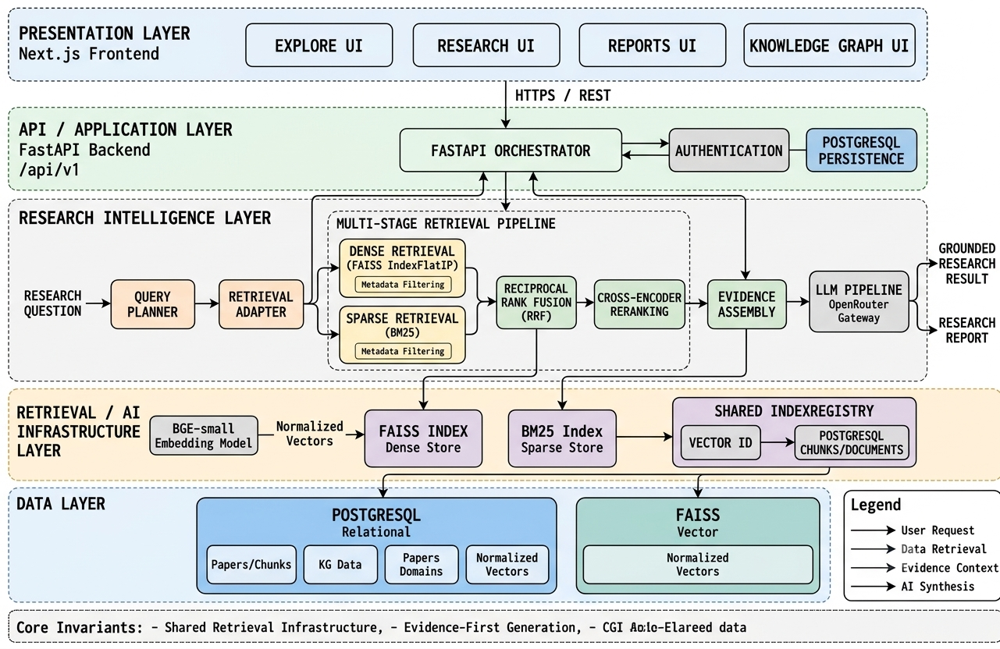
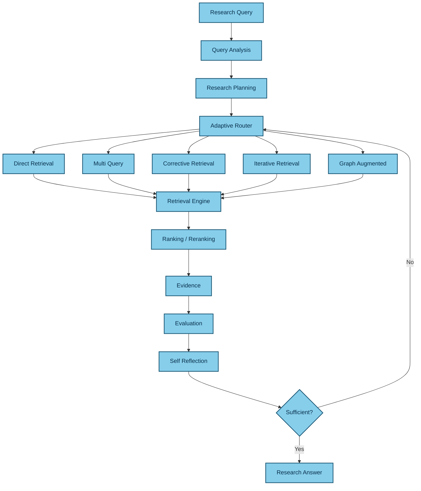
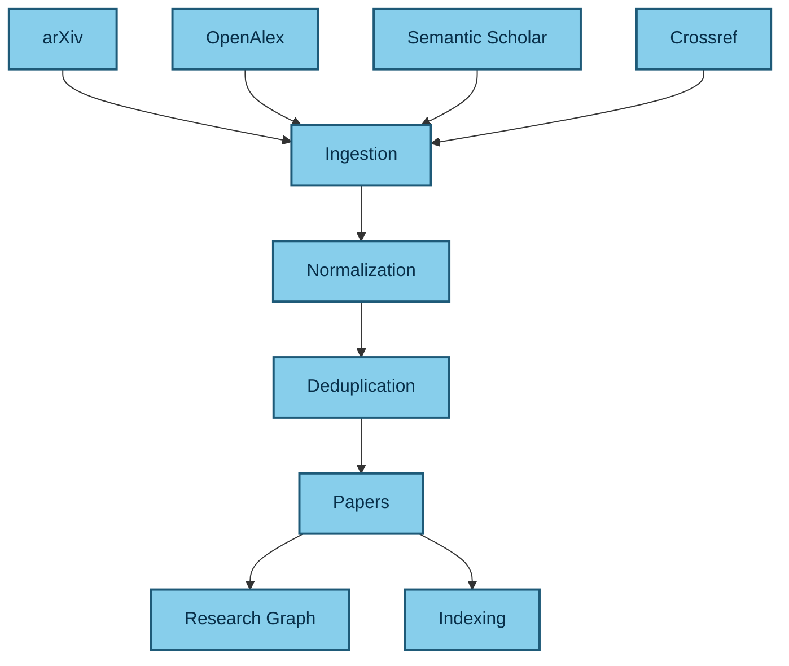
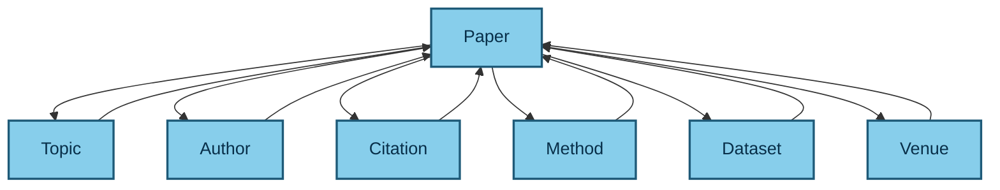
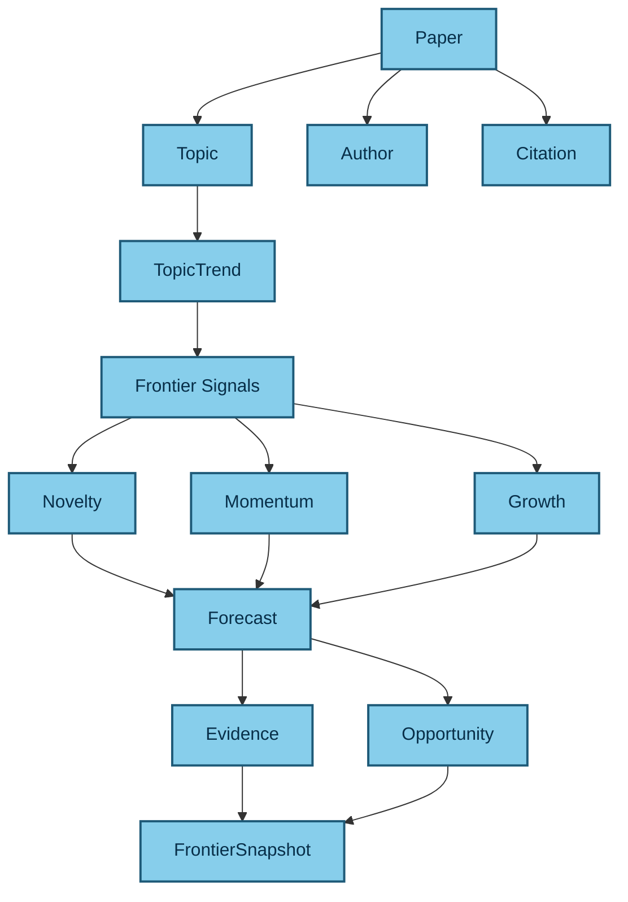
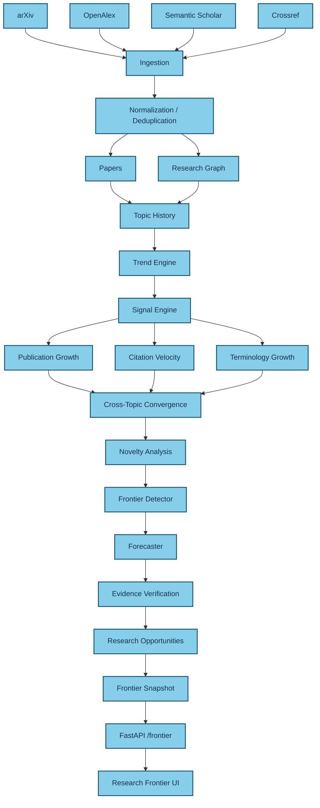

# 🔬 AI Research Assistant

### AI-powered research discovery, adaptive retrieval, evidence-grounded analysis, and research frontier intelligence

<p align="center">
  
</p>

<p align="center">
  <strong>Discover research papers • Retrieve evidence • Analyze literature • Explore research frontiers</strong>
</p>

<p align="center">

[](https://www.python.org/)
[](https://fastapi.tiangolo.com/)
[](https://nextjs.org/)
[](https://react.dev/)
[](https://www.postgresql.org/)
[](https://redis.io/)
[](https://github.com/facebookresearch/faiss)
[](https://www.docker.com/)

</p>

---

## 🎥 Demo

<p align="center">
  <a href="https://youtu.be/EnA22WtY6Sc">
    
  </a>
</p>

<p align="center">
  ▶️ <a href="https://youtu.be/EnA22WtY6Sc"><strong>Watch the full demo on YouTube</strong></a>
</p>

---

# 📖 Overview

**AI Research Assistant** is a research-focused AI platform for working with **AI research papers**.

It combines research ingestion, knowledge representation, hybrid retrieval, Adaptive RAG, evidence verification, research synthesis, graph exploration, and research frontier analysis into one platform.

Rather than treating research assistance as:

```text
Query → Vector Search → LLM → Answer
```

the system is designed as a layered research platform:

```text
Research Sources
       ↓
   Ingestion
       ↓
Normalization / Deduplication
       ↓
Papers + Knowledge
       ↓
Retrieval
       ↓
Adaptive RAG
       ↓
Evidence
       ↓
Research Intelligence
       ↓
Frontier Intelligence
       ↓
Researcher
```

The current focus is **AI research papers**, with architecture designed to support broader research domains over time.

---

# 🏗️ System Architecture

<p align="center">
  
</p>

The platform is organized into six major systems:

```text
┌────────────────────────────────────────────────────┐
│                 RESEARCH PLATFORM                  │
├────────────────────────────────────────────────────┤
│                                                    │
│  1. INGESTION                                      │
│     Papers / APIs / Documents                      │
│                                                    │
│  2. KNOWLEDGE                                      │
│     Papers / Topics / Authors / Graph / Vectors    │
│                                                    │
│  3. RETRIEVAL                                      │
│     Search / RAG / Adaptive Retrieval              │
│                                                    │
│  4. RESEARCH INTELLIGENCE                          │
│     Research / Evidence / Synthesis                │
│                                                    │
│  5. FRONTIER INTELLIGENCE                          │
│     Trends / Signals / Novelty / Forecasts         │
│     Gaps / Opportunities / Evidence                │
│                                                    │
│  6. LEARNING                                       │
│     Evaluation / Feedback / Self-improvement        │
│                                                    │
└────────────────────────────────────────────────────┘
```

---

# 🧠 Architecture Philosophy

The system deliberately separates **retrieval infrastructure** from **adaptive retrieval intelligence**.

There are two important layers:

```text
┌──────────────────────────────┐
│        Adaptive RAG          │
│                              │
│ Decision + Orchestration     │
│ Strategy Selection           │
│ Query Planning               │
│ Evaluation                   │
│ Self Reflection              │
└──────────────┬───────────────┘
               ↓
┌──────────────────────────────┐
│         Retrieval            │
│                              │
│ Dense Search                 │
│ BM25                         │
│ Hybrid Retrieval             │
│ Ranking                      │
│ Reranking                    │
│ Compression                  │
│ Evidence                     │
└──────────────────────────────┘
```

Therefore:

```text
Research Query
      ↓
Adaptive RAG
      ↓
Retrieval
      ↓
Evidence
      ↓
Research
```

This avoids duplicating retrieval logic across the platform.

---

# 🔎 Retrieval Engine

The general retrieval engine is implemented under:

```text
backend/app/retrieval/
```

It contains reusable retrieval infrastructure for:

* Query analysis
* Query classification
* Query rewriting
* Retrieval planning
* Source selection
* Dense retrieval
* BM25 retrieval
* Hybrid retrieval
* Ranking
* Reciprocal Rank Fusion
* Reranking
* Metadata filtering
* Context compression
* Evidence collection

Representative structure:

```text
app/retrieval/
├── config.py
├── models.py
├── pipeline.py
├── query.py
├── service.py
│
├── advanced/
│   ├── intent_classifier.py
│   ├── query_decomposer.py
│   ├── query_rewriter.py
│   ├── retrieval_planner.py
│   └── source_selector.py
│
├── dense/
│   └── vector_search.py
│
├── sparse/
│   └── bm25.py
│
├── hybrid/
│   └── fusion.py
│
├── ranking/
│   ├── cross_encoder.py
│   ├── rrf.py
│   └── score_normalizer.py
│
├── reranking/
│   └── reranker.py
│
├── compression/
│   ├── context_ordering.py
│   ├── duplicate_remover.py
│   ├── semantic_compressor.py
│   └── token_optimizer.py
│
├── filters/
│   └── metadata_filter.py
│
├── evidence/
│   ├── collector.py
│   ├── coverage.py
│   ├── provenance.py
│   └── scorer.py
│
├── retrievers/
│   ├── dense.py
│   ├── hybrid.py
│   └── keyword.py
│
└── sources/
    ├── arxiv_source.py
    ├── bm25_source.py
    ├── documentation_source.py
    ├── github_source.py
    ├── vector_source.py
    └── router.py
```

---

# 🧠 Adaptive RAG

Adaptive RAG is the intelligent decision layer above the retrieval engine.

It is implemented under:

```text
backend/app/adaptive_rag/
```

Current architecture:

```text
adaptive_rag/
│
├── controller.py
├── domain_models.py
├── evaluator.py
├── exceptions.py
├── generation.py
├── planner.py
├── router.py
├── state.py
│
├── adapters/
│   └── retrieval.py
│
├── models/
│   ├── decision.py
│   ├── evidence.py
│   ├── query.py
│   ├── result.py
│   ├── state.py
│   └── trace.py
│
├── orchestration/
│   ├── budget_manager.py
│   ├── coordinator.py
│   ├── executor.py
│   └── planner.py
│
├── routing/
│   ├── route_scoring.py
│   ├── source_selector.py
│   ├── strategy_selector.py
│   └── router.py
│
├── strategies/
│   ├── base.py
│   ├── direct.py
│   ├── multi_query.py
│   ├── corrective.py
│   ├── iterative.py
│   └── graph_augmented.py
│
├── policies/
│   ├── confidence.py
│   ├── routing.py
│   └── stopping.py
│
├── evaluation/
│   ├── confidence.py
│   ├── coverage.py
│   ├── diversity.py
│   ├── evaluator.py
│   ├── quality.py
│   ├── relevance.py
│   └── sufficiency.py
│
├── evidence/
│   ├── collector.py
│   ├── contradiction.py
│   ├── corroboration.py
│   ├── coverage.py
│   ├── provenance.py
│   ├── scorer.py
│   └── validator.py
│
├── self_reflection/
│   ├── answer_checker.py
│   ├── critic.py
│   ├── gap_detector.py
│   ├── hallucination_detector.py
│   ├── reflection_loop.py
│   └── retrieval_checker.py
│
└── observability/
    ├── decisions.py
    ├── diagnostics.py
    ├── events.py
    └── trace.py
```

---

# 🔄 Adaptive Retrieval Flow



---

# 📚 Research Paper Ingestion

Research sources are handled by the ingestion layer:

```text
backend/app/ingestion/
```

Current providers include:

```text
app/ingestion/providers/
├── arxiv.py
├── crossref.py
├── openalex.py
├── semantic_scholar.py
├── manager.py
└── base.py
```

The ingestion pipeline performs:

```text
Research Sources
      ↓
Download / Access
      ↓
Extraction
      ↓
Parsing
      ↓
Normalization
      ↓
Validation
      ↓
Deduplication
      ↓
Paper Corpus
```

---

# 🌐 Research Data Pipeline



---

# 🧠 Knowledge Layer

The knowledge layer organizes papers into structured research entities.

```text
backend/app/knowledge/
```

It handles:

* Document structure
* Sections
* Semantic chunking
* Structural chunking
* Embeddings
* Vector indexing
* Keyword indexing
* Index management

The paper domain is represented through entities such as:

```text
Paper
Author
Topic
Citation
Method
Dataset
Venue
Document
Section
Chunk
```

---

# 🕸️ Research Knowledge Graph

The graph system is implemented under:

```text
backend/app/graph/
```

with:

```text
graph/
├── builder.py
├── models.py
├── schemas.py
├── service.py
├── traversal.py
│
├── extractors/
│   ├── author.py
│   ├── dataset.py
│   ├── method.py
│   ├── paper.py
│   ├── topic.py
│   └── venue.py
│
└── queries/
    ├── authors.py
    ├── methods.py
    ├── papers.py
    └── topics.py
```

Relationship model:



This graph supports:

* Related paper discovery
* Topic exploration
* Citation relationships
* Author relationships
* Method discovery
* Graph-augmented retrieval
* Frontier analysis

---

# 🔬 Research Intelligence

The research intelligence layer is implemented under:

```text
backend/app/research/
```

It includes:

```text
research/
├── dependencies.py
├── models.py
├── pipeline.py
├── planner.py
├── service.py
│
├── citation/
│   ├── formatter.py
│   └── generator.py
│
├── evidence/
│   ├── collector.py
│   ├── tracker.py
│   └── validator.py
│
├── reports/
│   └── builder.py
│
├── retrieval/
│   ├── docs_retriever.py
│   ├── github_retriever.py
│   └── paper_retriever.py
│
└── synthesis/
    ├── comparator.py
    ├── summarizer.py
    └── synthesizer.py
```

Research workflow:

```text
Research Question
      ↓
Research Planner
      ↓
Task Decomposition
      ↓
Adaptive Retrieval
      ↓
Evidence Collection
      ↓
Evidence Validation
      ↓
Cross-Paper Synthesis
      ↓
Citation Generation
      ↓
Research Report
```

---

# 📝 Research Generation

Generation is separated into its own layer:

```text
backend/app/generation/
```

and:

```text
backend/app/llm/
```

The generation system includes:

* LLM providers
* Prompt construction
* Synthesis
* Citation generation
* Citation verification
* Response generation

Supported provider integrations include:

```text
OpenAI
OpenRouter
Gemini
Ollama
```

The LLM layer is therefore independent from retrieval and research orchestration.

---

# 📑 Evidence-Grounded Answers

The platform emphasizes evidence-backed research.

```text
Research Claim
      ↓
Evidence Retrieval
      ↓
Source
      ↓
Paper
      ↓
Citation
      ↓
Verification
      ↓
Research Answer
```

Adaptive RAG additionally supports:

* Evidence scoring
* Evidence coverage
* Provenance
* Corroboration
* Contradiction detection
* Evidence validation

---

# 🚀 Research Frontier Intelligence

The Frontier layer analyzes how research topics evolve over time.

Implemented under:

```text
backend/app/frontier/
```

Current components:

```text
frontier/
├── detector.py
├── gaps.py
├── novelty.py
├── service.py
└── trends.py
```

The Frontier system can analyze:

* Topic trends
* Research growth
* Novelty
* Research gaps
* Emerging directions
* Evidence
* Research opportunities

---

# 📈 Frontier Entity Relationship



---

# 🌐 Complete Frontier Pipeline



---

# 🔗 Frontier API Flow

When a researcher opens a frontier direction such as:

```text
Self-Evolving Retrieval Systems
```

the backend can expose:

```text
GET /api/v1/frontier/{topic}
```

The conceptual request flow is:

```text
Frontier Request
       ↓
Frontier Service
       ↓
┌──────┼─────────┐
↓      ↓         ↓
Graph Retrieval Evidence
↓      ↓         ↓
Topics Papers Citations
└──────┼─────────┘
       ↓
    Forecast
       ↓
     JSON
       ↓
Frontier UI
```

The Frontier page therefore consumes the same underlying:

* Knowledge
* Retrieval
* Evidence
* Research

systems instead of creating an isolated data pipeline.

---

# 🧪 Evaluation

Evaluation is implemented under:

```text
backend/app/evaluation/
```

and includes:

```text
evaluation/
├── models.py
├── pipeline.py
│
├── datasets/
│   └── benchmark.py
│
├── deepeval/
│   ├── evaluator.py
│   └── test_case.py
│
├── ragas/
│   └── evaluator.py
│
├── generation/
│   ├── context.py
│   ├── faithfulness.py
│   └── relevance.py
│
├── metrics/
│   ├── answer_relevancy.py
│   ├── contextual_precision.py
│   ├── contextual_recall.py
│   └── faithfulness.py
│
├── retrieval/
│   ├── mrr.py
│   ├── ndcg.py
│   ├── precision.py
│   ├── recall.py
│   └── metrics.py
│
└── performance/
    └── latency.py
```

This allows the system to evaluate both retrieval and generation.

Example evaluation dimensions:

```text
Retrieval
├── Precision
├── Recall
├── MRR
└── nDCG

Generation
├── Faithfulness
├── Relevance
├── Contextual Precision
└── Contextual Recall

Performance
└── Latency
```

---

# 🔁 Self-Improvement

The platform also contains a self-improvement layer:

```text
backend/app/self_improvement/
```

It includes:

```text
self_improvement/
├── service.py
│
├── evaluation/
│   ├── evaluator.py
│   ├── evidence.py
│   ├── factuality.py
│   ├── generation.py
│   └── retrieval.py
│
├── feedback/
│   ├── analyzer.py
│   ├── collector.py
│   └── models.py
│
├── learning/
│   ├── prompts.py
│   ├── retrieval.py
│   ├── routing.py
│   ├── stopping.py
│   └── strategy.py
│
└── traces/
    ├── collector.py
    ├── models.py
    └── recorder.py
```

The intended feedback loop is:

```text
Research Query
      ↓
Retrieval
      ↓
Adaptive Decision
      ↓
Answer
      ↓
Evaluation
      ↓
User Feedback
      ↓
Learning
      ↓
Improved Strategy
```

---

# 📊 Observability

Observability is treated as a dedicated platform capability.

The backend contains:

```text
backend/app/monitoring/
```

including:

```text
monitoring/
├── alerts.py
├── health.py
├── logging.py
├── metrics.py
├── prometheus.py
└── tracing.py
```

Adaptive RAG additionally records:

```text
adaptive_rag/observability/
├── decisions.py
├── diagnostics.py
├── events.py
└── trace.py
```

A research request can therefore be traced through:

```text
Request
 ↓
Query Analysis
 ↓
Adaptive Decision
 ↓
Retrieval Strategy
 ↓
Retrieval
 ↓
Ranking
 ↓
Evidence
 ↓
Evaluation
 ↓
Generation
 ↓
Response
```

Useful measurements include:

* Request latency
* Retrieval latency
* LLM latency
* Retrieval strategy
* Number of retrieval attempts
* Retrieved document count
* Evidence coverage
* Confidence
* Iteration count
* Token usage

---

# 🖥️ Frontend

The frontend is built using:

* Next.js
* React
* TypeScript
* Tailwind CSS

Main application areas include:

```text
frontend/src/app/(dashboard)/
│
├── assistant/
├── collections/
├── dashboard/
├── explore/
├── frontier/
├── graph/
├── papers/
├── projects/
└── reports/
```

The frontend also contains dedicated domain modules:

```text
frontend/src/
├── adaptive-rag/
├── collections/
├── frontier/
├── generation/
├── graph/
├── papers/
├── projects/
├── reports/
├── research/
├── retrieval/
└── self-improvement/
```

---

# 🤖 Assistant UI

The Assistant interface is supported by:

```text
src/app/(dashboard)/assistant/page.tsx
src/app/(dashboard)/components/assistant-page.tsx
```

and the Adaptive RAG frontend module:

```text
src/adaptive-rag/
├── api.ts
├── types.ts
├── hooks/
│   └── use-adaptive-rag.ts
└── components/
    ├── adaptive-rag-panel.tsx
    ├── confidence-meter.tsx
    ├── evidence-evaluation.tsx
    ├── rag-trace.tsx
    ├── reasoning-status.tsx
    ├── retrieval-attempt.tsx
    ├── strategy-badge.tsx
    └── strategy-selector.tsx
```

This allows the UI to expose the adaptive retrieval process rather than presenting the system as a black box.

---

# 🔬 Research UI

The Research interface includes:

```text
src/research/
├── api.ts
├── types.ts
└── hooks/
    └── use-research.ts
```

with research components including:

```text
src/components/research/
├── citation-list.tsx
├── evidence-card.tsx
├── evidence-list.tsx
├── research-answer.tsx
├── research-input.tsx
├── research-page.tsx
├── research-plan.tsx
├── research-progress.tsx
├── research-session.tsx
├── research-task-list.tsx
├── research-task.tsx
└── verification-summary.tsx
```

---

# 🚀 Frontier UI

The Research Frontier interface is implemented through:

```text
src/app/(dashboard)/frontier/page.tsx
src/app/(dashboard)/components/frontier-page.tsx
```

with dedicated components:

```text
src/app/(dashboard)/components/frontier/
├── frontier-direction.tsx
├── frontier-evidence.tsx
├── frontier-overview.tsx
├── novelty-card.tsx
├── research-gap-card.tsx
└── trend-card.tsx
```

The frontend data layer is:

```text
src/frontier/
├── api.ts
├── types.ts
└── hooks/
    ├── use-frontier.ts
    ├── use-frontier-gaps.ts
    ├── use-frontier-trends.ts
    ├── use-gaps.ts
    ├── use-hypotheses.ts
    ├── use-novelty.ts
    ├── use-research-roadmap.ts
    └── use-trends.ts
```

---

# 🕸️ Graph UI

The graph interface contains:

```text
src/app/(dashboard)/components/graph/
├── graph-canvas.tsx
├── graph-controls.tsx
├── graph-details.tsx
├── graph-edge.tsx
├── graph-filters.tsx
├── graph-legend.tsx
├── graph-node.tsx
└── graph-search.tsx
```

It connects the visual graph experience to the backend research graph.

---

# 📑 Reports

Research reports are supported by both backend and frontend layers.

Backend:

```text
app/reports/
├── generator.py
├── schemas.py
└── service.py
```

Frontend:

```text
src/reports/
├── api.ts
├── types.ts
└── hooks/
    ├── use-report.ts
    └── use-reports.ts
```

The report interface includes:

```text
report-builder.tsx
report-export.tsx
report-list.tsx
report-section.tsx
report-view.tsx
```

---

# 🗂️ Collections

Researchers can organize papers and research material through collections.

Backend:

```text
app/collections/
├── schemas.py
└── service.py
```

Frontend:

```text
src/collections/
├── api.ts
├── types.ts
└── hooks/
```

This allows research material to be organized independently from the retrieval pipeline.

---

# 🗄️ Data & Storage

The application uses PostgreSQL for structured application and research data.

Core database entities include:

```text
User
Paper
Author
Document
Section
Chunk
Topic
Citation
Method
Dataset
Venue

ResearchProject
ResearchSession
ResearchExecution
ResearchResult
ResearchEvaluation
ResearchFeedback
ResearchTrace
ResearchNote

Collection
CollectionItem
Report
```

Vector indexing is handled through the indexing layer:

```text
app/indexing/
├── batch.py
├── incremental.py
├── pipeline.py
│
├── embeddings/
│   ├── generator.py
│   └── model.py
│
├── metadata/
│   ├── schema.py
│   └── store.py
│
└── vector_store/
    ├── faiss_index.py
    └── persistence.py
```

---

# 🧱 Backend Structure

The major backend architecture is:

```text
backend/
└── app/
    │
    ├── api/                 REST API
    │
    ├── ingestion/           Research source ingestion
    │
    ├── processing/          Document processing
    │
    ├── knowledge/           Research knowledge
    │
    ├── indexing/            Embeddings + vector indexing
    │
    ├── retrieval/           Retrieval infrastructure
    │
    ├── adaptive_rag/        Adaptive retrieval orchestration
    │
    ├── research/            Research workflows
    │
    ├── generation/          Research generation
    │
    ├── llm/                 LLM abstraction/providers
    │
    ├── graph/               Research knowledge graph
    │
    ├── frontier/             Research frontier intelligence
    │
    ├── evaluation/           Evaluation framework
    │
    ├── self_improvement/     Feedback + learning
    │
    ├── monitoring/           Observability
    │
    ├── security/             Security controls
    │
    ├── middleware/           Request middleware
    │
    ├── repositories/         Data access
    │
    ├── reports/              Research reports
    │
    ├── collections/          Research collections
    │
    └── workers/              Background processing
```

---

# 🌐 API Layer

API routes are located under:

```text
backend/app/api/routes/
```

Current route groups include:

```text
adaptive_rag.py
assistant.py
auth.py
collections.py
documents.py
explore.py
frontier.py
graph.py
health.py
papers.py
reports.py
research.py
retrieval.py
self_improvement.py
```

The API is versioned under:

```text
/api/v1
```

This provides a single backend interface for the web application and future clients.

---

# 🔐 Security

Security-related functionality is separated into dedicated modules:

```text
app/security/
├── cors.py
├── csrf.py
├── encryption.py
├── headers.py
└── secrets.py
```

API-level access control includes:

```text
app/api/dependencies/
├── auth.py
├── current_user.py
├── permissions.py
└── rate_limit.py
```

Additional middleware handles:

```text
Authentication
Exception handling
Logging
Rate limiting
Request IDs
Timing
```

---

# ⚙️ Technology Stack

### Backend

| Technology            | Purpose                             |
| --------------------- | ----------------------------------- |
| Python 3.12           | Backend runtime                     |
| FastAPI               | REST API                            |
| Pydantic              | Validation and schemas              |
| SQLAlchemy            | Database layer                      |
| PostgreSQL            | Persistent storage                  |
| Redis                 | Caching / background infrastructure |
| Celery                | Background tasks                    |
| FAISS                 | Vector search                       |
| BM25                  | Lexical retrieval                   |
| Sentence Transformers | Embeddings                          |
| LLM providers         | Research generation                 |

### Frontend

| Technology     | Purpose                 |
| -------------- | ----------------------- |
| Next.js 16     | Web application         |
| React 19       | UI                      |
| TypeScript     | Type safety             |
| Tailwind CSS   | Styling                 |
| TanStack Query | Data fetching / caching |

### Infrastructure

| Technology     | Purpose             |
| -------------- | ------------------- |
| Docker         | Containerization    |
| Docker Compose | Local orchestration |
| GitHub Actions | CI                  |
| Vercel         | Frontend deployment |
| Render         | Backend deployment  |

---

# 🐳 Local Development

## Clone

```bash
git clone https://github.com/garimakumari44/ai_research_assistant.git
cd ai_research_assistant/research-assistant
```

## Backend

```bash
cd backend

python -m venv .venv
```

Windows:

```powershell
.venv\Scripts\Activate.ps1
```

Install:

```bash
pip install -r requirements.txt
```

Run:

```bash
uvicorn app.main:app --reload --port 8010
```

API:

```text
http://localhost:8010
```

Swagger:

```text
http://localhost:8010/docs
```

---

# 💻 Frontend

```bash
cd frontend
npm install
npm run dev
```

Frontend:

```text
http://localhost:3000
```

---

# 🐳 Docker

The project contains Docker configuration for both backend and frontend.

Backend:

```text
backend/Dockerfile
backend/docker-compose.yml
```

Frontend:

```text
frontend/Dockerfile
```

The production-oriented architecture is:

```text
                   Browser
                      │
                      ↓
                Next.js UI
                      │
                      ↓
                FastAPI API
                      │
       ┌──────────────┼──────────────┐
       ↓              ↓              ↓
 PostgreSQL         Redis        Retrieval
                                    │
                             ┌──────┴──────┐
                             ↓             ↓
                           FAISS          BM25
```

---

# 📁 Repository Structure

The repository is organized as:

```text
research-assistant/
│
├── backend/
│   ├── app/
│   │   ├── adaptive_rag/
│   │   ├── api/
│   │   ├── assistant/
│   │   ├── cache/
│   │   ├── collections/
│   │   ├── core/
│   │   ├── db/
│   │   ├── documents/
│   │   ├── evaluation/
│   │   ├── explore/
│   │   ├── frontier/
│   │   ├── generation/
│   │   ├── graph/
│   │   ├── indexing/
│   │   ├── ingestion/
│   │   ├── knowledge/
│   │   ├── llm/
│   │   ├── middleware/
│   │   ├── monitoring/
│   │   ├── papers/
│   │   ├── processing/
│   │   ├── rate_limit/
│   │   ├── reports/
│   │   ├── repositories/
│   │   ├── research/
│   │   ├── retrieval/
│   │   ├── schemas/
│   │   ├── security/
│   │   ├── self_improvement/
│   │   ├── services/
│   │   ├── users/
│   │   └── workers/
│   │
│   ├── alembic/
│   ├── storage/
│   ├── Dockerfile
│   ├── docker-compose.yml
│   ├── requirements.txt
│   └── alembic.ini
│
├── frontend/
│   ├── src/
│   │   ├── adaptive-rag/
│   │   ├── app/
│   │   ├── collections/
│   │   ├── components/
│   │   ├── frontier/
│   │   ├── generation/
│   │   ├── graph/
│   │   ├── hooks/
│   │   ├── lib/
│   │   ├── papers/
│   │   ├── projects/
│   │   ├── providers/
│   │   ├── reports/
│   │   ├── research/
│   │   ├── retrieval/
│   │   ├── self-improvement/
│   │   └── types/
│   │
│   ├── public/
│   ├── Dockerfile
│   ├── package.json
│   ├── next.config.ts
│   └── tsconfig.json
│
└── docs/
    └── img/
```

---

# 🖼️ Documentation Assets

The architecture and UI visuals are stored under:

```text
docs/img/
```

Important visuals include:

```text
AI Research Assistant System Architecture.png
research_assistant_gif.png

adaptive_rag.png
adaptive_rag (2).png

assistant.png
Assistant — Adaptive RAG & LLM Research Architecture (1).png

explore.png
explore (2).png
Explore Adaptive Retrieval Architecture.png

frontier.png
report.png
system.png
archi_2.png
```

---

# 🧭 Researcher Workflow

A typical researcher journey is:

```text
                 RESEARCHER
                     │
                     ↓
              Discover Papers
                     │
                     ↓
                  Explore
                     │
                     ↓
              Select Context
                     │
                     ↓
              Ask Assistant
                     │
                     ↓
               Adaptive RAG
                     │
                     ↓
                  Evidence
                     │
                     ↓
             Research Synthesis
                     │
                     ↓
                Citations
                     │
                     ↓
                  Report
                     │
                     ↓
           Explore Research Frontier
                     │
                     ↓
          Trends / Novelty / Gaps
```

---

# 🎯 Core Design Principles

## 1. Retrieval is reusable infrastructure

The retrieval engine is not tied to one UI.

```text
retrieval/
      ↑
      │
Assistant
Research
Explore
Graph
Frontier
```

## 2. Adaptive RAG makes retrieval decisions

```text
Query
 ↓
Analyze
 ↓
Plan
 ↓
Select Strategy
 ↓
Retrieve
 ↓
Evaluate
 ↓
Continue / Stop
```

## 3. Evidence comes before synthesis

```text
Retrieve
   ↓
Evidence
   ↓
Validate
   ↓
Synthesize
```

## 4. Frontier consumes existing intelligence

The Frontier system is built on top of:

```text
Knowledge
    +
Retrieval
    +
Evidence
    +
Research
```

rather than creating a completely separate research system.

## 5. Evaluation and learning close the loop

```text
Research
   ↓
Evaluation
   ↓
Feedback
   ↓
Learning
   ↓
Improvement
```

---

# 🔭 Long-Term Architecture

The intended architecture can be summarized as:

```text
                    FRONTIER INTELLIGENCE
                             ↑
              ┌──────────────┼──────────────┐
              ↑              ↑              ↑
          KNOWLEDGE       RETRIEVAL       RESEARCH
              ↑              ↑              ↑
              └──────────────┼──────────────┘
                             ↑
                         INGESTION
```

The platform therefore progresses from:

```text
Research Sources
       ↓
Research Corpus
       ↓
Knowledge
       ↓
Retrieval
       ↓
Adaptive RAG
       ↓
Evidence
       ↓
Research Intelligence
       ↓
Frontier Intelligence
       ↓
Learning
```

---

# ⭐ Project Vision

The goal is to move beyond a conventional research chatbot.

Instead of only answering:

> **"What does this paper say?"**

the platform is designed to support a broader research workflow:

```text
What has been published?
          ↓
What does the literature say?
          ↓
How are papers connected?
          ↓
What evidence supports the claims?
          ↓
How is a topic evolving?
          ↓
Where are research gaps?
          ↓
What emerging directions can be identified?
```

The foundation is therefore:

```text
Papers
  ↓
Knowledge
  ↓
Retrieval
  ↓
Adaptive RAG
  ↓
Evidence
  ↓
Research
  ↓
Frontier
  ↓
Learning
```

---

# 🔬 Current Focus

The current platform is focused on **AI research papers**.

Core research areas can include:

* Large Language Models
* Retrieval-Augmented Generation
* AI Agents
* Multi-Agent Systems
* Reinforcement Learning
* Natural Language Processing
* Computer Vision
* Generative AI
* Machine Learning
* Information Retrieval
* AI Evaluation

The architecture is designed so additional research domains can be incorporated without replacing the underlying research infrastructure.

---

# 🛣️ Development Direction

The most important architectural backbone is:

```text
Topic History
      ↓
Trend Engine
      ↓
Signals
      ↓
Novelty
      ↓
Frontier Detection
      ↓
Forecast
      ↓
Evidence Verification
      ↓
Research Opportunities
      ↓
Frontier Snapshot
      ↓
FastAPI
      ↓
Research Frontier UI
```

The UI should consume this pipeline rather than becoming the source of the intelligence.

That keeps the platform grounded in actual research data, retrieval results, evidence, and measurable signals.

---

<p align="center">

## 🔬 AI Research Assistant

<strong>Research Papers → Evidence → Adaptive Intelligence → Frontier Discovery</strong>

</p>

<p align="center">

Built with Python • FastAPI • Next.js • PostgreSQL • FAISS • BM25 • Adaptive RAG

</p>
