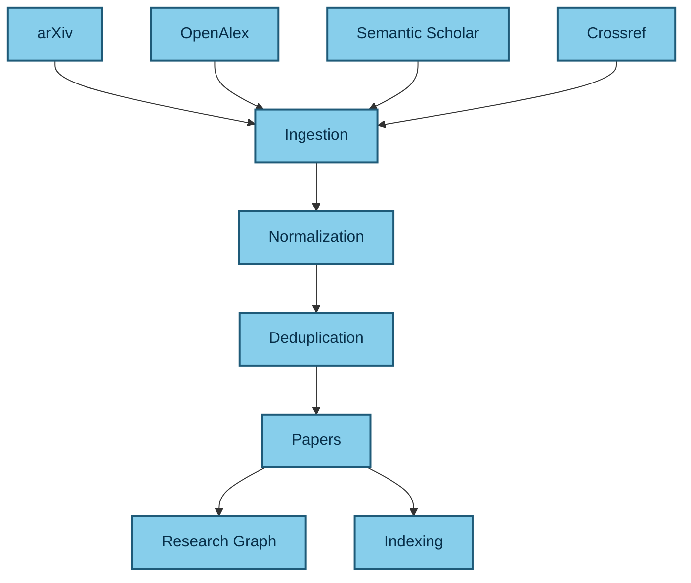
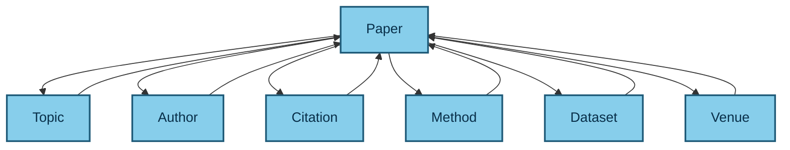
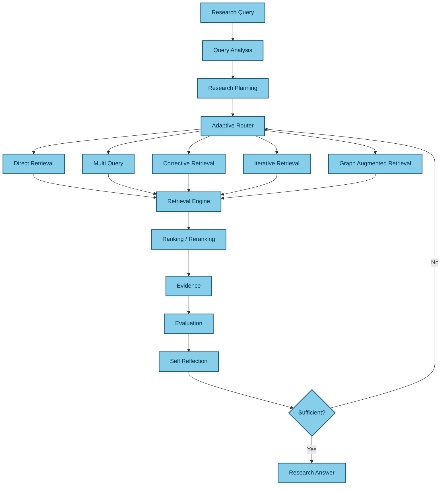
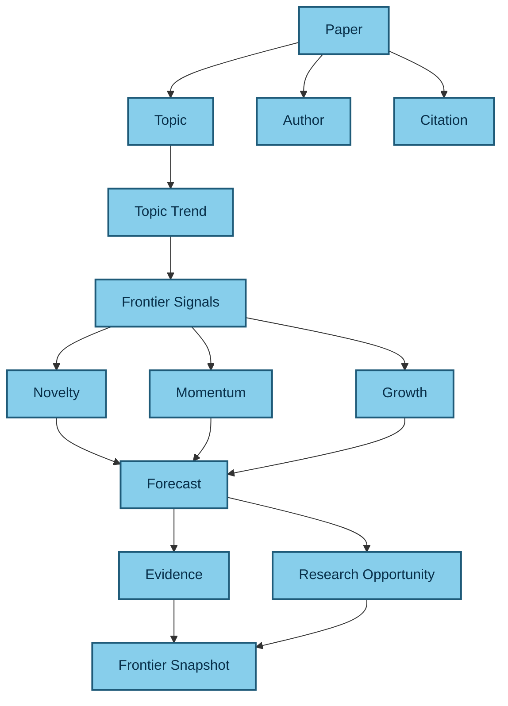
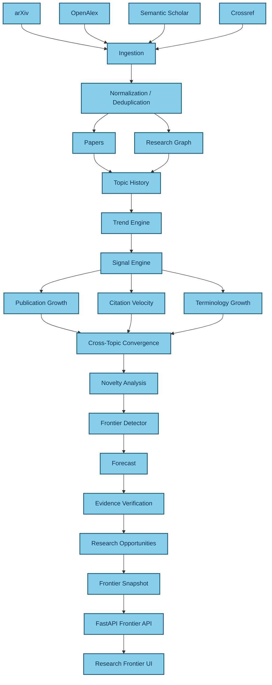

# AI Research Assistant

### AI-powered research discovery, adaptive retrieval, evidence-grounded analysis, and research frontier intelligence for AI research papers.

<p align="center">
  
</p>

<p align="center">
  <strong>Discover papers · Retrieve evidence · Analyze literature · Explore research frontiers</strong>
</p>

<p align="center">
  <a href="https://ai-research-assistant-wine.vercel.app">Live Application</a>
  ·
  <a href="https://youtu.be/EnA22WtY6Sc">Watch Demo</a>
  ·
  <a href="https://ai-research-assistant-xtjz.onrender.com/docs">API Documentation</a>
</p>

---

## Overview

**AI Research Assistant** is a research-focused AI platform designed for working with **AI research papers**.

It combines:

* Research paper ingestion
* Structured research knowledge
* Hybrid retrieval
* Adaptive RAG
* Evidence collection and verification
* Research synthesis
* Knowledge graph exploration
* Research reports
* Research evaluation
* Self-improvement
* Research frontier intelligence

The platform is designed around a simple principle:

> **Retrieval should be evidence-driven, adaptive, observable, and reusable across the entire research workflow.**

Instead of building a conventional:

```text
Question
   ↓
Vector Search
   ↓
LLM
   ↓
Answer
```

pipeline, the system separates research into multiple intelligent layers:

```text
Research Sources
       ↓
    Ingestion
       ↓
Normalization / Deduplication
       ↓
Research Corpus
       ↓
Knowledge Layer
       ↓
Retrieval
       ↓
Adaptive RAG
       ↓
Evidence
       ↓
Research Intelligence
       ↓
Frontier Intelligence
       ↓
Researcher
```

The current product focus is **AI research papers**, while the underlying architecture is designed to support broader research domains in the future.

---

# Demo

<p align="center">
  <a href="https://youtu.be/EnA22WtY6Sc">
    
  </a>
</p>

<p align="center">
  <a href="https://youtu.be/EnA22WtY6Sc">
    <strong>Watch the full demo on YouTube →</strong>
  </a>
</p>

---

# Live System

| Component         | Environment                                                                  |
| ----------------- | ---------------------------------------------------------------------------- |
| Web Application   | [AI Research Assistant](https://ai-research-assistant-wine.vercel.app)       |
| Backend API       | [FastAPI Backend](https://ai-research-assistant-xtjz.onrender.com)           |
| API Documentation | [OpenAPI / Swagger](https://ai-research-assistant-xtjz.onrender.com/docs)    |
| OpenAPI Schema    | [OpenAPI JSON](https://ai-research-assistant-xtjz.onrender.com/openapi.json) |
| Source Code       | [GitHub Repository](https://github.com/garimakumari44/ai_research_assistant) |
| Demo              | [YouTube](https://youtu.be/EnA22WtY6Sc)                                      |

---

# What the Platform Does

AI Research Assistant supports the complete research lifecycle:

```text
Discover
   ↓
Ingest
   ↓
Understand
   ↓
Retrieve
   ↓
Verify
   ↓
Synthesize
   ↓
Compare
   ↓
Explore
   ↓
Identify Gaps
   ↓
Discover Emerging Directions
```

## Core capabilities

### Research Paper Discovery

Connects research workflows to academic sources and paper metadata.

Current ingestion providers include:

* arXiv
* OpenAlex
* Semantic Scholar
* Crossref

---

### Hybrid Retrieval

Combines multiple retrieval approaches rather than depending on a single vector search method.

```text
Research Query
      ↓
Query Analysis
      ↓
Source Selection
      ↓
┌─────────────┬──────────────┐
│             │              │
Dense        BM25         Hybrid
Search       Search       Retrieval
│             │              │
└─────────────┼──────────────┘
              ↓
          RRF / Ranking
              ↓
           Reranking
              ↓
        Context Compression
              ↓
            Evidence
```

---

### Adaptive RAG

Adaptive RAG sits above the retrieval infrastructure and determines **how retrieval should happen**.

Depending on the query and retrieval state, the system can use strategies such as:

* Direct retrieval
* Multi-query retrieval
* Corrective retrieval
* Iterative retrieval
* Graph-augmented retrieval

The adaptive layer also evaluates retrieval quality and can continue or stop based on evidence sufficiency.

---

### Evidence-Grounded Research

The system separates evidence collection from final synthesis.

```text
Research Claim
      ↓
Evidence Retrieval
      ↓
Source
      ↓
Paper
      ↓
Citation
      ↓
Verification
      ↓
Research Answer
```

Evidence processing includes:

* Evidence scoring
* Provenance
* Coverage
* Corroboration
* Contradiction detection
* Evidence validation

---

### Research Knowledge Graph

Papers are connected through structured research entities.

```text
Paper
 ├── Author
 ├── Topic
 ├── Citation
 ├── Method
 ├── Dataset
 └── Venue
```

This supports:

* Related paper discovery
* Topic exploration
* Citation relationships
* Author relationships
* Method discovery
* Graph-augmented retrieval
* Frontier analysis

---

### Research Synthesis

Research workflows can combine evidence across multiple papers.

```text
Research Question
       ↓
Research Planner
       ↓
Task Decomposition
       ↓
Adaptive Retrieval
       ↓
Evidence Collection
       ↓
Evidence Validation
       ↓
Cross-Paper Synthesis
       ↓
Citation Generation
       ↓
Research Report
```

---

### Research Frontier Intelligence

The Frontier layer goes beyond answering questions about existing papers.

It analyzes how research areas evolve over time.

```text
Papers
  ↓
Topics
  ↓
Topic History
  ↓
Trends
  ↓
Research Signals
  ↓
Novelty
  ↓
Research Gaps
  ↓
Emerging Directions
  ↓
Research Opportunities
```

---

# System Architecture

<p align="center">
  
</p>

The platform is organized around six major systems:

```text
┌────────────────────────────────────────────────────────────┐
│                    AI RESEARCH PLATFORM                    │
├────────────────────────────────────────────────────────────┤
│                                                            │
│  1. INGESTION                                              │
│     Papers / APIs / Documents                              │
│                                                            │
│  2. KNOWLEDGE                                              │
│     Papers / Topics / Authors / Graph / Vectors            │
│                                                            │
│  3. RETRIEVAL                                              │
│     Search / Hybrid Retrieval / Adaptive RAG               │
│                                                            │
│  4. RESEARCH INTELLIGENCE                                  │
│     Research / Evidence / Synthesis / Reports              │
│                                                            │
│  5. FRONTIER INTELLIGENCE                                  │
│     Trends / Signals / Novelty / Gaps / Opportunities      │
│                                                            │
│  6. LEARNING                                               │
│     Evaluation / Feedback / Self-Improvement                │
│                                                            │
└────────────────────────────────────────────────────────────┘
```

---

# Architecture Philosophy

A central architectural decision is the separation between:

```text
Retrieval Infrastructure
```

and:

```text
Adaptive Retrieval Intelligence
```

These are intentionally different layers.

## Retrieval

The retrieval system provides reusable search infrastructure.

```text
Query
 ↓
Analysis
 ↓
Source Selection
 ↓
Dense / BM25 / Hybrid
 ↓
Ranking
 ↓
Reranking
 ↓
Compression
 ↓
Evidence
```

## Adaptive RAG

Adaptive RAG decides **which retrieval strategy should be used**.

```text
Research Query
      ↓
Adaptive RAG
      ↓
Retrieval
      ↓
Evidence
      ↓
Research
```

This allows the same retrieval infrastructure to be reused by:

```text
Assistant
Research
Explore
Graph
Frontier
```

without duplicating retrieval logic.

---

# Research Data Pipeline

The research corpus begins with external academic sources.



The ingestion pipeline is implemented under:

```text
backend/app/ingestion/
```

### Providers

```text
backend/app/ingestion/providers/

├── arxiv.py
├── crossref.py
├── openalex.py
├── semantic_scholar.py
├── manager.py
└── base.py
```

### Processing flow

```text
Research Sources
      ↓
Download / Access
      ↓
Extraction
      ↓
Parsing
      ↓
Normalization
      ↓
Validation
      ↓
Deduplication
      ↓
Paper Corpus
```

---

# Knowledge Layer

The knowledge layer transforms raw research documents into structured research entities.

Implemented under:

```text
backend/app/knowledge/
```

It handles:

* Document structure
* Sections
* Semantic chunking
* Structural chunking
* Embeddings
* Vector indexing
* Keyword indexing
* Index management

The research domain is represented through entities such as:

```text
Paper
Author
Topic
Citation
Method
Dataset
Venue
Document
Section
Chunk
```

---

# Research Knowledge Graph

Implemented under:

```text
backend/app/graph/
```

The graph contains:

```text
graph/
├── builder.py
├── models.py
├── schemas.py
├── service.py
├── traversal.py
│
├── extractors/
│   ├── author.py
│   ├── dataset.py
│   ├── method.py
│   ├── paper.py
│   ├── topic.py
│   └── venue.py
│
└── queries/
    ├── authors.py
    ├── methods.py
    ├── papers.py
    └── topics.py
```

## Research graph model



The graph supports:

* Related paper discovery
* Topic exploration
* Citation traversal
* Author exploration
* Method discovery
* Graph-augmented retrieval
* Frontier analysis

---

# Retrieval Architecture

The reusable retrieval infrastructure lives under:

```text
backend/app/retrieval/
```

It contains:

```text
retrieval/
├── config.py
├── models.py
├── pipeline.py
├── query.py
├── service.py
│
├── advanced/
│   ├── intent_classifier.py
│   ├── query_decomposer.py
│   ├── query_rewriter.py
│   ├── retrieval_planner.py
│   └── source_selector.py
│
├── dense/
│   └── vector_search.py
│
├── sparse/
│   └── bm25.py
│
├── hybrid/
│   └── fusion.py
│
├── ranking/
│   ├── cross_encoder.py
│   ├── rrf.py
│   └── score_normalizer.py
│
├── reranking/
│   └── reranker.py
│
├── compression/
│   ├── context_ordering.py
│   ├── duplicate_remover.py
│   ├── semantic_compressor.py
│   └── token_optimizer.py
│
├── filters/
│   └── metadata_filter.py
│
├── evidence/
│   ├── collector.py
│   ├── coverage.py
│   ├── provenance.py
│   └── scorer.py
│
├── retrievers/
│   ├── dense.py
│   ├── hybrid.py
│   └── keyword.py
│
└── sources/
    ├── arxiv_source.py
    ├── bm25_source.py
    ├── documentation_source.py
    ├── github_source.py
    ├── vector_source.py
    └── router.py
```

This layer provides reusable retrieval infrastructure for:

* Query analysis
* Query classification
* Query rewriting
* Retrieval planning
* Source selection
* Dense search
* BM25
* Hybrid retrieval
* Reciprocal Rank Fusion
* Ranking
* Reranking
* Metadata filtering
* Context compression
* Evidence collection

---

# Adaptive RAG

Adaptive RAG is implemented separately under:

```text
backend/app/adaptive_rag/
```

It is responsible for **retrieval decisions, orchestration, evaluation, and reflection** rather than duplicating the retrieval engine.

```text
adaptive_rag/
├── controller.py
├── domain_models.py
├── evaluator.py
├── exceptions.py
├── generation.py
├── planner.py
├── router.py
├── state.py
│
├── adapters/
│   └── retrieval.py
│
├── evaluation/
├── evidence/
├── models/
├── observability/
├── orchestration/
├── policies/
├── routing/
├── self_reflection/
└── strategies/
```

## Adaptive retrieval strategies

```text
Direct
Multi Query
Corrective
Iterative
Graph Augmented
```

---

# Adaptive RAG Flow



---

# Evidence Architecture

Evidence is treated as a first-class component of the research system.

```text
Claim
 ↓
Retrieval
 ↓
Evidence Collection
 ↓
Source Attribution
 ↓
Validation
 ↓
Coverage / Confidence
 ↓
Synthesis
```

Adaptive RAG evidence modules include:

```text
Evidence Collector
Evidence Scorer
Evidence Validator
Provenance
Coverage
Corroboration
Contradiction Detection
```

This architecture allows the system to distinguish between:

```text
Retrieved Context
```

and:

```text
Validated Research Evidence
```

---

# Research Intelligence

The research workflow is implemented under:

```text
backend/app/research/
```

The layer includes:

```text
research/
├── dependencies.py
├── models.py
├── pipeline.py
├── planner.py
├── service.py
│
├── citation/
│   ├── formatter.py
│   └── generator.py
│
├── evidence/
│   ├── collector.py
│   ├── tracker.py
│   └── validator.py
│
├── reports/
│   └── builder.py
│
├── retrieval/
│   ├── docs_retriever.py
│   ├── github_retriever.py
│   └── paper_retriever.py
│
└── synthesis/
    ├── comparator.py
    ├── summarizer.py
    └── synthesizer.py
```

## Research workflow

```text
Research Question
       ↓
Research Planner
       ↓
Task Decomposition
       ↓
Adaptive Retrieval
       ↓
Evidence Collection
       ↓
Evidence Validation
       ↓
Cross-Paper Synthesis
       ↓
Citation Generation
       ↓
Research Report
```

---

# LLM and Generation Layer

LLM functionality is separated from retrieval and research orchestration.

Implemented under:

```text
backend/app/llm/
backend/app/generation/
```

The LLM abstraction supports provider integrations including:

```text
OpenAI
OpenRouter
Gemini
Ollama
```

The generation architecture includes:

```text
LLM Provider
     ↓
Prompt Construction
     ↓
Context
     ↓
Research Synthesis
     ↓
Citation Generation
     ↓
Citation Verification
     ↓
Response
```

This separation allows retrieval and research orchestration to remain independent from a particular LLM provider.

---

# Research Frontier Intelligence

The Frontier system is implemented under:

```text
backend/app/frontier/
```

Current modules include:

```text
frontier/
├── detector.py
├── gaps.py
├── novelty.py
├── service.py
└── trends.py
```

The Frontier layer is designed to answer questions such as:

```text
How is this research topic evolving?

Which areas are growing?

Which directions appear novel?

Where are research gaps?

Which topics are converging?

What emerging research directions deserve further investigation?
```

---

# Frontier Entity Model



---

# Frontier Data Pipeline



The important architectural principle is that Frontier Intelligence **reuses the existing research platform**.

```text
                 FRONTIER INTELLIGENCE
                          ↑
          ┌───────────────┼───────────────┐
          ↑               ↑               ↑
      KNOWLEDGE       RETRIEVAL        RESEARCH
          ↑               ↑               ↑
          └───────────────┼───────────────┘
                          ↑
                      INGESTION
```

---

# Frontier API Flow

A Frontier request follows the same underlying knowledge and evidence infrastructure.

```text
Frontier Request
      ↓
Frontier Service
      ↓
┌────────────┬────────────┐
│            │            │
Graph     Retrieval     Evidence
│            │            │
Topics      Papers      Citations
└────────────┴────────────┘
      ↓
   Signals
      ↓
  Forecast
      ↓
Evidence Verification
      ↓
Research Opportunity
      ↓
Frontier Snapshot
      ↓
Frontier UI
```

The API layer is exposed under the versioned FastAPI API.

---

# Evaluation

Evaluation is implemented under:

```text
backend/app/evaluation/
```

The evaluation system covers both retrieval and generation.

```text
evaluation/
├── models.py
├── pipeline.py
│
├── datasets/
│   └── benchmark.py
│
├── deepeval/
│   ├── evaluator.py
│   └── test_case.py
│
├── ragas/
│   └── evaluator.py
│
├── generation/
│   ├── context.py
│   ├── faithfulness.py
│   └── relevance.py
│
├── metrics/
│   ├── answer_relevancy.py
│   ├── contextual_precision.py
│   ├── contextual_recall.py
│   └── faithfulness.py
│
├── retrieval/
│   ├── metrics.py
│   ├── mrr.py
│   ├── ndcg.py
│   ├── precision.py
│   └── recall.py
│
└── performance/
    └── latency.py
```

## Evaluation dimensions

### Retrieval

```text
Precision
Recall
MRR
nDCG
```

### Generation

```text
Faithfulness
Relevance
Contextual Precision
Contextual Recall
```

### Performance

```text
Latency
```

Evaluation is intended to provide measurable feedback for improving retrieval, generation, and adaptive decisions.

---

# Self-Improvement

The platform contains a self-improvement layer under:

```text
backend/app/self_improvement/
```

It combines:

* Evaluation
* Feedback
* Trace collection
* Retrieval learning
* Routing learning
* Prompt improvement
* Strategy improvement
* Stopping-policy improvement

Conceptually:

```text
Research Query
      ↓
Retrieval
      ↓
Adaptive Decision
      ↓
Answer
      ↓
Evaluation
      ↓
Feedback
      ↓
Learning
      ↓
Improved Strategy
```

---

# Observability

Observability is treated as a dedicated platform capability.

Implemented under:

```text
backend/app/monitoring/
```

with:

```text
monitoring/
├── alerts.py
├── health.py
├── logging.py
├── metrics.py
├── prometheus.py
└── tracing.py
```

Adaptive RAG also maintains its own decision and trace observability:

```text
adaptive_rag/observability/
├── decisions.py
├── diagnostics.py
├── events.py
└── trace.py
```

A research request can therefore be traced through:

```text
Request
  ↓
Query Analysis
  ↓
Adaptive Decision
  ↓
Retrieval Strategy
  ↓
Retrieval
  ↓
Ranking
  ↓
Evidence
  ↓
Evaluation
  ↓
Generation
  ↓
Response
```

Useful operational measurements include:

* Request latency
* Retrieval latency
* LLM latency
* Retrieval strategy
* Retrieval attempts
* Retrieved document count
* Evidence coverage
* Confidence
* Iteration count
* Token usage

---

# Frontend Architecture

The web application is built with:

* Next.js
* React
* TypeScript
* Tailwind CSS
* TanStack Query

Main application areas include:

```text
frontend/src/app/(dashboard)/

├── assistant/
├── collections/
├── dashboard/
├── explore/
├── frontier/
├── graph/
├── papers/
├── projects/
└── reports/
```

Domain modules include:

```text
frontend/src/

├── adaptive-rag/
├── collections/
├── frontier/
├── generation/
├── graph/
├── papers/
├── projects/
├── reports/
├── research/
├── retrieval/
└── self-improvement/
```

---

# Assistant Interface

The primary research assistant interface is implemented through:

```text
src/app/(dashboard)/assistant/page.tsx
src/app/(dashboard)/components/assistant-page.tsx
```

Adaptive RAG UI components live under:

```text
src/adaptive-rag/

├── api.ts
├── types.ts
├── hooks/
│   └── use-adaptive-rag.ts
│
└── components/
    ├── adaptive-rag-panel.tsx
    ├── confidence-meter.tsx
    ├── evidence-evaluation.tsx
    ├── rag-trace.tsx
    ├── reasoning-status.tsx
    ├── retrieval-attempt.tsx
    ├── strategy-badge.tsx
    └── strategy-selector.tsx
```

The interface is designed to expose retrieval state and evidence rather than hiding the entire process behind a single chat response.

---

# Research Interface

The research domain is implemented under:

```text
src/research/
```

with:

```text
src/research/
├── api.ts
├── types.ts
└── hooks/
    └── use-research.ts
```

Research components include:

```text
src/components/research/

├── citation-list.tsx
├── evidence-card.tsx
├── evidence-list.tsx
├── research-answer.tsx
├── research-input.tsx
├── research-page.tsx
├── research-plan.tsx
├── research-progress.tsx
├── research-session.tsx
├── research-task-list.tsx
├── research-task.tsx
└── verification-summary.tsx
```

---

# Frontier Interface

The Research Frontier UI is implemented through:

```text
src/app/(dashboard)/frontier/page.tsx
src/app/(dashboard)/components/frontier-page.tsx
```

Dedicated components include:

```text
src/app/(dashboard)/components/frontier/

├── frontier-direction.tsx
├── frontier-evidence.tsx
├── frontier-overview.tsx
├── novelty-card.tsx
├── research-gap-card.tsx
└── trend-card.tsx
```

The frontend data layer lives under:

```text
src/frontier/
```

and contains APIs, types, and frontier-related hooks.

---

# Graph Interface

The research graph interface contains:

```text
src/app/(dashboard)/components/graph/

├── graph-canvas.tsx
├── graph-controls.tsx
├── graph-details.tsx
├── graph-edge.tsx
├── graph-filters.tsx
├── graph-legend.tsx
├── graph-node.tsx
└── graph-search.tsx
```

This connects the visual research graph to the backend graph and research knowledge layers.

---

# Research Reports

Research reports are supported by backend and frontend layers.

### Backend

```text
backend/app/reports/

├── generator.py
├── schemas.py
└── service.py
```

### Frontend

```text
frontend/src/reports/

├── api.ts
├── types.ts
└── hooks/
```

Report functionality includes:

```text
Report Builder
Report Sections
Report View
Report Export
Report List
```

---

# Collections

Researchers can organize papers and research material through collections.

Backend:

```text
backend/app/collections/

├── schemas.py
└── service.py
```

Frontend:

```text
frontend/src/collections/

├── api.ts
├── types.ts
└── hooks/
```

Collections remain separate from retrieval infrastructure, allowing research organization to evolve independently from search and RAG.

---

# Data and Storage

PostgreSQL stores structured application and research data.

Important entities include:

```text
User
Paper
Author
Document
Section
Chunk
Topic
Citation
Method
Dataset
Venue

ResearchProject
ResearchSession
ResearchExecution
ResearchResult
ResearchEvaluation
ResearchFeedback
ResearchTrace
ResearchNote

Collection
CollectionItem
Report
```

Vector indexing is implemented under:

```text
backend/app/indexing/
```

with:

```text
indexing/
├── batch.py
├── incremental.py
├── pipeline.py
│
├── embeddings/
│   ├── generator.py
│   └── model.py
│
├── metadata/
│   ├── schema.py
│   └── store.py
│
└── vector_store/
    ├── faiss_index.py
    └── persistence.py
```

The retrieval layer combines vector and lexical search infrastructure.

---

# API Architecture

API routes are implemented under:

```text
backend/app/api/routes/
```

Current route groups include:

```text
adaptive_rag.py
assistant.py
auth.py
collections.py
documents.py
explore.py
frontier.py
graph.py
health.py
papers.py
reports.py
research.py
retrieval.py
self_improvement.py
```

The API is versioned under:

```text
/api/v1
```

This provides a common backend interface for the web application and future research clients.

---

# Security

Security functionality is separated into dedicated modules.

```text
backend/app/security/

├── cors.py
├── csrf.py
├── encryption.py
├── headers.py
└── secrets.py
```

API dependencies include:

```text
backend/app/api/dependencies/

├── auth.py
├── current_user.py
├── permissions.py
└── rate_limit.py
```

Middleware handles concerns such as:

```text
Authentication
Exception Handling
Logging
Rate Limiting
Request IDs
Timing
```

---

# Technology Stack

## Backend

| Technology            | Role                       |
| --------------------- | -------------------------- |
| Python 3.12           | Backend runtime            |
| FastAPI               | REST API                   |
| Pydantic              | Validation and schemas     |
| SQLAlchemy            | Database access            |
| PostgreSQL            | Persistent data            |
| Redis                 | Caching and infrastructure |
| Celery                | Background processing      |
| FAISS                 | Vector search              |
| BM25                  | Lexical retrieval          |
| Sentence Transformers | Embeddings                 |
| RAGAS                 | RAG evaluation             |
| DeepEval              | Evaluation                 |
| Prometheus            | Metrics                    |
| LLM Providers         | Research generation        |

## Frontend

| Technology     | Role                      |
| -------------- | ------------------------- |
| Next.js        | Web application           |
| React          | UI                        |
| TypeScript     | Type safety               |
| Tailwind CSS   | Styling                   |
| TanStack Query | Data fetching and caching |

## Infrastructure

| Technology     | Role                |
| -------------- | ------------------- |
| Docker         | Containerization    |
| Docker Compose | Local orchestration |
| GitHub Actions | CI                  |
| Vercel         | Frontend deployment |
| Render         | Backend deployment  |

---

# Local Development

## Clone

```bash
git clone https://github.com/garimakumari44/ai_research_assistant.git
cd ai_research_assistant/research-assistant
```

---

## Backend

Create a virtual environment:

```bash
cd backend
python -m venv .venv
```

### Windows

```powershell
.venv\Scripts\Activate.ps1
```

Install dependencies:

```bash
pip install -r requirements.txt
```

Configure environment variables using:

```text
backend/.env.example
```

Run the API:

```bash
uvicorn app.main:app --reload --port 8010
```

Backend:

```text
http://localhost:8010
```

Swagger:

```text
http://localhost:8010/docs
```

OpenAPI:

```text
http://localhost:8010/openapi.json
```

---

# Frontend

From the repository's `research-assistant` directory:

```bash
cd frontend
npm install
npm run dev
```

The development application runs at:

```text
http://localhost:3000
```

Configure the frontend API environment according to the provided environment configuration.

---

# Docker

The backend contains:

```text
backend/Dockerfile
backend/docker-compose.yml
```

The frontend contains:

```text
frontend/Dockerfile
```

The production-oriented application topology is:

```text
                         Browser
                            │
                            ↓
                       Next.js UI
                            │
                            ↓
                       FastAPI API
                            │
              ┌─────────────┼─────────────┐
              ↓             ↓             ↓
         PostgreSQL       Redis       Retrieval
                                         │
                                  ┌──────┴──────┐
                                  ↓             ↓
                                FAISS          BM25
                                  │             │
                                  └──────┬──────┘
                                         ↓
                                      Evidence
                                         ↓
                                    Research
```

---

# Repository Structure

```text
ai_research_assistant/
│
├── README.md
│
├── docs/
│   ├── explore.md
│   └── img/
│       ├── AI Research Assistant System Architecture.png
│       ├── adaptive_rag.png
│       ├── adaptive_rag (2).png
│       ├── Assistant — Adaptive RAG & LLM Research Architecture (1).png
│       ├── assistant.png
│       ├── archi_2.png
│       ├── explore.png
│       ├── explore (2).png
│       ├── Explore Adaptive Retrieval Architecture.png
│       ├── frontier.png
│       ├── report.png
│       ├── research_assistant_gif.gif
│       └── system.png
│
└── research-assistant/
    │
    ├── backend/
    │   ├── app/
    │   │   ├── adaptive_rag/
    │   │   ├── api/
    │   │   ├── assistant/
    │   │   ├── cache/
    │   │   ├── collections/
    │   │   ├── core/
    │   │   ├── db/
    │   │   ├── documents/
    │   │   ├── evaluation/
    │   │   ├── explore/
    │   │   ├── frontier/
    │   │   ├── generation/
    │   │   ├── graph/
    │   │   ├── indexing/
    │   │   ├── ingestion/
    │   │   ├── knowledge/
    │   │   ├── llm/
    │   │   ├── middleware/
    │   │   ├── monitoring/
    │   │   ├── papers/
    │   │   ├── processing/
    │   │   ├── rate_limit/
    │   │   ├── reports/
    │   │   ├── repositories/
    │   │   ├── research/
    │   │   ├── retrieval/
    │   │   ├── schemas/
    │   │   ├── security/
    │   │   ├── self_improvement/
    │   │   ├── services/
    │   │   ├── users/
    │   │   └── workers/
    │   │
    │   ├── alembic/
    │   ├── storage/
    │   ├── Dockerfile
    │   ├── docker-compose.yml
    │   ├── requirements.txt
    │   └── alembic.ini
    │
    └── frontend/
        ├── src/
        │   ├── adaptive-rag/
        │   ├── app/
        │   ├── collections/
        │   ├── components/
        │   ├── frontier/
        │   ├── generation/
        │   ├── graph/
        │   ├── hooks/
        │   ├── lib/
        │   ├── papers/
        │   ├── projects/
        │   ├── providers/
        │   ├── reports/
        │   ├── research/
        │   ├── retrieval/
        │   ├── self-improvement/
        │   └── types/
        │
        ├── public/
        ├── Dockerfile
        ├── package.json
        ├── next.config.ts
        └── tsconfig.json
```

---

# Researcher Workflow

The intended researcher workflow is:

```text
                         RESEARCHER
                             │
                             ↓
                       Discover Papers
                             │
                             ↓
                          Explore
                             │
                             ↓
                       Select Context
                             │
                             ↓
                       Ask Assistant
                             │
                             ↓
                        Adaptive RAG
                             │
                             ↓
                          Evidence
                             │
                             ↓
                     Research Synthesis
                             │
                             ↓
                         Citations
                             │
                             ↓
                          Report
                             │
                             ↓
                 Research Frontier
                             │
                             ↓
                    Trends / Novelty
                    / Gaps / Signals
```

---

# Core Design Principles

## 1. Retrieval is reusable infrastructure

Retrieval is not coupled to a single interface.

```text
                  Retrieval
                     ↑
       ┌─────────────┼─────────────┐
       ↑             ↑             ↑
   Assistant      Research      Frontier
       ↑             ↑             ↑
     Explore        Graph      Other Clients
```

---

## 2. Adaptive RAG makes retrieval decisions

```text
Query
 ↓
Analyze
 ↓
Plan
 ↓
Select Strategy
 ↓
Retrieve
 ↓
Evaluate
 ↓
Continue / Stop
```

Adaptive RAG is therefore a decision and orchestration layer, not another copy of the retrieval engine.

---

## 3. Evidence comes before synthesis

```text
Retrieve
   ↓
Evidence
   ↓
Validate
   ↓
Synthesize
```

This creates a clear separation between finding context and generating research conclusions.

---

## 4. Frontier Intelligence consumes existing intelligence

The Frontier layer builds on:

```text
Knowledge
    +
Retrieval
    +
Evidence
    +
Research
```

rather than maintaining an isolated research database and retrieval pipeline.

---

## 5. Evaluation closes the loop

```text
Research
   ↓
Evaluation
   ↓
Feedback
   ↓
Learning
   ↓
Improvement
```

---

# Long-Term Architecture

The platform can be summarized as:

```text
                    FRONTIER INTELLIGENCE
                              ↑
              ┌───────────────┼───────────────┐
              ↑               ↑               ↑
          KNOWLEDGE       RETRIEVAL        RESEARCH
              ↑               ↑               ↑
              └───────────────┼───────────────┘
                              ↑
                          INGESTION
```

The complete progression is:

```text
Research Sources
       ↓
Research Corpus
       ↓
Knowledge
       ↓
Retrieval
       ↓
Adaptive RAG
       ↓
Evidence
       ↓
Research Intelligence
       ↓
Frontier Intelligence
       ↓
Learning
```

---

# Current Research Focus

The current platform is focused on **AI research papers**.

The architecture can support research across areas such as:

* Large Language Models
* Retrieval-Augmented Generation
* AI Agents
* Multi-Agent Systems
* Reinforcement Learning
* Natural Language Processing
* Computer Vision
* Generative AI
* Machine Learning
* Information Retrieval
* AI Evaluation

The underlying ingestion, knowledge, retrieval, evidence, and research architecture is designed to make additional research domains possible without replacing the core platform.

---

# Research Frontier Direction

The long-term frontier pipeline is:

```text
Topic History
      ↓
Trend Engine
      ↓
Research Signals
      ↓
Novelty
      ↓
Frontier Detection
      ↓
Forecast
      ↓
Evidence Verification
      ↓
Research Opportunities
      ↓
Frontier Snapshot
      ↓
FastAPI
      ↓
Research Frontier UI
```

The UI consumes the output of this pipeline rather than becoming the source of the intelligence.

This keeps frontier analysis connected to:

```text
Actual research data
        +
Research graph
        +
Retrieval results
        +
Evidence
        +
Measurable signals
```

---

# Project Vision

The goal is to move beyond a conventional research chatbot.

Instead of answering only:

> **“What does this paper say?”**

the platform is designed around a broader research workflow:

```text
What has been published?
          ↓
What does the literature say?
          ↓
How are papers connected?
          ↓
What evidence supports the claims?
          ↓
How is a topic evolving?
          ↓
Where are research gaps?
          ↓
What emerging directions can be identified?
```

The foundation is:

```text
Papers
  ↓
Knowledge
  ↓
Retrieval
  ↓
Adaptive RAG
  ↓
Evidence
  ↓
Research
  ↓
Frontier
  ↓
Learning
```

---

# Project Status

The current system is being developed as a production-oriented research platform with an initial focus on **AI research papers**.

The core architecture already includes:

```text
✓ Research ingestion
✓ Paper knowledge representation
✓ Hybrid retrieval
✓ Adaptive RAG
✓ Evidence processing
✓ Research synthesis
✓ Knowledge graph
✓ Research reports
✓ Frontier intelligence
✓ Evaluation
✓ Self-improvement
✓ Observability
✓ Security controls
✓ Dockerized services
✓ CI infrastructure
✓ Web application
✓ Deployed frontend
✓ Deployed backend
```

---

# Built With

```text
Python
FastAPI
PostgreSQL
Redis
FAISS
BM25
Sentence Transformers
RAGAS
DeepEval
Next.js
React
TypeScript
Tailwind CSS
Docker
GitHub Actions
```

---

<p align="center">
  <strong>AI Research Assistant</strong>
  <br/>
  Research Papers → Evidence → Adaptive Intelligence → Frontier Discovery
</p>

<p align="center">
  Built for AI research workflows with Python, FastAPI, Next.js, PostgreSQL, FAISS, BM25, and Adaptive RAG.
</p>
