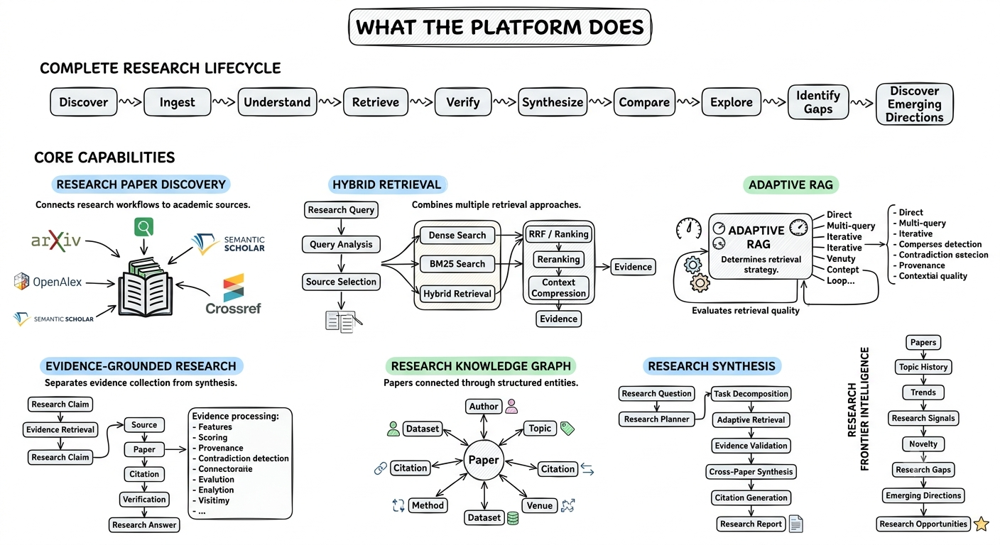
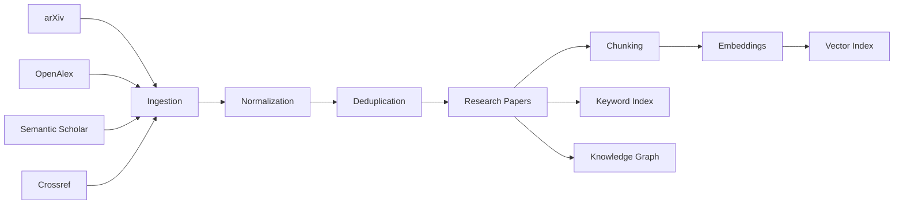
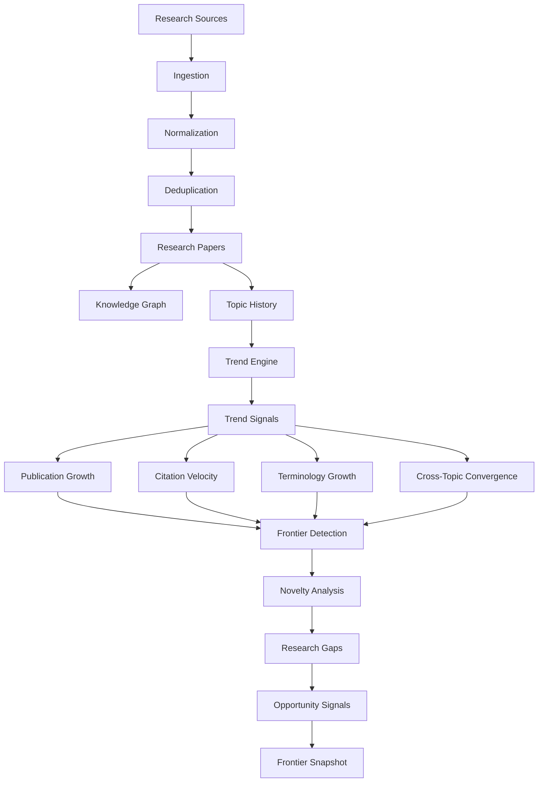

# AI Research Assistant

### AI-powered research discovery, adaptive retrieval, evidence-grounded analysis, and research frontier intelligence for AI research papers.

<p align="center">
  
</p>

<p align="center">
  <a href="https://ai-research-assistant-wine.vercel.app">Live Application</a> •
  <a href="https://youtu.be/EnA22WtY6Sc">Watch Demo</a> •
  <a href="https://ai-research-assistant-xtjz.onrender.com/docs">API Documentation</a>
</p>

---

## Overview

**AI Research Assistant** is a production-oriented research intelligence platform designed to help researchers discover, retrieve, analyze, connect, and synthesize AI research papers.

Instead of treating research as a simple semantic-search problem, the platform combines:

* Research paper ingestion
* Structured document and knowledge management
* Dense and lexical retrieval
* Hybrid retrieval and Reciprocal Rank Fusion
* Adaptive RAG orchestration
* Evidence collection and attribution
* Multi-step research planning
* Cross-paper synthesis
* Knowledge graph construction
* Research reports
* Retrieval and generation evaluation
* Self-improvement workflows
* Research frontier intelligence

The system separates **reusable retrieval infrastructure** from **adaptive retrieval intelligence**, allowing the same retrieval foundation to support simple search, complex research workflows, graph-based exploration, and iterative RAG strategies.

---

# Platform at a Glance

```text
Research Sources
      │
      ▼
┌───────────────────────┐
│ Ingestion             │
│ discovery • parsing   │
│ normalization • dedup │
└──────────┬────────────┘
           │
           ▼
┌───────────────────────┐
│ Knowledge Layer       │
│ papers • chunks       │
│ embeddings • graph    │
└──────────┬────────────┘
           │
           ▼
┌───────────────────────┐
│ Retrieval             │
│ dense • BM25 • hybrid │
│ RRF • reranking       │
└──────────┬────────────┘
           │
           ▼
┌───────────────────────┐
│ Adaptive RAG          │
│ routing • planning    │
│ iterative retrieval   │
└──────────┬────────────┘
           │
           ▼
┌───────────────────────┐
│ Evidence              │
│ claims • attribution  │
│ validation • coverage │
└──────────┬────────────┘
           │
           ▼
┌───────────────────────┐
│ Research Intelligence │
│ synthesis • citations │
│ reports • analysis    │
└──────────┬────────────┘
           │
           ▼
┌───────────────────────┐
│ Frontier Intelligence │
│ trends • novelty      │
│ gaps • opportunities  │
└──────────┬────────────┘
           │
           ▼
        Researcher
```

---

# Demo

<p align="center">
  
</p>

### Video Demo

<p align="center">
  <a href="https://youtu.be/EnA22WtY6Sc">
    
  </a>
</p>

---

# Live System

| Component         | URL                                                          |
| ----------------- | ------------------------------------------------------------ |
| Web Application   | https://ai-research-assistant-wine.vercel.app                |
| Backend API       | https://ai-research-assistant-xtjz.onrender.com              |
| API Documentation | https://ai-research-assistant-xtjz.onrender.com/docs         |
| OpenAPI Schema    | https://ai-research-assistant-xtjz.onrender.com/openapi.json |
| GitHub Repository | https://github.com/garimakumari44/ai_research_assistant      |

---

# What the Platform Does

<p align="center">
  
</p>

## 1. Research Paper Discovery

The ingestion layer connects the platform to research sources and normalizes research metadata into a unified representation.

Supported research providers include:

* arXiv
* OpenAlex
* Semantic Scholar
* Crossref

The ingestion pipeline is designed around:

```text
Source
  ↓
Discovery
  ↓
Parsing
  ↓
Normalization
  ↓
Deduplication
  ↓
Document Storage
  ↓
Chunking
  ↓
Indexing
```

---

## 2. Hybrid Research Retrieval

Research questions often require more than semantic similarity.

The retrieval system combines:

* Dense vector retrieval
* BM25 lexical retrieval
* Hybrid retrieval
* Reciprocal Rank Fusion
* Metadata filtering
* Ranking
* Cross-encoder reranking
* Context compression
* Evidence extraction

This allows the system to handle both:

```text
Semantic queries
"How does retrieval augmentation improve reasoning?"
```

and:

```text
Exact research terminology
"retrieval-augmented generation"
"chain-of-thought"
"Mixture of Experts"
```

---

## 3. Adaptive RAG

The platform does not force every question through the same retrieval strategy.

The adaptive RAG layer analyzes the query and dynamically selects an appropriate strategy.

Possible strategies include:

* Direct retrieval
* Multi-query retrieval
* Corrective retrieval
* Iterative retrieval
* Graph-augmented retrieval

The objective is to make retrieval **query-dependent rather than pipeline-dependent**.

---

## 4. Evidence-Grounded Research

Research answers are built around evidence rather than unsupported generation.

The evidence pipeline follows:

```text
Question
   ↓
Claims
   ↓
Evidence Retrieval
   ↓
Evidence Collection
   ↓
Attribution
   ↓
Validation
   ↓
Coverage / Confidence
   ↓
Synthesis
```

This provides a foundation for traceable research outputs.

---

## 5. Knowledge Graph

The graph layer connects research entities such as:

* Papers
* Authors
* Topics
* Concepts
* Methods
* Research relationships

This enables graph-aware research exploration and provides an additional retrieval signal beyond vector similarity.

---

## 6. Research Synthesis

Complex research questions can be decomposed into multiple research tasks.

The research pipeline supports:

```text
Research Question
       ↓
Planning
       ↓
Task Decomposition
       ↓
Adaptive Retrieval
       ↓
Evidence Collection
       ↓
Evidence Validation
       ↓
Cross-Paper Synthesis
       ↓
Citation Generation
       ↓
Research Report
```

---

# System Architecture

The platform is organized around six major systems:

```text
┌─────────────────────────────────────────────┐
│              AI Research Assistant          │
├─────────────────────────────────────────────┤
│                                             │
│  1. Ingestion                               │
│     ↓                                       │
│  2. Knowledge                               │
│     ↓                                       │
│  3. Retrieval                               │
│     ↓                                       │
│  4. Research Intelligence                  │
│     ↓                                       │
│  5. Frontier Intelligence                  │
│     ↓                                       │
│  6. Evaluation / Learning                  │
│                                             │
└─────────────────────────────────────────────┘
```

### Architecture Diagram

<p align="center">
  
</p>

---

# Architecture Philosophy

A central design principle is the separation between:

### Retrieval Infrastructure

Reusable mechanisms responsible for:

* Query processing
* Dense retrieval
* BM25
* Hybrid retrieval
* RRF
* Ranking
* Reranking
* Filtering
* Evidence retrieval

and:

### Retrieval Intelligence

Adaptive mechanisms responsible for:

* Query classification
* Retrieval planning
* Strategy selection
* Iterative retrieval
* Self-reflection
* Corrective retrieval
* Graph-aware retrieval
* Evidence sufficiency

This separation makes the retrieval stack reusable across different research workflows.

---

# Research Data Pipeline



The ingestion architecture creates a common research corpus from heterogeneous sources.

---

# Knowledge Layer

The knowledge layer transforms raw research documents into structured searchable knowledge.

```text
Research Paper
      │
      ├── Metadata
      │
      ├── Sections
      │
      ├── Chunks
      │
      ├── Embeddings
      │
      ├── Keywords
      │
      ├── Entities
      │
      └── Relationships
```

Core responsibilities include:

* Document management
* Chunking
* Embedding generation
* Vector indexing
* Keyword indexing
* Graph construction

---

# Retrieval Architecture

The reusable retrieval infrastructure lives under:

```text
backend/app/retrieval/
```

The retrieval layer contains components for:

```text
Query Analysis
      ↓
Query Classification
      ↓
Query Rewriting
      ↓
Source Selection
      ↓
Dense Retrieval ─────┐
                     │
BM25 Retrieval ──────┤
                     ▼
               Hybrid Retrieval
                     │
                     ▼
              Reciprocal Rank Fusion
                     │
                     ▼
                  Ranking
                     │
                     ▼
                Reranking
                     │
                     ▼
               Compression
                     │
                     ▼
                  Evidence
```

---

# Adaptive RAG Architecture

Adaptive retrieval intelligence lives under:

```text
backend/app/adaptive_rag/
```

The high-level flow is:

```text
                    Query
                      │
                      ▼
               Query Analysis
                      │
                      ▼
                RAG Planning
                      │
                      ▼
              Adaptive Router
                      │
       ┌──────────────┼──────────────┐
       ▼              ▼              ▼
    Direct        Multi-Query     Corrective
   Retrieval       Retrieval      Retrieval
       │              │              │
       └──────────────┼──────────────┘
                      │
                      ▼
             Ranking / Reranking
                      │
                      ▼
                   Evidence
                      │
                      ▼
                 Evaluation
                      │
                      ▼
                Self-Reflection
                      │
                ┌─────┴─────┐
                │           │
             Sufficient?    No
                │           │
               Yes          └──────► Iterate
                │
                ▼
              Answer
```

The adaptive controller can therefore treat retrieval as a decision-making problem rather than a fixed sequence of operations.

---

# Evidence Architecture

Evidence is treated as a first-class research object.

```text
Claim
  │
  ▼
Evidence Retrieval
  │
  ▼
Evidence Collection
  │
  ▼
Source Attribution
  │
  ▼
Evidence Validation
  │
  ├── Coverage
  ├── Confidence
  └── Source Quality
  │
  ▼
Research Synthesis
```

This architecture supports traceable answers and research reports where claims can be connected to supporting sources.

---

# Research Intelligence

The research intelligence layer orchestrates multi-step research workflows.

```text
Research Question
       │
       ▼
Research Planner
       │
       ▼
Task Decomposition
       │
       ▼
Adaptive Retrieval
       │
       ▼
Evidence Collection
       │
       ▼
Evidence Validation
       │
       ▼
Cross-Paper Synthesis
       │
       ▼
Citation Generation
       │
       ▼
Research Report
```

The research layer is implemented under:

```text
backend/app/research/
```

It contains components for:

* Research planning
* Research pipelines
* Evidence handling
* Citation management
* Retrieval integration
* Synthesis
* Report generation

---

# Knowledge Graph

The graph subsystem lives under:

```text
backend/app/graph/
```

It provides:

* Graph construction
* Entity extraction
* Relationship extraction
* Graph traversal
* Graph queries
* Research relationship modeling

Conceptually:

```text
              Paper
             /     \
            /       \
        Author      Topic
           |          |
         Method ─── Concept
            \         /
             \       /
              Related
              Papers
```

Graph relationships can provide additional context for research discovery and graph-augmented retrieval.

---

# Frontier Intelligence

The frontier intelligence layer is designed to identify emerging research directions from the research corpus.

The current architecture combines:

* Trend analysis
* Topic evolution
* Novelty signals
* Research gaps
* Frontier detection
* Evidence-backed opportunity analysis

Conceptual flow:

```text
Paper
  ↓
Topic
  ↓
Topic History
  ↓
Trend Signals
  ↓
Growth / Novelty / Momentum
  ↓
Frontier Detection
  ↓
Research Gaps
  ↓
Research Opportunities
  ↓
Frontier Snapshot
```

The frontier subsystem lives under:

```text
backend/app/frontier/
```

with modules including:

```text
detector.py
gaps.py
novelty.py
service.py
trends.py
```

### Frontier Intelligence Architecture



The frontier layer is intended to evolve toward increasingly sophisticated research trend and opportunity analysis as more historical research data becomes available.

---

# LLM and Generation Layer

The platform supports multiple LLM providers through an abstraction layer.

```text
                    LLM Provider Interface
                             │
          ┌──────────────────┼──────────────────┐
          │                  │                  │
       OpenAI            OpenRouter           Gemini
          │                  │                  │
          └──────────────────┼──────────────────┘
                             │
                           Ollama
```

Provider implementations are located under:

```text
backend/app/llm/providers/
```

This abstraction allows model providers to be changed without coupling the research pipeline to a single vendor.

---

# Evaluation

Evaluation is treated as part of the platform architecture rather than an external afterthought.

The evaluation layer includes:

### Retrieval Metrics

* Precision
* Recall
* MRR
* nDCG

### Generation Metrics

* Faithfulness
* Relevance
* Contextual precision
* Contextual recall

### System Metrics

* Retrieval latency
* Generation latency
* End-to-end latency

Supported evaluation frameworks include:

* RAGAS
* DeepEval

Evaluation components live under:

```text
backend/app/evaluation/
```

---

# Self-Improvement

The platform contains a self-improvement subsystem designed to learn from research execution and evaluation signals.

```text
Research Execution
       ↓
Trace Collection
       ↓
Evaluation
       ↓
Feedback
       ↓
Learning Signals
       ↓
Strategy Improvement
```

The subsystem lives under:

```text
backend/app/self_improvement/
```

This creates a foundation for improving retrieval and research workflows using observed system behavior.

---

# Observability

Observability is implemented as a separate platform concern.

The monitoring layer includes:

* Health checks
* Structured logging
* Metrics
* Prometheus integration
* Tracing
* Alerts

Located under:

```text
backend/app/monitoring/
```

The goal is to make important stages measurable:

```text
Request
  ↓
Planning
  ↓
Retrieval
  ↓
Reranking
  ↓
Evidence
  ↓
Generation
  ↓
Response
```

This makes latency and execution behavior easier to inspect across the research pipeline.

---

# Security

Security components are organized separately from the research logic.

Current areas include:

* CORS
* CSRF protection
* Encryption
* Security headers
* Secret management

Located under:

```text
backend/app/security/
```

The architecture keeps security concerns isolated so they can evolve independently from retrieval and research intelligence.

---

# Frontend Architecture

The frontend is built with:

* Next.js
* React
* TypeScript
* Tailwind CSS
* TanStack Query

Major application areas include:

```text
Dashboard
│
├── Assistant
├── Collections
├── Explore
├── Frontier
├── Graph
├── Papers
├── Projects
└── Reports
```

The frontend communicates with the FastAPI backend through the `/api/v1` API layer.

---

# Assistant Interface

The Assistant is the primary research interaction surface.

It combines:

```text
User Query
    ↓
Query Understanding
    ↓
Adaptive Retrieval
    ↓
Evidence
    ↓
LLM Synthesis
    ↓
Research Answer
```

The interface is designed around researcher questions rather than exposing retrieval internals directly.

---

# Research Interface

The Research interface supports structured research workflows involving:

* Research planning
* Multi-step questions
* Evidence gathering
* Cross-paper analysis
* Citation-aware synthesis
* Research reports

The goal is to move from:

> "Search for a paper"

toward:

> "Investigate a research question."

---

# Frontier Interface

The Frontier interface exposes research trend and opportunity signals.

Conceptually:

```text
Research Corpus
      ↓
Topic Trends
      ↓
Novelty Signals
      ↓
Emerging Directions
      ↓
Research Gaps
      ↓
Frontier View
```

Frontend components are organized under the frontier feature area, including the frontier overview interface.

---

# Graph Interface

The Graph interface provides a visual representation of relationships within the research corpus.

It can be used to explore:

* Papers
* Topics
* Authors
* Concepts
* Methods
* Related research

This provides a complementary exploration mechanism to traditional search.

---

# Reports

Research reports combine:

* Research planning
* Retrieved evidence
* Source attribution
* Cross-paper synthesis
* Citations
* Structured conclusions

The report layer is designed to turn multi-step retrieval into a reusable research artifact.

---

# Collections

Collections provide a way to organize research documents and create focused research corpora.

A collection can act as a controlled knowledge space for:

* Specific research topics
* Research projects
* Literature reviews
* Experimental areas
* Research teams

---

# API Architecture

The backend is built with **FastAPI** and exposes a versioned API.

```text
/api/v1
```

Major route groups include:

```text
/api/v1/auth
/api/v1/papers
/api/v1/documents
/api/v1/collections
/api/v1/retrieval
/api/v1/adaptive-rag
/api/v1/research
/api/v1/reports
/api/v1/explore
/api/v1/graph
/api/v1/frontier
/api/v1/self-improvement
/api/v1/health
```

Interactive API documentation:

https://ai-research-assistant-xtjz.onrender.com/docs

OpenAPI schema:

https://ai-research-assistant-xtjz.onrender.com/openapi.json

---

# Technology Stack

## Backend

| Technology            | Purpose                  |
| --------------------- | ------------------------ |
| Python                | Core backend language    |
| FastAPI               | API framework            |
| Pydantic              | Validation and schemas   |
| SQLAlchemy            | Database access          |
| PostgreSQL            | Persistent storage       |
| Redis                 | Caching / infrastructure |
| FAISS                 | Vector indexing          |
| BM25                  | Lexical retrieval        |
| Sentence Transformers | Embeddings               |
| Cross-Encoder         | Reranking                |
| RAGAS                 | RAG evaluation           |
| DeepEval              | LLM evaluation           |
| Prometheus            | Metrics                  |
| Docker                | Containerization         |

## Frontend

| Technology     | Purpose                 |
| -------------- | ----------------------- |
| Next.js        | Web application         |
| React          | UI                      |
| TypeScript     | Type safety             |
| Tailwind CSS   | Styling                 |
| TanStack Query | Server-state management |

## Research Infrastructure

| Component        | Role                           |
| ---------------- | ------------------------------ |
| arXiv            | Research discovery             |
| OpenAlex         | Scholarly metadata             |
| Semantic Scholar | Research metadata              |
| Crossref         | Scholarly metadata             |
| FAISS            | Dense vector search            |
| BM25             | Lexical search                 |
| Knowledge Graph  | Relationship-aware exploration |

---

# Local Development

## 1. Clone the Repository

```bash
git clone https://github.com/garimakumari44/ai_research_assistant.git
cd ai_research_assistant
```

The application source is located under:

```text
research-assistant/
```

---

## 2. Backend Setup

```bash
cd research-assistant/backend
```

Create a virtual environment:

```bash
python -m venv .venv
```

Activate on Windows:

```powershell
.venv\Scripts\Activate.ps1
```

Install dependencies:

```bash
pip install -r requirements.txt
```

Run the API:

```bash
uvicorn app.main:app --reload --port 8010
```

Backend:

```text
http://localhost:8010
```

API documentation:

```text
http://localhost:8010/docs
```

---

## 3. Frontend Setup

Open another terminal:

```bash
cd research-assistant/frontend
```

Install dependencies:

```bash
npm install
```

Run the development server:

```bash
npm run dev
```

Frontend:

```text
http://localhost:3000
```

---

# Docker

The project can also be run using Docker-based infrastructure.

The application architecture is designed around containerized backend and frontend services together with supporting infrastructure.

Typical development topology:

```text
                    Browser
                       │
                       ▼
                Next.js Frontend
                       │
                       ▼
                 FastAPI Backend
                       │
          ┌────────────┼────────────┐
          ▼            ▼            ▼
      PostgreSQL     Redis        FAISS
                                     
                       │
                       ▼
                LLM / Embedding
                  Providers
```

---

# Repository Structure

```text
ai_research_assistant/
│
├── README.md
│
├── docs/
│   └── img/
│       ├── adaptive_rag.png
│       ├── adaptive_rag (2).png
│       ├── AI Research Assistant System Architecture.png
│       ├── archi_2.png
│       ├── Assistant — Adaptive RAG & LLM Research Architecture (1).png
│       ├── assistant.png
│       ├── explore.png
│       ├── explore (2).png
│       ├── Explore Adaptive Retrieval Architecture.png
│       ├── frontier.png
│       ├── report.png
│       ├── research_assistant_gif.gif
│       └── system.png
│
└── research-assistant/
    │
    ├── backend/
    │   ├── app/
    │   │   ├── api/
    │   │   ├── adaptive_rag/
    │   │   ├── evaluation/
    │   │   ├── frontier/
    │   │   ├── graph/
    │   │   ├── ingestion/
    │   │   ├── knowledge/
    │   │   ├── llm/
    │   │   ├── monitoring/
    │   │   ├── research/
    │   │   ├── retrieval/
    │   │   ├── security/
    │   │   └── self_improvement/
    │   │
    │   ├── tests/
    │   ├── requirements.txt
    │   └── ...
    │
    └── frontend/
        ├── app/
        ├── components/
        ├── lib/
        ├── public/
        ├── types/
        ├── Dockerfile
        ├── package.json
        └── ...
```

---

# Backend Architecture

```text
backend/
└── app/
    │
    ├── api/
    │   └── routes/
    │       ├── adaptive_rag
    │       ├── assistant
    │       ├── auth
    │       ├── collections
    │       ├── documents
    │       ├── explore
    │       ├── frontier
    │       ├── graph
    │       ├── health
    │       ├── papers
    │       ├── reports
    │       ├── research
    │       ├── retrieval
    │       └── self_improvement
    │
    ├── ingestion/
    │   ├── documents/
    │   ├── processing/
    │   └── providers/
    │
    ├── knowledge/
    │   ├── chunking/
    │   ├── documents/
    │   ├── embeddings/
    │   └── indexing/
    │
    ├── retrieval/
    │   ├── query/
    │   ├── sources/
    │   ├── dense/
    │   ├── bm25/
    │   ├── hybrid/
    │   ├── ranking/
    │   ├── reranking/
    │   ├── compression/
    │   ├── evidence/
    │   └── filters/
    │
    ├── adaptive_rag/
    │   ├── controller/
    │   ├── planner/
    │   ├── router/
    │   ├── orchestration/
    │   ├── policies/
    │   ├── routing/
    │   ├── strategies/
    │   ├── evaluation/
    │   ├── evidence/
    │   ├── observability/
    │   └── self_reflection/
    │
    ├── research/
    │   ├── planner/
    │   ├── pipeline/
    │   ├── citation/
    │   ├── evidence/
    │   ├── retrieval/
    │   ├── reports/
    │   └── synthesis/
    │
    ├── graph/
    │   ├── builder/
    │   ├── extractors/
    │   ├── models/
    │   ├── queries/
    │   ├── schemas/
    │   ├── service/
    │   └── traversal/
    │
    ├── frontier/
    │   ├── detector.py
    │   ├── gaps.py
    │   ├── novelty.py
    │   ├── service.py
    │   └── trends.py
    │
    ├── evaluation/
    │
    ├── self_improvement/
    │
    ├── monitoring/
    │
    ├── security/
    │
    └── llm/
        └── providers/
            ├── openai
            ├── openrouter
            ├── gemini
            └── ollama
```

---

# Researcher Workflow

The intended workflow is:

```text
1. Discover
      ↓
2. Collect
      ↓
3. Organize
      ↓
4. Search
      ↓
5. Retrieve
      ↓
6. Investigate
      ↓
7. Validate Evidence
      ↓
8. Connect Research
      ↓
9. Synthesize
      ↓
10. Identify Emerging Directions
      ↓
11. Generate Research Output
```

The platform therefore combines the functionality of:

```text
Research Search
       +
RAG System
       +
Research Assistant
       +
Knowledge Graph
       +
Research Intelligence
       +
Frontier Analysis
```

---

# Core Design Principles

## 1. Retrieval First

Generation should operate over retrieved research evidence rather than relying entirely on model memory.

## 2. Evidence as a First-Class Object

Claims should be connected to supporting research evidence.

## 3. Adaptive Retrieval

Different research questions require different retrieval strategies.

## 4. Modular Architecture

Ingestion, knowledge, retrieval, research, frontier intelligence, evaluation, and monitoring remain independently extensible.

## 5. Evaluation-Driven Development

Retrieval and generation quality should be measurable.

## 6. Observable AI Systems

Research execution should expose enough telemetry to understand system behavior and latency.

## 7. Provider Independence

LLM and embedding providers should remain replaceable through abstraction layers.

## 8. Research-Oriented UX

The interface should help researchers investigate questions rather than simply return search results.

---

# Long-Term Architecture

The platform is designed to evolve from a research assistant into a broader research intelligence system.

```text
                    Research Corpus
                           │
                           ▼
                    Knowledge Layer
                           │
             ┌─────────────┼─────────────┐
             ▼             ▼             ▼
         Retrieval      Graph        Research
             │             │             │
             └─────────────┼─────────────┘
                           ▼
                    Adaptive RAG
                           │
                           ▼
                   Evidence Engine
                           │
                           ▼
                 Research Intelligence
                           │
                           ▼
                 Frontier Intelligence
                           │
                           ▼
                  Researcher Workflow
```

The architecture is intentionally designed so that additional research domains, data providers, retrieval strategies, models, and evaluation methods can be added without redesigning the entire platform.

---

# Current Research Focus

The current platform is primarily focused on **AI research papers**.

The architecture is designed to support broader research corpora over time, including additional scholarly domains and specialized knowledge sources.

---

# Frontier Direction

The frontier intelligence subsystem is intended to progressively support deeper analysis of:

* Emerging research topics
* Topic growth
* Novelty
* Research gaps
* Cross-topic convergence
* Method evolution
* Research opportunities

As the underlying research corpus grows, these signals can become increasingly useful for understanding how research areas evolve.

---

# Project Status

### Implemented

* Research paper ingestion
* Research metadata normalization
* Document processing
* Chunking
* Embeddings
* Vector indexing
* BM25 retrieval
* Hybrid retrieval
* Reciprocal Rank Fusion
* Reranking
* Adaptive RAG architecture
* Evidence handling
* Research planning
* Research synthesis
* Knowledge graph infrastructure
* Frontier intelligence foundation
* Evaluation infrastructure
* Self-improvement infrastructure
* Monitoring and observability
* FastAPI backend
* Next.js frontend
* Docker-based deployment architecture

### Active Development

The platform continues to evolve around:

* More robust research evaluation
* Expanded frontier intelligence
* Improved graph-aware retrieval
* More research providers
* Better evidence validation
* More advanced self-improvement workflows
* Expanded observability
* Research workflow refinement

---

# Project Vision

The long-term goal is to build an AI research system that does more than retrieve papers.

It should help researchers:

```text
Discover
   ↓
Understand
   ↓
Connect
   ↓
Evaluate
   ↓
Synthesize
   ↓
Identify Gaps
   ↓
Explore Emerging Directions
```

The core idea is to combine **retrieval infrastructure, adaptive reasoning, evidence grounding, knowledge graphs, evaluation, and research intelligence** into a single extensible research platform.

---

# Why This Architecture

Traditional research search systems generally optimize for:

```text
Query → Similar Papers
```

This platform is designed around:

```text
Research Question
        ↓
Question Understanding
        ↓
Adaptive Retrieval
        ↓
Evidence
        ↓
Validation
        ↓
Cross-Paper Reasoning
        ↓
Research Synthesis
        ↓
Knowledge Connections
        ↓
Frontier Signals
```

This architectural shift allows the platform to move from a conventional search experience toward a more complete **AI research workflow**.

---

# Repository

GitHub:

https://github.com/garimakumari44/ai_research_assistant

Live application:

https://ai-research-assistant-wine.vercel.app

API:

https://ai-research-assistant-xtjz.onrender.com

---

# Author

**Garima Kumari**

B.A. (Hons.) Economics
Miranda House, University of Delhi

Interested in:

* AI Engineering
* Machine Learning
* NLP
* Reinforcement Learning
* Multi-Agent Systems
* AI Research Infrastructure

---

<p align="center">
  Built as a production-oriented AI research platform.
</p>
