# AI Research Assistant — Technical Architecture

> Detailed component and data-flow architecture for the **AI Research Assistant** research-intelligence platform.

---

## 1. Architecture Overview

The **AI Research Assistant** is a layered research-intelligence platform that combines:

* A **Next.js frontend** for exploration, research, reports, and knowledge-graph workflows.
* A **FastAPI `/api/v1` application layer** for authentication and API orchestration.
* A **Research Intelligence layer** responsible for planning, retrieval, evidence assembly, LLM generation, and report creation.
* A **Retrieval / AI infrastructure layer** containing dense vector search, sparse keyword search, hybrid retrieval, reranking, and external LLM access.
* A **PostgreSQL data layer** for persistent application, document, research, and knowledge-graph data.
* A **FAISS dense retrieval layer** for normalized embedding vectors and similarity search.

The architecture separates **persistent relational data** from **vector-search infrastructure**.

PostgreSQL stores application state, document metadata, research state, chunks, and knowledge-graph data, while FAISS stores and searches normalized embedding vectors.

---

# 2. High-Level Architecture

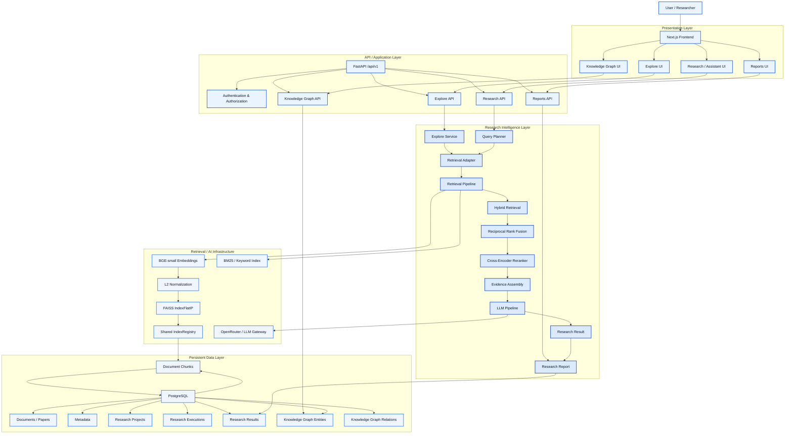

---

# 3. Architectural Layers

## 3.1 Presentation Layer

The presentation layer is implemented with **Next.js** and provides the researcher-facing application.

### Explore UI

The Explore interface supports fast document and knowledge-base discovery.

It is primarily retrieval-oriented and can operate without an LLM for basic browsing and source discovery.

Typical flow:

```text
User Query
    ↓
Explore API
    ↓
Explore Service
    ↓
Retrieval
    ↓
Ranked Sources
    ↓
Interactive Exploration
```

### Research / Assistant UI

The Research / Assistant interface provides the primary research workflow.

It submits a research question to the backend, where the question can be planned, decomposed, retrieved against the knowledge base, grounded in evidence, and synthesized by the LLM pipeline.

```text
Research Question
        ↓
Query Planner
        ↓
Retrieval Adapter
        ↓
Retrieval Pipeline
        ↓
Evidence Assembly
        ↓
LLM Pipeline
        ↓
Research Result
```

### Reports UI

The Reports interface presents persisted research outputs as exportable research reports.

Reports are downstream of research executions and use the assembled evidence and generated research result.

### Knowledge Graph UI

The Knowledge Graph interface exposes relationships between research entities such as:

* Papers
* Authors
* Topics
* Citations
* Research entities

---

# 4. API / Application Layer

The backend exposes the application through **FastAPI** under:

```text
/api/v1
```

### Responsibilities

* Authentication and authorization
* Request validation
* API routing
* Research orchestration
* Explore orchestration
* Report access and generation
* Knowledge-graph access
* Persistence coordination
* Integration with retrieval services
* Integration with LLM services

The application layer remains separate from low-level retrieval implementations.

API routes should **not directly manage**:

* FAISS
* BM25
* RRF
* Cross-Encoder reranking
* Embedding models
* External LLM providers

Instead, these capabilities are exposed through application and domain interfaces.

---

# 5. Research Intelligence Layer

The Research Intelligence layer contains the core research workflow.

---

## 5.1 Explore Service

The Explore Service provides retrieval-first discovery.

### Responsibilities

* Accept exploration queries
* Execute retrieval
* Apply ranking
* Return relevant sources
* Support interactive source exploration

The Explore path is intentionally lighter than full research synthesis.

```text
Explore Request
      ↓
Explore Service
      ↓
Retrieval
      ↓
Ranked Sources
      ↓
Interactive Exploration
```

---

## 5.2 Research Pipeline

The Research Pipeline is the main orchestration layer for research generation.

Conceptually:

```text
Question
   ↓
Plan
   ↓
Retrieve
   ↓
Rerank
   ↓
Evidence Assembly
   ↓
Synthesize
   ↓
Research Result
   ↓
Research Report
```

### Major components

1. Query Planner
2. Retrieval Adapter
3. Retrieval Pipeline
4. Evidence Assembly
5. LLM Pipeline
6. Research Result
7. Research Report

---

## 5.3 Query Planner

The Query Planner converts a research question into a retrieval plan.

A complex research question may be decomposed into multiple sub-queries.

```text
Research Question
        ↓
Query Analysis
        ↓
Sub-query / Retrieval Plan
        ↓
Retrieval Adapter
```

The planner should remain independent of the underlying retrieval implementation.

This allows retrieval infrastructure to evolve without coupling planning logic to a particular search engine.

---

## 5.4 Retrieval Adapter

The Retrieval Adapter provides a uniform interface between the research pipeline and retrieval infrastructure.

This abstraction allows the research pipeline to request evidence without depending directly on:

* FAISS
* BM25
* Metadata filters
* Specific embedding implementations
* Individual retrieval strategies

Conceptually:

```text
Research Pipeline
        ↓
Retrieval Adapter
        ↓
Retrieval Pipeline
        ├── Dense Retrieval
        ├── BM25 / Keyword Retrieval
        └── Metadata Filtering
```

---

## 5.5 Evidence Assembly

Evidence Assembly converts ranked retrieval results into structured context for generation.

### Responsibilities

* Select high-quality evidence
* Preserve document/chunk identity
* Maintain source metadata
* Construct grounded context
* Preserve citation information
* Prepare context for the LLM pipeline

The key invariant is:

> Generated research should be grounded in retrieved evidence rather than relying solely on the model's prior knowledge.

---

## 5.6 LLM Pipeline

The LLM Pipeline is responsible for evidence-grounded generation.

It receives:

* Research question
* Retrieval plan
* Retrieved evidence
* Source metadata
* Relevant citations

and produces the research result.

```text
Evidence
   ↓
Prompt Construction
   ↓
LLM Gateway
   ↓
Generated Research Result
```

The external model gateway is **OpenRouter**, which provides access to configured LLM providers and models.

---

## 5.7 Research Result

A Research Result represents the grounded answer produced by the research pipeline.

It should retain enough information to connect the generated answer back to the evidence used to produce it.

Typical conceptual fields include:

| Field              | Purpose                        |
| ------------------ | ------------------------------ |
| Research Question  | Original user question         |
| Generated Answer   | Grounded research response     |
| Sources            | Retrieved source references    |
| Citations          | Evidence provenance            |
| Execution Metadata | Pipeline execution information |
| Timestamp          | Creation/update time           |
| Status             | Execution state                |

---

## 5.8 Research Report

A Research Report is the presentation/export layer for a completed research result.

```text
Research Result
      ↓
Report Generation
      ↓
Research Report
```

Reports should preserve evidence provenance and citations so that researchers can inspect the basis of generated findings.

---

# 6. Retrieval / AI Infrastructure

The retrieval subsystem uses a multi-stage retrieval architecture.

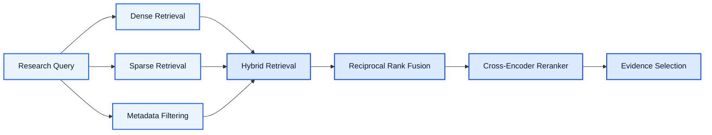

---

## 6.1 Embedding Model

The architecture uses **BGE-small** embeddings for document chunks and queries.

```text
Document Chunk
      ↓
BGE-small Encoder
      ↓
Embedding Vector
      ↓
Normalization
```

Query embeddings are generated using the same embedding space.

---

## 6.2 Normalized Vectors

Vectors are normalized before similarity search.

This allows inner-product search to behave as cosine-similarity search when vectors are unit normalized.

```text
Embedding
    ↓
L2 Normalization
    ↓
Normalized Vector
```

---

## 6.3 FAISS Index

The dense vector store is represented by a:

```text
FAISS IndexFlatIP
```

Architecture:

```text
Normalized Vectors
        ↓
FAISS IndexFlatIP
        ↓
Dense Candidate Retrieval
```

`IndexFlatIP` performs exact inner-product similarity search over indexed vectors.

When vectors are normalized, the inner product corresponds to cosine similarity.

---

## 6.4 Shared IndexRegistry

The Shared IndexRegistry provides the common lifecycle and lookup layer for retrieval indexes.

It acts as the shared source of truth for:

* Dense vector index access
* Vector IDs
* Index metadata
* Index lifecycle
* Lookup between vector IDs and document/chunk records

The registry prevents separate retrieval paths from accidentally creating independent or inconsistent indexes.

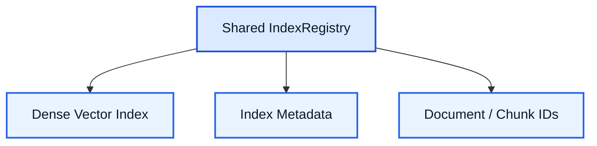

---

## 6.5 Document / Chunk IDs

Vector indexes must resolve retrieved vector identifiers back to document and chunk records.

The mapping is:

```text
Vector ID
    ↓
Document / Chunk ID
    ↓
Document Chunk
    ↓
Metadata + Source
```

This mapping is critical for:

* Citation generation
* Evidence provenance
* Source inspection
* Research traceability

---

## 6.6 BM25 / Keyword Retrieval

The sparse retrieval path provides lexical matching.

```text
Query
  ↓
BM25 / Keyword Index
  ↓
Sparse Candidate Results
```

Sparse retrieval complements dense retrieval because exact terminology, identifiers, names, and domain-specific phrases may not always be captured optimally by semantic embeddings.

---

## 6.7 Metadata Filtering

Metadata filtering restricts retrieval using structured document attributes.

Possible filtering dimensions include:

* Paper/document identity
* Source metadata
* Topics
* Authors
* Document type
* Other indexed metadata

Metadata filtering is implemented as part of the retrieval pipeline rather than independently by individual API routes.

---

# 7. Hybrid Retrieval

The retrieval pipeline combines dense and sparse retrieval.

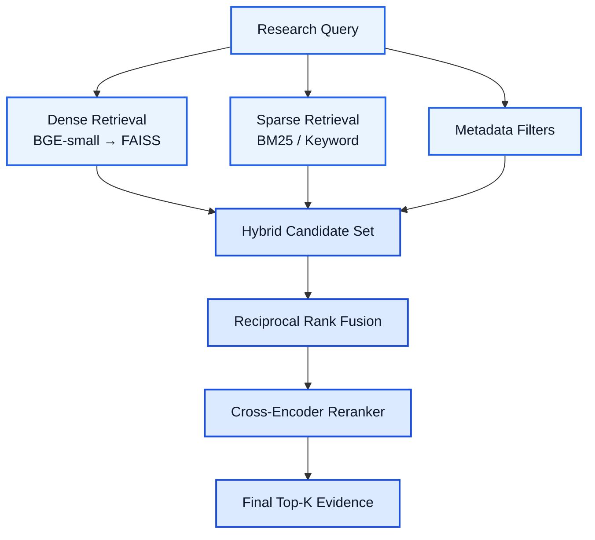

### Dense Retrieval

Finds semantically similar document chunks using normalized embedding vectors.

### Sparse Retrieval

Finds lexical matches using BM25 or keyword search.

### Hybrid Retrieval

Combines candidate sets from both retrieval strategies.

### Reciprocal Rank Fusion

RRF combines ranked lists into a unified ranking without requiring raw scores from different retrieval systems to be directly comparable.

### Cross-Encoder Reranking

The Cross-Encoder performs pairwise relevance evaluation between a query and candidate text.

```text
Query + Candidate Chunk
          ↓
    Cross-Encoder
          ↓
    Relevance Score
          ↓
    Final Top-K Ranking
```

This creates a multi-stage retrieval architecture:

```text
Candidate Generation
        ↓
Dense + Sparse
        ↓
Rank Fusion
        ↓
Precision Reranking
        ↓
Evidence Selection
```

---

# 8. Knowledge Graph Architecture

The Knowledge Graph provides structured relationships between research entities.

## Core Entity Types

* Paper
* Author
* Topic
* Citation
* Research Entity

Example relationships:

```text
Paper → written by → Author

Paper → belongs to → Topic

Paper → cites → Paper

Paper → associated with → Research Entity
```

The graph is persisted in PostgreSQL.

The Knowledge Graph UI accesses graph data through the FastAPI application layer rather than directly connecting to the database.

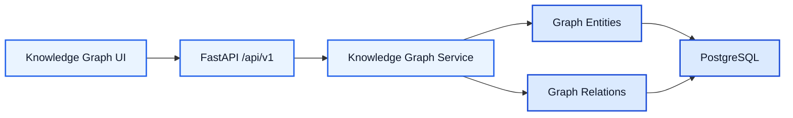

---

# 9. Data Layer

## PostgreSQL

PostgreSQL is the primary persistent relational data store.

It stores application state and structured research data rather than acting as the primary dense vector-search engine in this architecture.

### Main logical data domains

| Domain                        | Purpose                                                   |
| ----------------------------- | --------------------------------------------------------- |
| Users & Authentication        | User accounts, credentials, and authentication state      |
| Papers / Documents            | Research documents and source metadata                    |
| Document Chunks               | Chunked document content used for retrieval               |
| Metadata                      | Structured document/source metadata                       |
| Research Projects             | Persistent research workspace/project state               |
| Research Executions & Results | Execution state, generated answers, and research outputs  |
| Knowledge Graph Entities      | Papers, authors, topics, citations, and research entities |
| Knowledge Graph Relations     | Relationships between graph entities                      |
| Index Metadata                | Metadata required to maintain retrieval index consistency |

---

# 10. Vector Data vs Relational Data

A key architectural separation is:

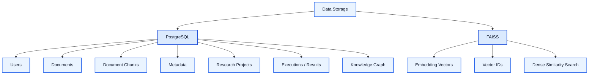

This separation allows relational persistence and dense retrieval to evolve independently.

---

# 11. End-to-End Research Data Flow

A complete research request follows this flow:

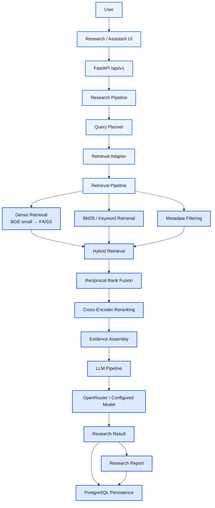

---

# 12. Explore Data Flow

Explore is optimized for source discovery rather than full synthesis.

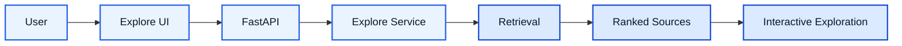

The Explore path can therefore provide useful retrieval results even when an LLM generation step is unnecessary.

---

# 13. Research / Assistant Data Flow

The Assistant workflow is more comprehensive:

```text
User Question
      ↓
Research / Assistant UI
      ↓
FastAPI
      ↓
Research Pipeline
      ↓
Query Planner
      ↓
Retrieval Adapter
      ↓
Retrieval Pipeline
      ↓
Dense + BM25 + Metadata Filters
      ↓
Hybrid Retrieval
      ↓
RRF
      ↓
Cross-Encoder Reranking
      ↓
Evidence Assembly
      ↓
LLM Pipeline
      ↓
Grounded Research Result
      ↓
Research UI / Reports
```

---

# 14. Report Data Flow

Reports consume completed research outputs.


The report layer should not independently invent research evidence.

Its source of truth is the completed research result and its associated evidence.

---

# 15. Authentication and Security

Authentication sits at the application boundary.

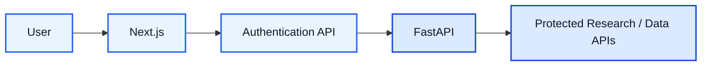

The backend must enforce authorization independently of frontend route protection.

### Security responsibilities

* Credential validation
* Token/session validation
* Protected API endpoints
* User-scoped research projects
* User-scoped research executions/results
* Secure handling of external LLM credentials
* Environment-based configuration
* No secrets committed to source control

---

# 16. Component Responsibilities

| Component            | Responsibility                                  |
| -------------------- | ----------------------------------------------- |
| Next.js Frontend     | User interaction and presentation               |
| Explore Service      | Retrieval-first exploration                     |
| Research Pipeline    | End-to-end research orchestration               |
| Query Planner        | Query analysis and decomposition                |
| Retrieval Adapter    | Uniform retrieval interface                     |
| Retrieval Pipeline   | Multi-stage retrieval execution                 |
| Dense Retrieval      | Semantic candidate generation                   |
| BM25 / Keyword       | Lexical candidate generation                    |
| Metadata Filter      | Structured retrieval constraints                |
| Hybrid Retrieval     | Dense/sparse candidate combination              |
| RRF                  | Rank-list fusion                                |
| Cross-Encoder        | Precision reranking                             |
| Evidence Assembly    | Grounded context construction                   |
| LLM Pipeline         | Evidence-grounded synthesis                     |
| OpenRouter           | External LLM gateway/provider access            |
| Shared IndexRegistry | Shared retrieval index lifecycle/lookup         |
| PostgreSQL           | Persistent relational application/research data |
| FAISS                | Dense vector similarity search                  |
| Knowledge Graph      | Structured research relationships               |
| Reports              | Presentable/exportable research outputs         |

---

# 17. Architectural Principles

## Separation of Concerns

Frontend, API, research orchestration, retrieval, AI inference, and persistence should remain independently testable.

## Shared Retrieval Infrastructure

All research retrieval paths should use the shared retrieval infrastructure and IndexRegistry rather than creating ad-hoc indexes.

## Evidence-First Generation

LLM synthesis should operate on explicitly assembled evidence.

## Provenance Preservation

Every retrieved chunk should remain traceable to its document/source metadata so that generated answers can provide citations.

## Multi-Stage Retrieval

Retrieval should progressively improve precision:

```text
Broad Candidate Generation
        ↓
Dense + Sparse
        ↓
Fusion
        ↓
Reranking
        ↓
Evidence Selection
```

## API Boundary

Frontend code should communicate through the FastAPI API rather than directly accessing:

* PostgreSQL
* FAISS
* External model providers

## Persistent Research State

Research projects, executions, results, and graph entities should remain persistent in PostgreSQL so workflows can be revisited and reported later.

---

# 18. Reliability and Consistency Requirements

The architecture depends on several important invariants.

## 18.1 Retrieval Index Consistency

Vector IDs must resolve correctly to document/chunk records.

```text
FAISS Vector ID
      ↓
IndexRegistry
      ↓
Document / Chunk ID
      ↓
PostgreSQL Document Chunk
```

## 18.2 Filter Consistency

Document and paper filters must use the identifier type expected by the underlying retrieval and persistence layers.

## 18.3 Shared Pipeline Consistency

Explore and Research should not silently maintain separate retrieval indexes when they are intended to operate over the same knowledge base.

## 18.4 Citation Consistency

Evidence selected for generation must retain its source identity through the complete pipeline:

```text
Retrieval
   ↓
Reranking
   ↓
Evidence Assembly
   ↓
LLM Prompt
   ↓
Research Result
   ↓
Report
```

---

# 19. Deployment View

The logical production deployment can be represented as:

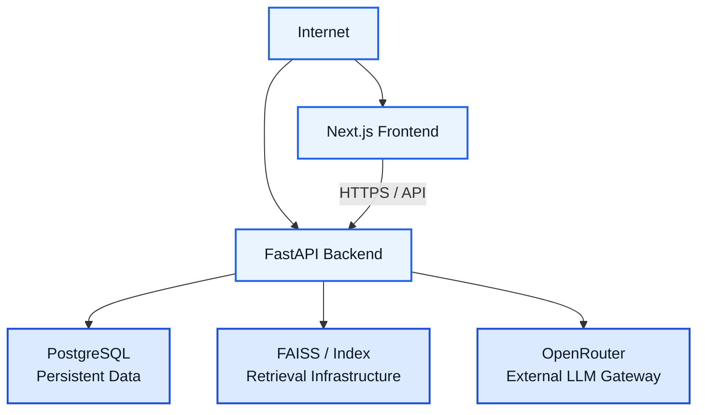

The frontend should contain only public configuration required for API communication.

Secrets and provider credentials belong on the backend.

---

# 20. Observability

The research pipeline should expose enough structured information to diagnose failures across stages.

Recommended execution-level observability:

```text
Request
  ↓
Authentication
  ↓
Planning
  ↓
Retrieval
  ↓
Fusion
  ↓
Reranking
  ↓
Evidence Assembly
  ↓
LLM
  ↓
Persistence
```

Each stage should ideally record:

* Execution status
* Duration
* Error information
* Input/output counts
* Retrieved source counts
* Reranked source counts
* LLM invocation status
* Persistence status

This makes it possible to distinguish retrieval failures from LLM, authentication, API, or persistence failures.

---

# 21. Testing Strategy

## Unit Tests

Test individual components:

* Query Planner
* Retrieval Adapter
* Dense Retrieval
* BM25 retrieval
* Metadata filtering
* RRF
* Cross-Encoder reranking
* Evidence Assembly
* LLM prompt construction

## Integration Tests

Test:

```text
API
 ↓
Research Pipeline
 ↓
Retrieval Infrastructure
 ↓
PostgreSQL
```

## End-to-End Tests

Test complete researcher workflows:

```text
Register / Login
      ↓
Explore
      ↓
Select / Inspect Sources
      ↓
Ask Research Question
      ↓
Generate Grounded Result
      ↓
Open Report
```

## Retrieval Validation

Use known documents and questions to verify:

* Relevant documents are retrieved.
* Filters are respected.
* Vector IDs resolve correctly.
* Hybrid retrieval combines candidate sets correctly.
* Reranking changes ordering appropriately when relevance differs.
* Citations map back to the correct source chunks.

---

# 22. Scalability Considerations

## API Scaling

Run multiple FastAPI instances behind a load balancer.

## Frontend Scaling

Deploy the Next.js application independently from the backend.

## Retrieval Scaling

The retrieval layer can evolve from a local FAISS deployment toward a dedicated vector-search service if dataset size or concurrency requires it.

## LLM Scaling

OpenRouter provides an abstraction over external model providers, allowing the configured model/provider to change without redesigning the research pipeline.

## Database Scaling

PostgreSQL can be scaled independently for persistent application and research state.

---

# 23. Failure Boundaries

The architecture intentionally creates clear failure boundaries.

## Authentication Failure

Stops the request before protected research operations.

## Retrieval Failure

Prevents or degrades evidence generation while keeping the API available for unrelated functionality.

## Reranking Failure

Can be handled as a retrieval-stage failure or degraded mode depending on application policy.

## LLM Failure

Should not erase successfully retrieved evidence.

The research execution should retain enough state to diagnose or retry generation.

## Persistence Failure

Should be reported independently from successful retrieval/generation so that transient database issues do not obscure the underlying research execution.

---

# 24. Architecture Summary

The AI Research Assistant follows a layered, evidence-grounded architecture:

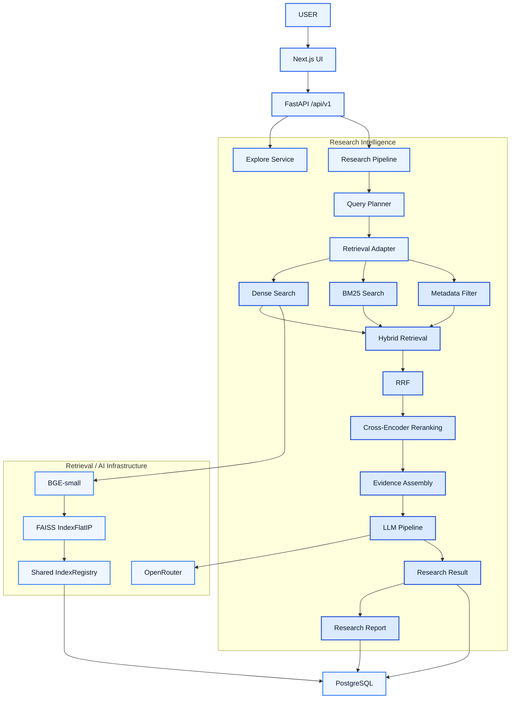

The central design goal is to keep **retrieval, evidence, generation, provenance, and persistence** connected through explicit interfaces.

This allows the system to provide:

* Fast exploration
* Structured research workflows
* Hybrid retrieval
* Evidence-grounded LLM answers
* Citation-aware research results
* Persistent research state
* Exportable research reports
* Knowledge-graph exploration
* Clear operational and failure boundaries

while maintaining traceability from generated output back to the underlying research sources.

---

## Architecture Principles at a Glance

```text
                    RESEARCH QUESTION
                           │
                           ▼
                    ┌──────────────┐
                    │ Query Planner│
                    └──────┬───────┘
                           │
                           ▼
                  ┌─────────────────┐
                  │ RetrievalAdapter│
                  └────────┬────────┘
                           │
              ┌────────────┼────────────┐
              ▼            ▼            ▼
           Dense         BM25       Metadata
           Search        Search       Filter
              │            │            │
              └────────────┼────────────┘
                           ▼
                  Hybrid Retrieval
                           │
                           ▼
                         RRF
                           │
                           ▼
                  Cross-Encoder
                    Reranking
                           │
                           ▼
                  Evidence Assembly
                           │
                           ▼
                    LLM Pipeline
                           │
                           ▼
                  Research Result
                           │
                           ▼
                  Research Report
                           │
                           ▼
                      PostgreSQL
```

### Core invariants

```text
Shared Retrieval Infrastructure
            +
Evidence-First Generation
            +
Provenance Preservation
            +
Persistent Research State
            +
Explicit API Boundaries
            =
Traceable Research Intelligence
```

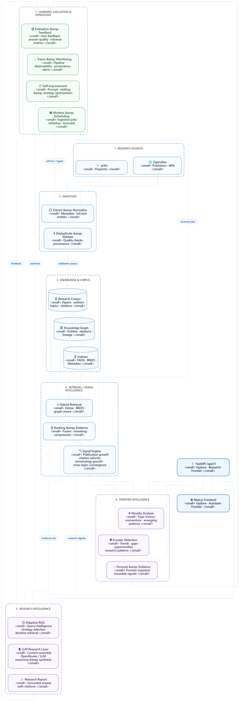