# AI Research Assistant — Adaptive RAG & LLM Research Architecture

## 1. Overview

The Assistant is the research-facing reasoning layer of the AI Research Assistant platform.

It sits above the Adaptive RAG system and transforms a user's research question into a grounded, evidence-backed response.

The Assistant does not independently search or invent evidence.

Instead, it delegates retrieval planning and orchestration to the Adaptive RAG system.

### High-Level Architecture

```mermaid
flowchart LR

    U[User]

    A[Assistant]

    API[Research / Assistant API]

    RS[Research Service]

    C[AdaptiveRAGController]

    P[AdaptiveRAGPlanner]

    R[Retrieval]

    K[Knowledge]

    G[Research Graph]

    F[Fusion / Ranking]

    RR[Reranking]

    E[Evidence Evaluator]

    AD[Adaptive Retrieval]

    CA[Context Assembly]

    GP[Evidence-Grounded Prompt]

    LLM[LLM / OpenRouter]

    S[Reasoning / Synthesis]

    OUT[Research Report / Assistant Answer]

    PV[Sources / Provenance]


    U --> A
    A --> API
    API --> RS
    RS --> C

    C --> P

    P --> R
    P --> K
    P --> G

    R --> F
    K --> F
    G --> F

    F --> RR
    RR --> E

    E -->|Insufficient| AD
    AD --> P

    E -->|Sufficient| CA

    CA --> GP
    GP --> LLM
    LLM --> S
    S --> OUT

    OUT --> PV
```

---

## 2. Architectural Responsibilities

The Assistant layer is responsible for:

- Accepting research questions.
- Passing research requests into the application service.
- Delegating retrieval planning to Adaptive RAG.
- Ensuring the LLM receives grounded research context.
- Producing synthesized research responses.
- Preserving sources and provenance.
- Separating retrieval from reasoning.

The Assistant is therefore a **reasoning and interaction layer**, not the primary retrieval engine.

---

# 3. Request Flow

The request begins with a user's research question.

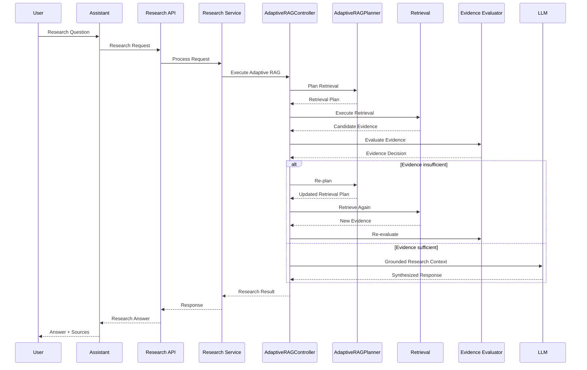

The application service remains intentionally thin.

The Adaptive RAG controller is the orchestration boundary responsible for:

1. Query planning.
2. Retrieval strategy selection.
3. Retrieval execution.
4. Candidate ranking.
5. Reranking.
6. Evidence evaluation.
7. Adaptive retrieval.
8. Context preparation.
9. LLM handoff.

---

# 4. Adaptive RAG Controller

`AdaptiveRAGController` is the main orchestration boundary between the Assistant and the retrieval system.

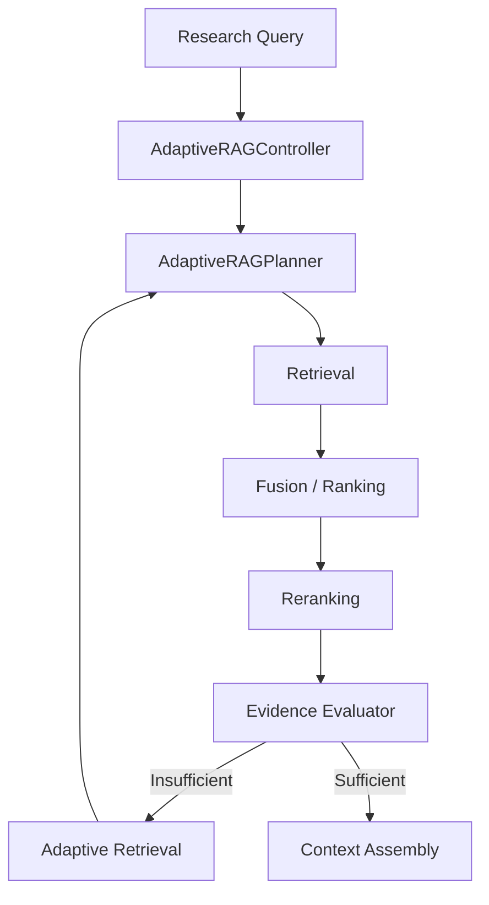

The controller does not replace the planner.

The controller executes the overall workflow while the planner determines the retrieval requirements.

---

# 5. Adaptive RAG Planner

The planner answers:

> **What does this research query actually require?**

The planner determines the retrieval strategy before retrieval execution begins.

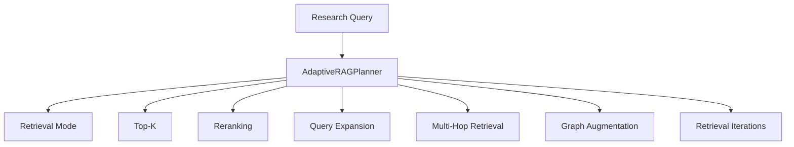

The planner can determine whether the query requires:

- Dense retrieval.
- BM25 / keyword retrieval.
- Hybrid retrieval.
- Reranking.
- Query expansion.
- Multi-hop retrieval.
- Graph augmentation.
- Additional retrieval iterations.
- Different `top_k` values.

The planner is:

- Deterministic.
- Provider-independent.
- Retrieval-independent.
- Focused on planning rather than execution.

---

## 5.1 Dense Retrieval

Dense retrieval uses embeddings to identify semantically similar research content.

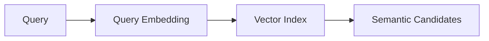

Dense retrieval is useful when the query and source document use different wording but express similar concepts.

Examples include:

- Semantic concepts.
- Paraphrases.
- Related terminology.
- Conceptual research questions.
- Similar methodological descriptions.

---

## 5.2 BM25 / Keyword Retrieval

Keyword retrieval uses lexical matching to identify documents and chunks containing relevant terms.

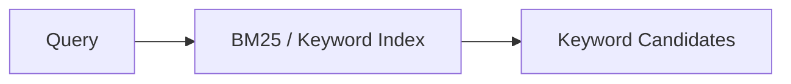

Keyword retrieval is particularly useful for:

- Exact terminology.
- Paper titles.
- Author names.
- Technical concepts.
- Identifiers.
- Domain-specific phrases.
- Named methods.
- Acronyms.

For research systems, lexical retrieval is especially valuable when the user provides precise terminology.

---

## 5.3 Hybrid Retrieval

Hybrid retrieval combines semantic and lexical retrieval.

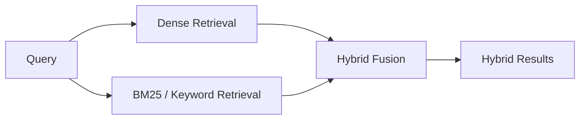

Hybrid retrieval combines:

- Semantic similarity.
- Lexical relevance.

The resulting candidate set can then be passed to ranking and reranking.

---

# 6. Knowledge Layer

The Knowledge layer provides access to the indexed research corpus.

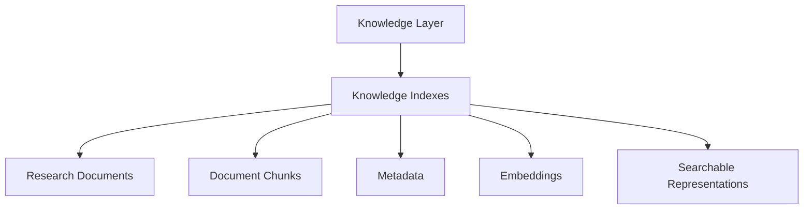

The knowledge indexes can contain:

- Research documents.
- Paper content.
- Document chunks.
- Metadata.
- Embeddings.
- Searchable representations.
- Research-specific attributes.

The Assistant does not directly depend on the physical storage implementation.

Instead, access occurs through the retrieval pipeline and index abstraction.

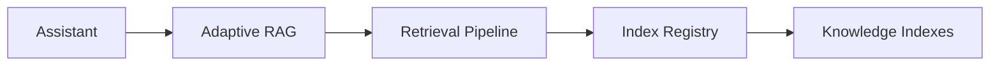

This separation allows storage and indexing implementations to evolve without requiring changes to the Assistant layer.

---

# 7. Research Graph

The Research Graph provides structured relationships between research entities.

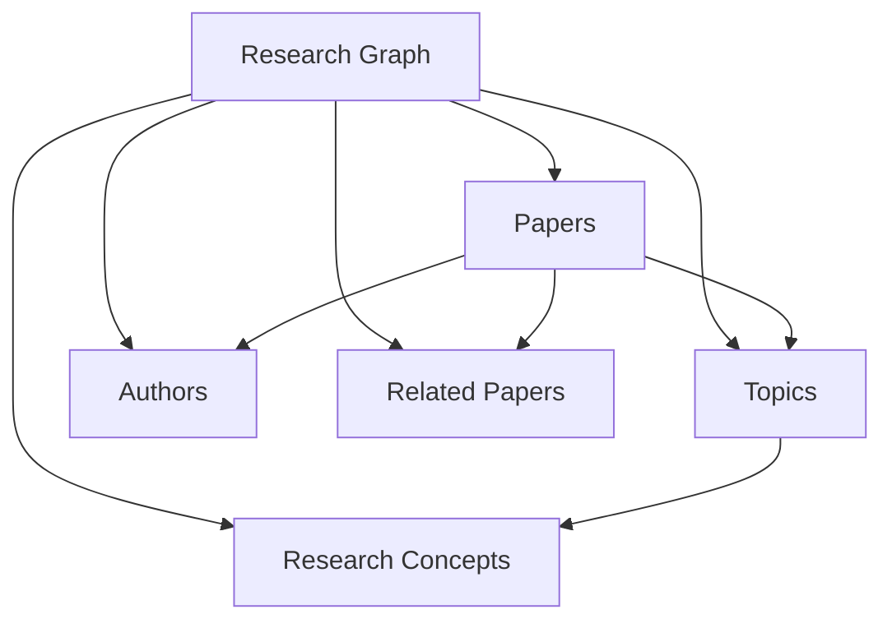

The graph can represent relationships between:

- Papers.
- Topics.
- Authors.
- Related papers.
- Research concepts.

Graph information can enrich retrieval for questions involving:

- Related papers.
- Research topics.
- Authors.
- Paper relationships.
- Research trends.
- Connected evidence.
- Citation or conceptual relationships.

Graph retrieval is an augmentation mechanism rather than a replacement for conventional retrieval.

---

# 8. Fusion / Ranking

Results from multiple retrieval and knowledge sources are combined before final reranking.

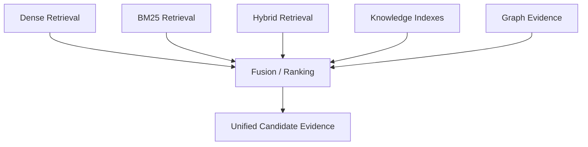

Fusion creates a unified candidate evidence set.

Conceptually:

```text
Candidate Evidence
├── Result 1
├── Result 2
├── Result 3
├── Result 4
└── ...
```

The ranking stage orders candidates before dedicated reranking.

---

# 9. Reranking

The reranking layer evaluates retrieved candidates against the original research query.

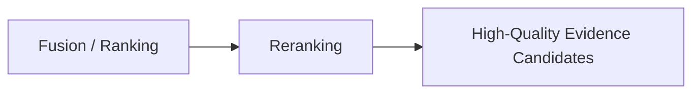

Initial retrieval is generally optimized for recall.

Reranking improves precision by identifying which retrieved candidates are most relevant to the specific query.

Conceptually:

```text
Large Candidate Set
        |
        v
    Reranker
        |
        v
Relevant Evidence
        |
        v
Context Assembly
```

This prevents the LLM from receiving unnecessary or weakly relevant context.

---

# 10. Evidence Evaluator

The Evidence Evaluator is the primary quality gate before the LLM research layer.

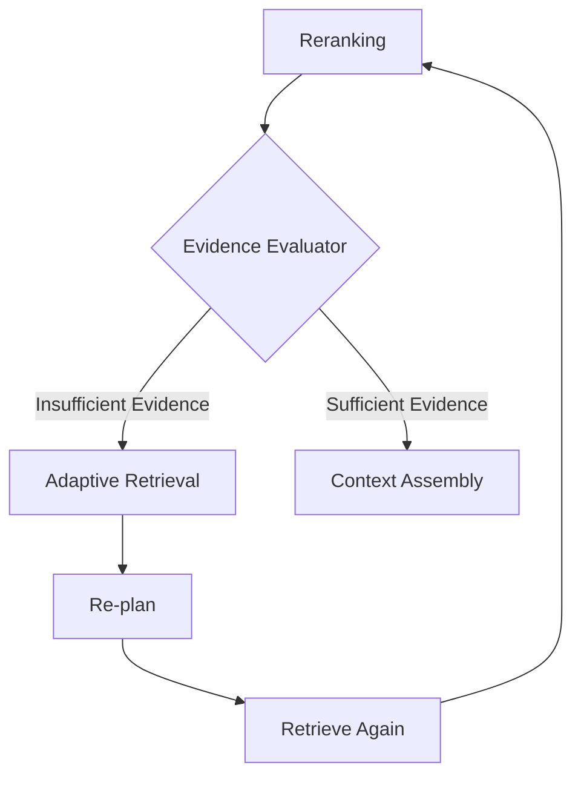

The evaluator determines whether the retrieved evidence is sufficient for the requested research task.

The important architectural principle is:

> The LLM should not be the first component deciding whether evidence is sufficient.

The evidence gate happens before the LLM research layer.

---

# 11. Evidence Sufficiency

Evidence evaluation can consider factors such as:

- Relevance.
- Coverage.
- Evidence quality.
- Number of supporting sources.
- Retrieval confidence.
- Query requirements.
- Diversity of supporting evidence.
- Presence of supporting passages.

The exact evaluation logic can evolve independently of the Assistant API.

The important architectural contract is:

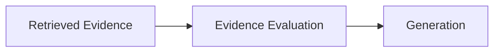

Generation should proceed only when the evidence satisfies the required quality conditions.

---

# 12. Adaptive Retrieval Loop

If the Evidence Evaluator determines that the evidence is insufficient, the system does not immediately generate the final answer.

Instead, the system enters an adaptive retrieval loop.

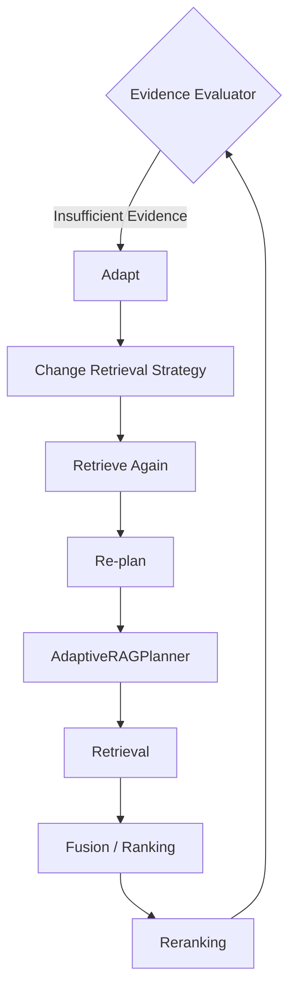

The system can modify the retrieval plan based on the results of the previous iteration.

Possible adaptations include:

- Changing retrieval mode.
- Increasing `top_k`.
- Enabling reranking.
- Expanding the query.
- Using hybrid retrieval.
- Introducing graph augmentation.
- Performing another retrieval iteration.
- Adjusting retrieval parameters.

The objective is not simply to retrieve more documents.

The objective is:

> **Sufficient, relevant, and grounded evidence.**

---

# 13. Adapt Layer

The Adapt layer changes retrieval behavior when the current evidence is insufficient.

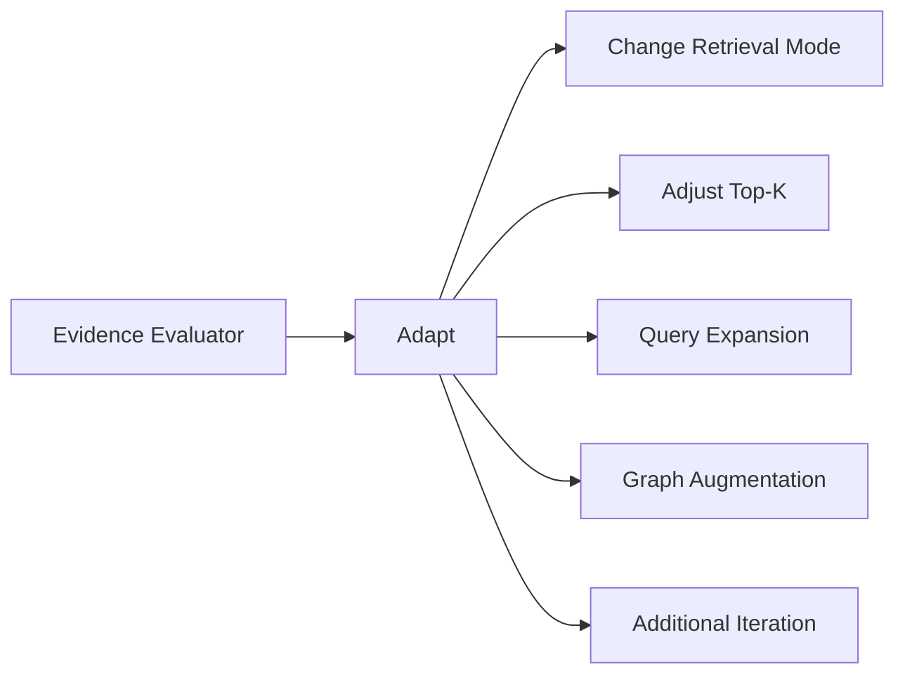

The adaptation decision can be based on the observed weaknesses of the current retrieval result.

For example:

```text
Insufficient Evidence
        |
        v
Analyze Retrieval Failure
        |
        +--> Low Semantic Coverage
        |
        +--> Missing Exact Terms
        |
        +--> Weak Source Diversity
        |
        +--> Missing Relationships
        |
        v
Modify Retrieval Strategy
```

---

# 14. Re-Planning

After an unsuccessful retrieval attempt, the system can return to the planner.

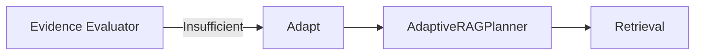

This creates a feedback loop:

```text
Plan
  |
  v
Retrieve
  |
  v
Evaluate
  |
  v
Adapt
  |
  v
Re-plan
  |
  v
Retrieve Again
```

The planner therefore remains the component responsible for determining retrieval requirements.

---

# 15. Evidence Gate

The evidence gate separates retrieval from generation.

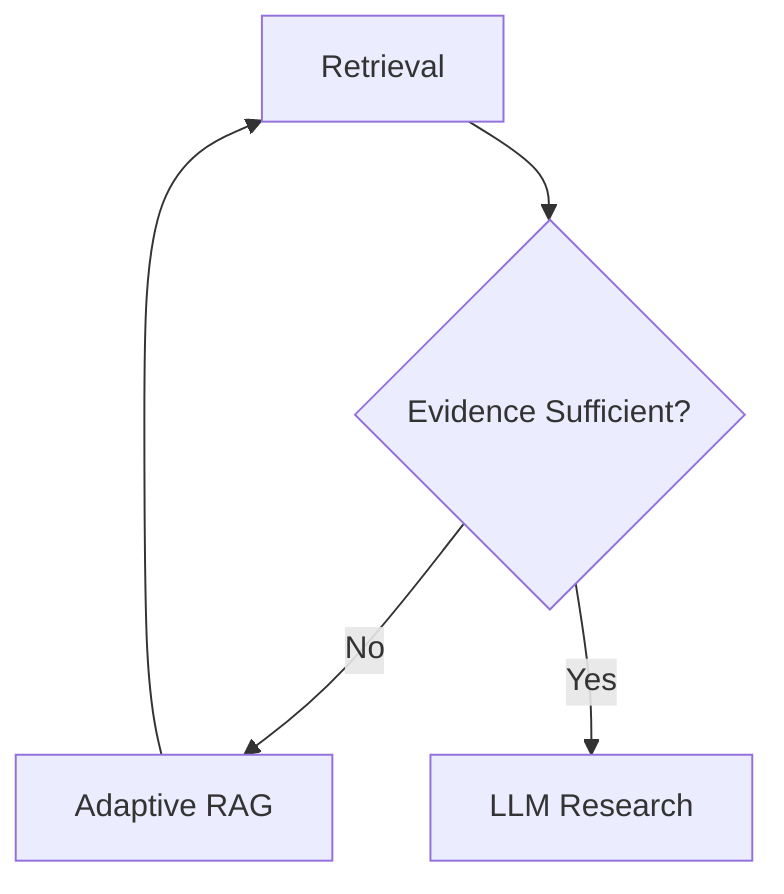

This architecture reduces the risk of generating an answer before sufficient research evidence has been retrieved.

---

# 16. LLM Research Layer

Once evidence is considered sufficient, the system prepares the research context for the LLM.

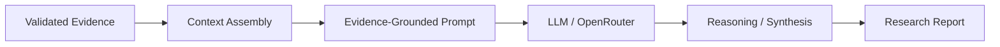

The LLM is responsible for:

- Interpreting evidence.
- Connecting findings.
- Reasoning over retrieved material.
- Synthesizing information.
- Producing the final research response.

The LLM should not independently invent evidence.

---

# 17. Context Assembly

Context Assembly combines the validated evidence into a structured research context.

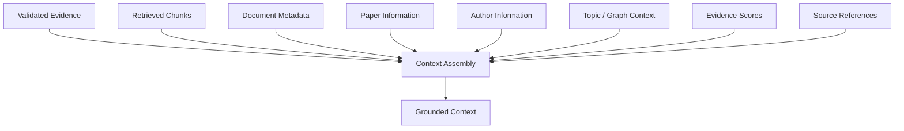

Context Assembly can include:

- Retrieved chunks.
- Document metadata.
- Paper information.
- Author information.
- Topic context.
- Graph relationships.
- Evidence scores.
- Source references.

The purpose is to provide the LLM with structured and traceable evidence.

---

# 18. Evidence-Grounded Prompt

The Evidence-Grounded Prompt connects:

```text
Research Question
        +
Retrieved Evidence
        +
Source Metadata
        =
Grounded LLM Context
```

```mermaid
flowchart TD

    Q[Research Question]

    E[Validated Evidence]

    S[Source Metadata]

    P[Evidence-Grounded Prompt]

    LLM[LLM]

    Q --> P
    E --> P
    S --> P

    P --> LLM
```

The prompt should instruct the model to:

- Use the supplied evidence.
- Distinguish evidence from synthesis.
- Avoid unsupported claims.
- Preserve uncertainty.
- Reference sources.
- Avoid fabricating citations.
- Clearly communicate missing information.

---

# 19. LLM / OpenRouter

The LLM layer is accessed through a provider abstraction.

```mermaid
flowchart LR

    P[Evidence-Grounded Prompt]

    L[LLM Provider Layer]

    O[OpenRouter]

    M[Selected Language Model]

    P --> L
    L --> O
    O --> M
```

The provider abstraction allows the underlying model to change without redesigning:

- Retrieval.
- Ranking.
- Evidence evaluation.
- Graph retrieval.
- Indexing.
- Provenance.

This provides model-provider independence.

---

# 20. Reasoning / Synthesis

The Reasoning / Synthesis layer transforms validated evidence into a structured research response.

```mermaid
flowchart TD

    E[Validated Evidence]

    L[LLM]

    S[Reasoning / Synthesis]

    A[Research Answer]

    E --> L
    L --> S
    S --> A
```

The generated response can contain:

- Direct answer.
- Key findings.
- Evidence-supported claims.
- Research synthesis.
- Interpretation.
- Limitations.
- Sources.
- Provenance.

The response should distinguish between:

### Evidence-supported findings

Claims directly supported by retrieved research evidence.

### Interpretation / synthesis

Conclusions formed by connecting multiple pieces of evidence.

### Uncertainty

Information that is missing, ambiguous, conflicting, or insufficiently supported.

---

# 21. Sources and Provenance

Sources and provenance provide traceability from the final response back to the original research material.

```mermaid
flowchart LR

    D[Source Document]

    C[Document Chunk]

    R[Retrieval Result]

    RR[Reranked Evidence]

    CTX[Context]

    CLAIM[Generated Claim]

    D --> C
    C --> R
    R --> RR
    RR --> CTX
    CTX --> CLAIM
```

The desired provenance chain is:

```text
Source Document
      |
      v
Document Chunk
      |
      v
Retrieval Result
      |
      v
Reranked Evidence
      |
      v
LLM Context
      |
      v
Generated Claim
```

This enables the system to trace research claims back to their supporting evidence.

---

# 22. Final Answer Structure

A research response can follow the structure:

```text
Research Answer
│
├── Summary
│
├── Key Findings
│
├── Evidence
│
├── Reasoning / Synthesis
│
├── Sources
│
└── Limitations
```

```mermaid
flowchart TD

    A[Research Answer]

    S[Summary]
    K[Key Findings]
    E[Evidence]
    R[Reasoning / Synthesis]
    SO[Sources]
    L[Limitations]

    A --> S
    A --> K
    A --> E
    A --> R
    A --> SO
    A --> L
```

This structure separates the answer from the evidence supporting it.

---

# 23. Component Boundaries

| Component | Responsibility |
|---|---|
| Assistant | User-facing research interaction |
| Research / Assistant API | HTTP and API boundary |
| Research Service | Application-level orchestration |
| AdaptiveRAGController | Adaptive RAG orchestration boundary |
| AdaptiveRAGPlanner | Determines retrieval requirements |
| Dense Retrieval | Semantic candidate retrieval |
| BM25 / Keyword Retrieval | Lexical candidate retrieval |
| Hybrid Retrieval | Combines semantic and lexical retrieval |
| Knowledge Layer | Provides indexed research knowledge |
| Research Graph | Provides structured research relationships |
| Fusion / Ranking | Combines and orders candidate evidence |
| Reranking | Improves candidate relevance |
| Evidence Evaluator | Determines evidence sufficiency |
| Adapt | Changes retrieval behavior |
| Context Assembly | Builds grounded LLM context |
| Evidence-Grounded Prompt | Constructs grounded LLM input |
| LLM / OpenRouter | Language reasoning and generation |
| Reasoning / Synthesis | Produces research response |
| Sources / Provenance | Provides traceability |

---

# 24. Core Design Principles

## 24.1 Retrieval Before Generation

The system follows:

```text
Retrieve
   ↓
Evaluate
   ↓
Ground
   ↓
Generate
```

Rather than:

```text
Generate
   ↓
Attempt to justify
```

---

## 24.2 Evidence-Gated Generation

Generation happens after evidence evaluation.

```mermaid
flowchart LR

    R[Retrieve]

    E[Evaluate Evidence]

    G[Generate]

    R --> E
    E --> G
```

---

## 24.3 Adaptive Retrieval

Retrieval is iterative when evidence is insufficient.

```mermaid
flowchart LR

    P[Plan]

    R[Retrieve]

    E[Evaluate]

    A[Adapt]

    P --> R
    R --> E
    E --> A
    A --> P
```

---

## 24.4 Planning / Execution Separation

The planner determines what should happen.

The controller executes the workflow.

```mermaid
flowchart LR

    P[Planner]

    C[Controller]

    R[Retrieval]

    P --> C
    C --> R
```

This separation improves testability and maintainability.

---

## 24.5 Provider Independence

The retrieval and reasoning architecture should not be tightly coupled to one LLM provider.

```mermaid
flowchart TD

    R[Retrieval System]

    E[Evidence Evaluation]

    C[Context Assembly]

    L[LLM Provider Abstraction]

    P1[Provider A]
    P2[Provider B]
    P3[Provider C]

    R --> E
    E --> C
    C --> L

    L --> P1
    L --> P2
    L --> P3
```

---

## 24.6 Retrieval vs Reasoning Separation

The architecture separates:

```text
What evidence do we have?
```

from:

```text
What does the evidence mean?
```

Retrieval answers the first question.

The LLM reasoning layer addresses the second.

---

## 24.7 Provenance Preservation

Evidence should retain source information throughout the pipeline.

```mermaid
flowchart LR

    SOURCE[Source]

    CHUNK[Chunk]

    RET[Retrieval]

    RERANK[Reranking]

    CONTEXT[Context]

    ANSWER[Answer]

    SOURCE --> CHUNK
    CHUNK --> RET
    RET --> RERANK
    RERANK --> CONTEXT
    CONTEXT --> ANSWER
```

---

## 24.8 Fail Safely

If evidence remains insufficient after adaptive retrieval, the system should not fabricate certainty.

```mermaid
flowchart TD

    E[Evidence Evaluator]

    A[Adaptive Retrieval]

    G{Evidence Sufficient?}

    L[LLM Research]

    U[Return Insufficient Evidence]

    E --> G

    G -->|Yes| L
    G -->|No| A

    A --> E

    G -->|Still Insufficient| U
```

The system should communicate uncertainty or missing evidence when appropriate.

---

# 25. End-to-End Research Example

Consider the research question:

> What are the main limitations of agentic RAG systems identified in recent research?

The request flows through the architecture as follows:

```text
User
  ↓
Assistant
  ↓
Research API
  ↓
Research Service
  ↓
AdaptiveRAGController
  ↓
AdaptiveRAGPlanner
  ↓
Dense Retrieval
  +
BM25 Retrieval
  +
Knowledge Indexes
  +
Research Graph
  ↓
Fusion / Ranking
  ↓
Reranking
  ↓
Evidence Evaluator
  ↓
Evidence Sufficient?
  ↓
Context Assembly
  ↓
Evidence-Grounded Prompt
  ↓
LLM / OpenRouter
  ↓
Reasoning / Synthesis
  ↓
Research Answer
  ↓
Sources / Provenance
```

If evidence is insufficient:

```text
Evidence Evaluator
       ↓
Insufficient Evidence
       ↓
Adapt
       ↓
Re-plan
       ↓
Hybrid / Graph Retrieval
       ↓
Reranking
       ↓
Evidence Evaluator
```

---

# 26. Example Adaptive Retrieval Scenario

A possible adaptive retrieval sequence is:

```mermaid
flowchart TD

    Q[Research Query]

    D[Dense Retrieval]

    R1[Reranking]

    E1{Evidence Sufficient?}

    A[Adapt Strategy]

    H[Hybrid Retrieval]

    G[Graph Augmentation]

    R2[Reranking]

    E2{Evidence Sufficient?}

    CA[Context Assembly]

    Q --> D
    D --> R1
    R1 --> E1

    E1 -->|No| A

    A --> H
    A --> G

    H --> R2
    G --> R2

    R2 --> E2

    E2 -->|No| A
    E2 -->|Yes| CA
```

This allows the retrieval strategy to evolve based on evidence quality.

---

# 27. Complete Sequence

```mermaid
sequenceDiagram

    participant U as User
    participant A as Assistant
    participant API as Research API
    participant RS as Research Service
    participant C as AdaptiveRAGController
    participant P as Planner
    participant R as Retrieval
    participant F as Fusion
    participant RR as Reranker
    participant E as Evidence Evaluator
    participant CA as Context Assembly
    participant L as LLM
    participant O as Output

    U->>A: Research Question

    A->>API: Request
    API->>RS: Research Request

    RS->>C: Execute Adaptive RAG

    C->>P: Analyze Query
    P-->>C: Retrieval Plan

    C->>R: Execute Retrieval
    R-->>C: Candidate Evidence

    C->>F: Combine Results
    F-->>C: Ranked Candidates

    C->>RR: Rerank Candidates
    RR-->>C: Reranked Evidence

    C->>E: Evaluate Evidence
    E-->>C: Evidence Decision

    alt Evidence Insufficient

        C->>P: Re-plan
        P-->>C: Updated Plan

        C->>R: Retrieve Again
        R-->>C: Additional Evidence

        C->>F: Fuse Results
        F-->>C: Updated Candidates

        C->>RR: Rerank
        RR-->>C: Updated Evidence

        C->>E: Re-evaluate
        E-->>C: Evidence Decision

    else Evidence Sufficient

        C->>CA: Assemble Context
        CA-->>C: Grounded Context

        C->>L: Evidence-Grounded Prompt
        L-->>C: Reasoned Synthesis

        C->>O: Research Answer + Sources

    end

    O-->>A: Final Response
    A-->>U: Answer
```

---

# 28. Final Architecture

```mermaid
flowchart LR

    U[User]

    subgraph ASSISTANT["Assistant Layer"]

        A[Assistant]

        API[Research / Assistant API]

        RS[Research Service]

    end

    subgraph RAG["Adaptive RAG"]

        C[AdaptiveRAGController]

        P[AdaptiveRAGPlanner]

        subgraph RETRIEVAL["Retrieval"]

            D[Dense Retrieval]

            B[BM25 / Keyword]

            H[Hybrid Retrieval]

        end

        K[Knowledge Layer]

        G[Research Graph]

        F[Fusion / Ranking]

        RR[Reranking]

        E[Evidence Evaluator]

        AD[Adaptive Retrieval]

    end

    subgraph LLM_LAYER["LLM Research"]

        CA[Context Assembly]

        GP[Evidence-Grounded Prompt]

        L[LLM / OpenRouter]

        S[Reasoning / Synthesis]

    end

    OUT[Research Report / Assistant Answer]

    PV[Sources / Provenance]


    U --> A

    A --> API
    API --> RS

    RS --> C

    C --> P

    P --> D
    P --> B
    P --> H
    P --> K
    P --> G

    D --> F
    B --> F
    H --> F
    K --> F
    G --> F

    F --> RR
    RR --> E

    E -->|Insufficient| AD
    AD --> P

    E -->|Sufficient| CA

    CA --> GP
    GP --> L
    L --> S

    S --> OUT
    OUT --> PV
```

---

# 29. Architectural Summary

The complete architecture can be summarized as:

```text
User Intent
     ↓
Assistant
     ↓
Research Service
     ↓
Adaptive RAG Controller
     ↓
Adaptive RAG Planner
     ↓
Adaptive Retrieval
     ↓
Dense + BM25 + Hybrid + Knowledge + Graph
     ↓
Fusion / Ranking
     ↓
Reranking
     ↓
Evidence Evaluation
     ↓
 ┌───────────────────────┐
 │ Evidence Insufficient │
 │          ↓            │
 │       Adapt           │
 │          ↓            │
 │      Re-plan          │
 │          ↓            │
 │   Retrieve Again      │
 └───────────────────────┘
     ↓
Evidence Sufficient
     ↓
Context Assembly
     ↓
Evidence-Grounded Prompt
     ↓
LLM / OpenRouter
     ↓
Reasoning / Synthesis
     ↓
Research Answer
     ↓
Sources / Provenance
```

---

# 30. Core Architecture Principle

The core principle of the system is:

> **The Assistant should reason over validated research evidence, not generate answers independently of the retrieval and evidence pipeline.**

The architecture therefore follows:

```text
User Intent
      ↓
Adaptive Retrieval
      ↓
Evidence Validation
      ↓
Grounded Reasoning
      ↓
Research Synthesis
      ↓
Traceable Answer
```

This creates a clear separation between:

- **Intent understanding**
- **Retrieval planning**
- **Evidence retrieval**
- **Evidence validation**
- **Adaptive retrieval**
- **Context construction**
- **LLM reasoning**
- **Research synthesis**
- **Source provenance**

# Assistant


.png)