# AI Research Assistant — Explore & Adaptive Retrieval Architecture

## 1. Overview

The **Explore module** is the research discovery and retrieval interface of the AI Research Assistant.

It allows users to search across an indexed research corpus using:

* Dense semantic retrieval
* BM25 / keyword retrieval
* Metadata filtering
* Reciprocal Rank Fusion
* Unified candidate ranking
* Cross-encoder reranking
* Top-K evidence selection

The Explore pipeline combines multiple retrieval signals and returns ranked research results to the Next.js Explore UI.

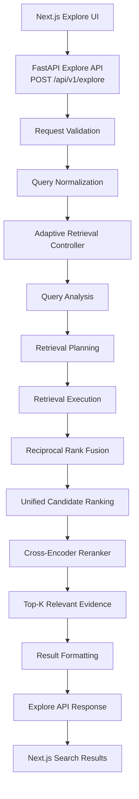

---

# 2. Explore Request Flow

The Explore request begins in the Next.js frontend and travels through the FastAPI API into the Adaptive Retrieval Controller.

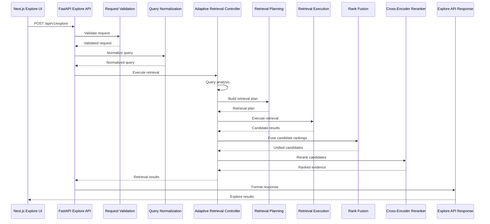

---

# 3. Explore API Layer

The Explore API provides the HTTP boundary for research discovery and retrieval.

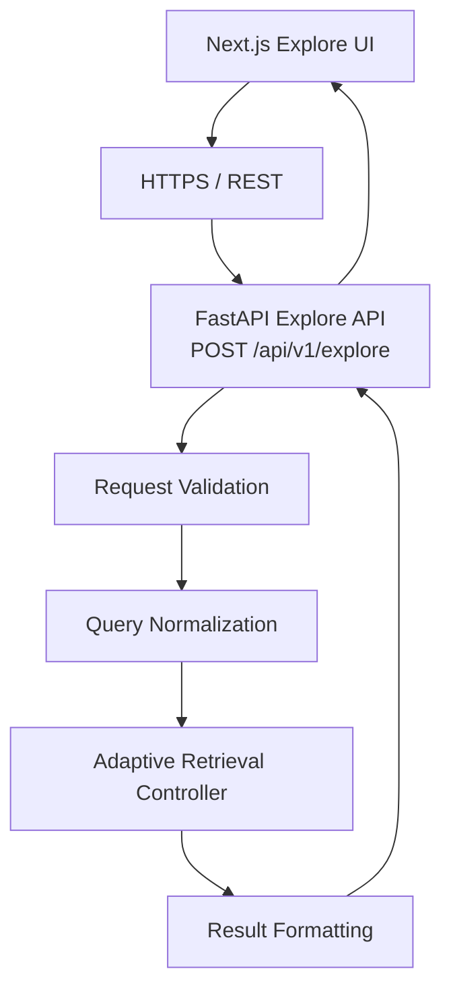

The API is responsible for:

* Receiving the Explore request
* Validating request parameters
* Normalizing the query
* Invoking the Adaptive Retrieval Controller
* Formatting the final retrieval response
* Returning search results to the frontend

---

# 4. Request Validation

The request validation layer ensures that the incoming Explore request satisfies the expected API contract.

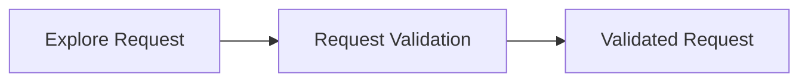

Validation can cover:

* Query presence
* Query format
* Retrieval parameters
* Pagination or result limits
* Metadata filters
* Optional retrieval configuration

---

# 5. Query Normalization

The query normalization layer prepares the user's query for retrieval.

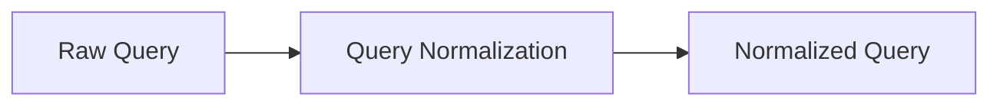

Normalization creates a consistent representation before query analysis and retrieval planning.

The normalized query is then passed to the Adaptive Retrieval Controller.

---

# 6. Adaptive Retrieval Controller

The **Adaptive Retrieval Controller** is the central orchestration boundary of the Explore retrieval pipeline.

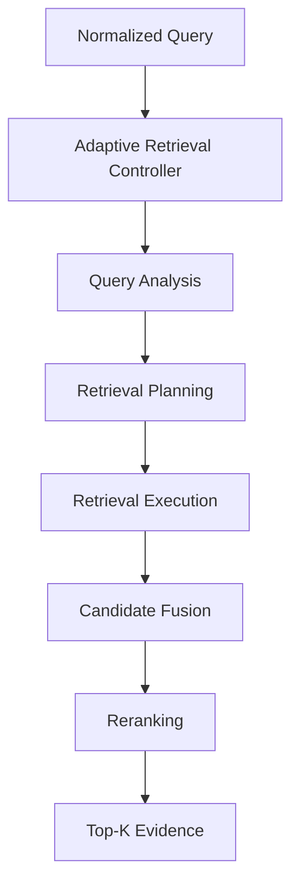

The controller coordinates:

1. Query analysis
2. Retrieval planning
3. Retrieval execution
4. Candidate fusion
5. Unified candidate ranking
6. Cross-encoder reranking
7. Top-K evidence selection

The controller is responsible for **orchestration**, while individual retrieval components remain responsible for their own retrieval operations.

---

# 7. Query Analysis

Query analysis determines the characteristics of the incoming research query.

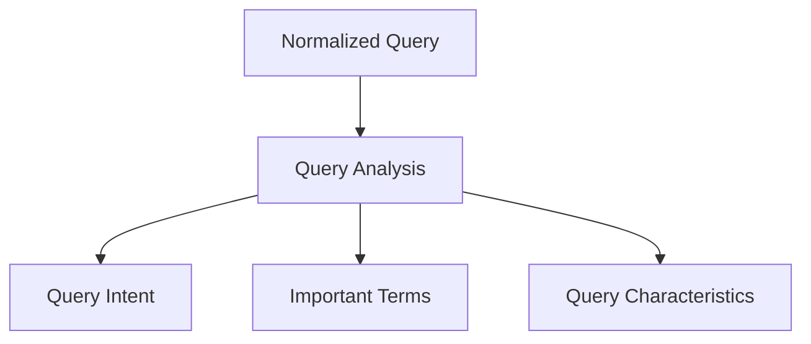

Query analysis can identify:

* Semantic research intent
* Exact terminology
* Important keywords
* Technical phrases
* Potential metadata constraints
* Retrieval requirements

---

# 8. Retrieval Planning

The retrieval planner determines which retrieval mechanisms should participate in the search.

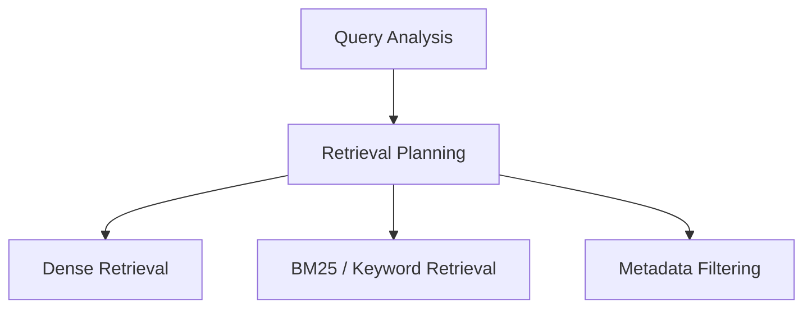

The retrieval plan can combine multiple retrieval signals.

Conceptually:

```text
Research Query
      |
      v
Query Analysis
      |
      v
Retrieval Planning
      |
      +---- Dense Retrieval
      |
      +---- BM25 Retrieval
      |
      +---- Metadata Filtering
```

---

# 9. Retrieval Execution

The Retrieval Execution layer runs the retrieval mechanisms selected by the planner.

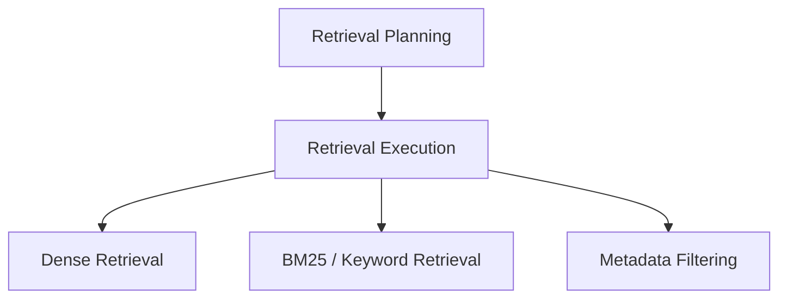

The retrieval execution layer produces candidate result sets that are later combined through rank fusion.

Metadata filters may also act as constraints on dense and lexical retrieval, depending on the configured retrieval strategy.

---

# 10. Research Source Ingestion

The Explore retrieval system depends on an indexed research corpus.

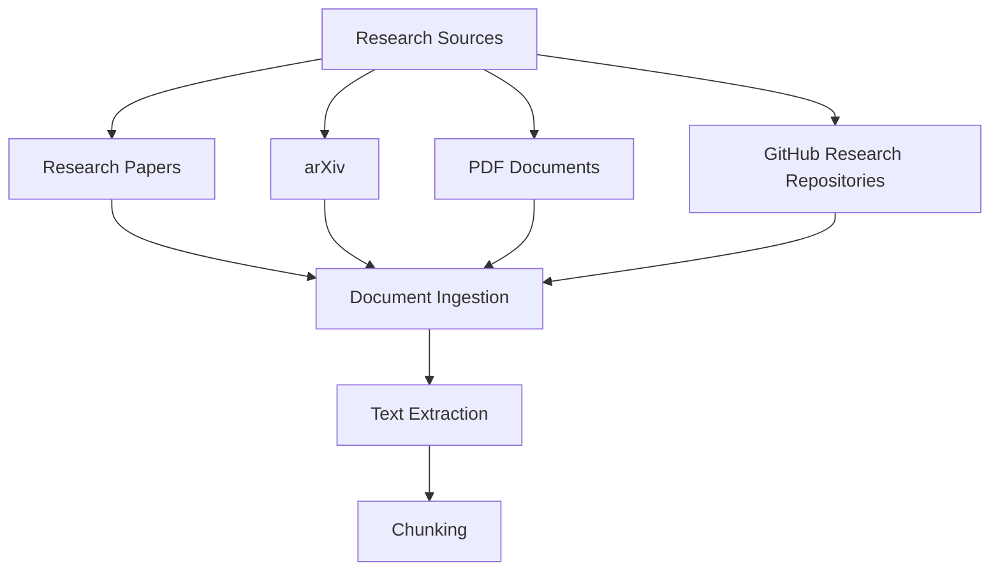

The ingestion pipeline transforms research sources into searchable representations.

---

# 11. Document Ingestion

Research sources enter the system through the document ingestion pipeline.

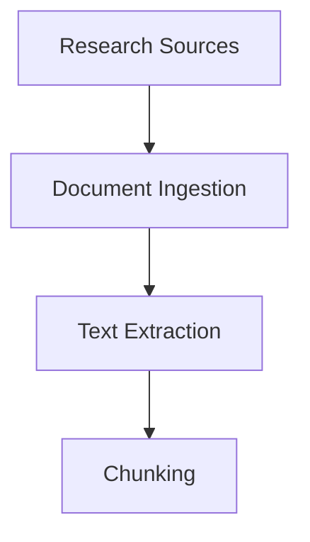

Supported research sources can include:

* Research papers
* arXiv content
* PDF documents
* GitHub research repositories

---

# 12. Text Extraction

Text extraction converts source documents into machine-processable text.


The extracted text becomes the input for chunking.

---

# 13. Chunking

Chunking divides extracted research text into smaller searchable units.

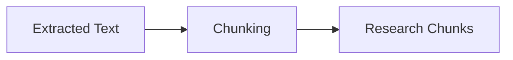

Chunks provide the retrieval unit for semantic and lexical search.

---

# 14. Research Index Construction

After chunking, the system creates the representations required by the retrieval layer.

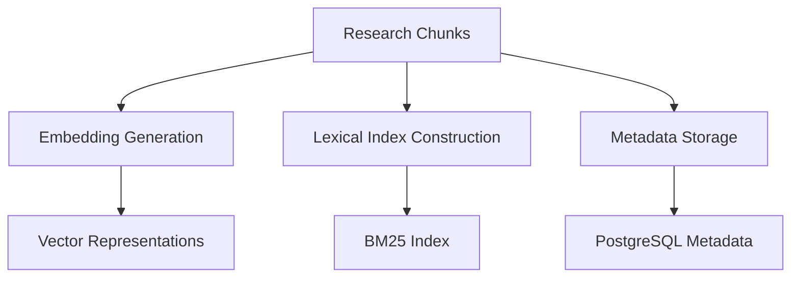

The ingestion architecture therefore creates three complementary retrieval resources:

1. Vector representations for dense retrieval
2. A lexical index for BM25 retrieval
3. Structured metadata for filtering

---

# 15. Embedding Generation

The embedding pipeline converts research chunks into vector representations.

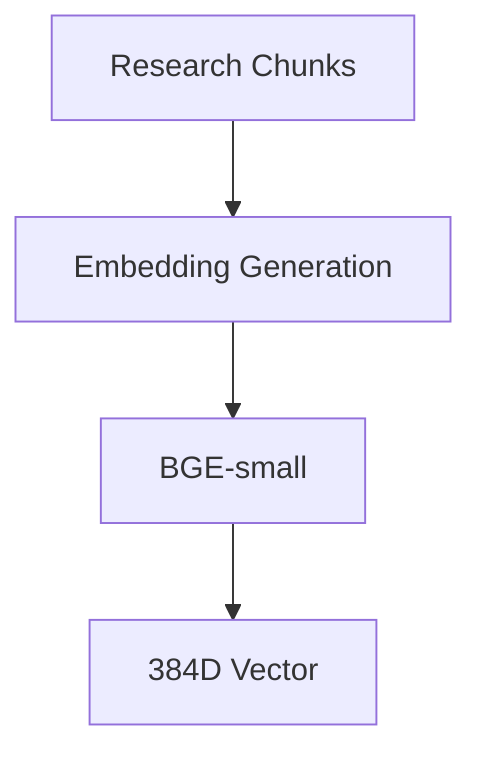

The Explore architecture uses BGE-small embeddings to represent research chunks in vector space.

The resulting vectors are used for dense semantic retrieval.

---

# 16. FAISS Vector Index

The generated vectors are stored in a FAISS vector index.

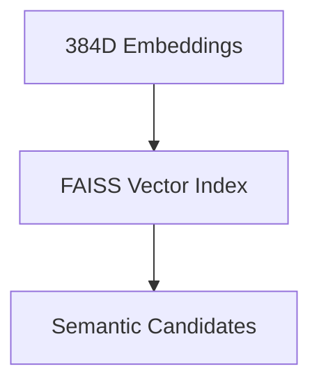

Dense retrieval follows:

```text
Query
  |
  v
Query Embedding
  |
  v
FAISS Vector Index
  |
  v
Semantic Candidates
```

---

# 17. Dense Retrieval

Dense retrieval performs semantic similarity search over the FAISS vector index.

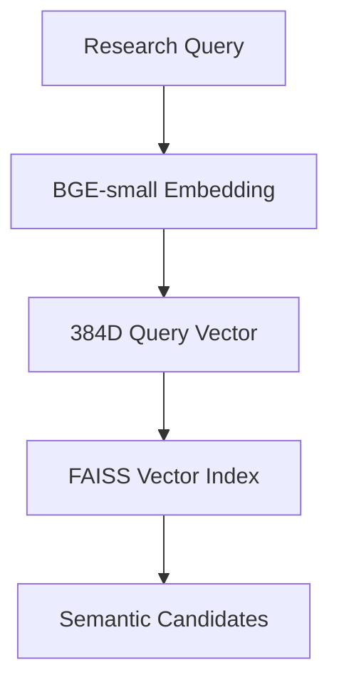

Dense retrieval is useful for:

* Semantic similarity
* Paraphrased concepts
* Conceptual research questions
* Related terminology
* Research ideas expressed with different wording

---

# 18. BM25 / Keyword Retrieval

BM25 provides lexical retrieval over indexed research content.

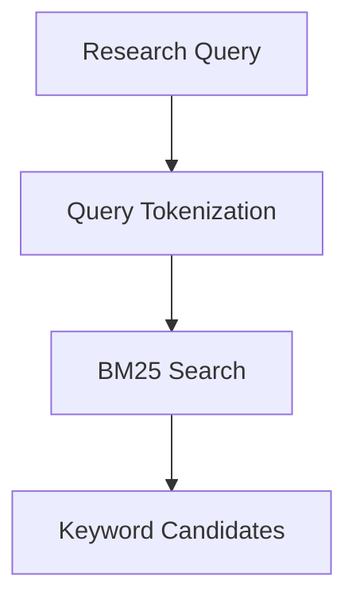

BM25 is particularly useful for:

* Exact terminology
* Technical terms
* Paper names
* Author names
* Acronyms
* Named methods
* Identifiers

---

# 19. Metadata Storage

Research metadata is maintained separately from the semantic retrieval index.

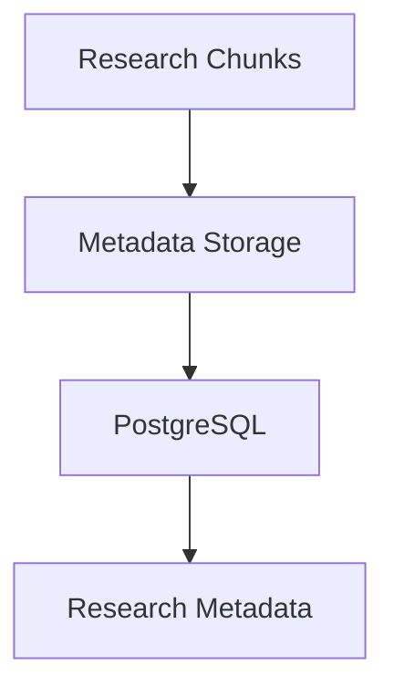

Metadata can include information associated with:

* Papers
* Chunks
* Documents
* Authors
* Topics
* Research attributes

---

# 20. Metadata Filtering

Metadata filtering narrows retrieval using structured research attributes.

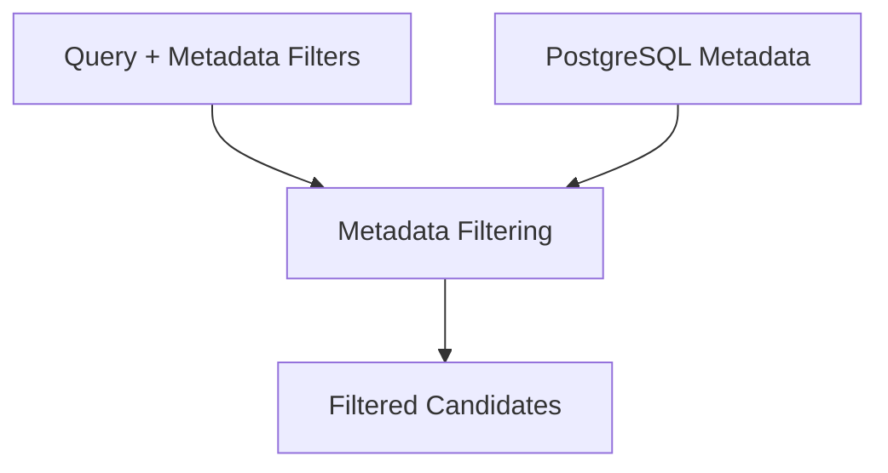

Metadata filtering can constrain retrieval using attributes such as:

* Author
* Topic
* Publication information
* Document type
* Research collection
* Source
* Other indexed metadata

Metadata filtering can operate alongside dense and lexical retrieval.

---

# 21. PostgreSQL Research Metadata

PostgreSQL stores structured research information used during filtering and retrieval.

```mermaid
flowchart TD
    PG["PostgreSQL"]

    P["Papers"]
    C["Chunks"]
    M["Metadata"]

    PG --> P
    PG --> C
    PG --> M
```

The metadata store complements the vector and lexical indexes.

---

# 22. Retrieval Candidate Generation

The retrieval layer produces multiple candidate sets.

```mermaid
flowchart TD
    D["Dense Retrieval"]
    B["BM25 / Keyword Retrieval"]
    M["Metadata Filtering"]

    SC["Semantic Candidates"]
    KC["Keyword Candidates"]
    FC["Filtered Candidates"]

    D --> SC
    B --> KC
    M --> FC
```

The candidate streams are passed into the candidate fusion stage.

---

# 23. Reciprocal Rank Fusion

Reciprocal Rank Fusion combines candidate rankings produced by multiple retrieval mechanisms.

```mermaid
flowchart TD
    SC["Semantic Candidates"]
    KC["Keyword Candidates"]
    FC["Filtered Candidates"]

    RRF["Reciprocal Rank Fusion"]
    U["Unified Candidate Ranking"]

    SC --> RRF
    KC --> RRF
    FC --> RRF

    RRF --> U
```

RRF provides a mechanism for combining different ranking signals into a unified candidate list.

Conceptually:

```text
Dense Ranking
      +
BM25 Ranking
      +
Metadata-Constrained Results
      |
      v
Reciprocal Rank Fusion
      |
      v
Unified Candidate Ranking
```

---

# 24. Unified Candidate Ranking

After reciprocal rank fusion, the system produces a unified candidate ranking.

```mermaid
flowchart LR
    RRF["Reciprocal Rank Fusion"]
    U["Unified Candidate Ranking"]

    RRF --> U
```

The unified candidate list becomes the input to the cross-encoder reranker.

---

# 25. Cross-Encoder Reranking

The cross-encoder reranker evaluates the unified candidates against the research query.

```mermaid
flowchart TD
    Q["Research Query"]
    U["Unified Candidate Ranking"]
    R["Cross-Encoder Reranker"]
    TOP["Top-K Relevant Evidence"]

    Q --> R
    U --> R
    R --> TOP
```

The reranking stage improves precision after the broader candidate-generation stages.

The pipeline therefore follows:

```text
High Recall Retrieval
        |
        v
Candidate Fusion
        |
        v
Unified Ranking
        |
        v
Cross-Encoder Reranking
        |
        v
High Precision Evidence
```

---

# 26. Top-K Relevant Evidence

The final retrieval stage selects the most relevant evidence.

```mermaid
flowchart LR
    R["Cross-Encoder Reranker"]
    TOP["Top-K Relevant Evidence"]

    R --> TOP
```

The Top-K result set is the final retrieval output consumed by the Explore API.

---

# 27. Result Formatting

The result formatting layer converts internal retrieval results into the public API response format.

```mermaid
flowchart LR
    E["Top-K Relevant Evidence"]
    F["Result Formatting"]
    R["Explore API Response"]

    E --> F
    F --> R
```

Formatting can include:

* Paper information
* Chunk information
* Relevance scores
* Metadata
* Search highlights
* Source information
* Result identifiers

---

# 28. Explore API Response

The FastAPI endpoint returns the formatted results to the frontend.

```mermaid
flowchart TD
    E["Top-K Relevant Evidence"]
    F["Result Formatting"]
    API["Explore API Response"]
    UI["Next.js Search Results"]

    E --> F
    F --> API
    API --> UI
```

The frontend receives a structured response that can be rendered by the Explore interface.

---

# 29. End-to-End Explore Retrieval

The complete retrieval architecture is:

```mermaid
flowchart TD
    UI["Next.js Explore UI"]
    API["FastAPI Explore API<br/>POST /api/v1/explore"]
    V["Request Validation"]
    N["Query Normalization"]
    C["Adaptive Retrieval Controller"]
    QA["Query Analysis"]
    RP["Retrieval Planning"]
    RE["Retrieval Execution"]

    D["Dense Retrieval"]
    DE["BGE-small Embedding"]
    QV["384D Query Vector"]
    FI["FAISS Vector Index"]
    SC["Semantic Candidates"]

    B["BM25 / Keyword Retrieval"]
    QT["Query Tokenization"]
    BS["BM25 Search"]
    KC["Keyword Candidates"]

    MF["Metadata Filtering"]
    PG["PostgreSQL Metadata"]
    FC["Filtered Candidates"]

    RRF["Reciprocal Rank Fusion"]
    UR["Unified Candidate Ranking"]
    RR["Cross-Encoder Reranker"]
    TOP["Top-K Relevant Evidence"]
    RF["Result Formatting"]
    RESP["Explore API Response"]
    RESULTS["Next.js Search Results"]

    UI --> API
    API --> V
    V --> N
    N --> C
    C --> QA
    QA --> RP
    RP --> RE

    RE --> D
    D --> DE
    DE --> QV
    QV --> FI
    FI --> SC

    RE --> B
    B --> QT
    QT --> BS
    BS --> KC

    RE --> MF
    MF --> PG
    PG --> FC

    SC --> RRF
    KC --> RRF
    FC --> RRF

    RRF --> UR
    UR --> RR
    RR --> TOP
    TOP --> RF
    RF --> RESP
    RESP --> RESULTS
```

---

# 30. Research Data Ingestion Architecture

The research corpus supporting Explore is created through an ingestion pipeline.

```mermaid
flowchart LR
    S["Research Sources"]
    I["Document Ingestion"]
    T["Text Extraction"]
    C["Chunking"]

    E["Embedding Generation"]
    V["FAISS Vector Index"]

    L["Lexical Index Construction"]
    B["BM25 Index"]

    M["Metadata Storage"]
    PG["PostgreSQL"]

    S --> I
    I --> T
    T --> C

    C --> E
    E --> V

    C --> L
    L --> B

    C --> M
    M --> PG
```

This creates three complementary retrieval representations:

```text
Research Documents
        |
        v
      Chunks
     /   |   \
    /    |    \
   v     v     v
Vectors BM25  Metadata
   |      |      |
   v      v      v
 FAISS  Lexical PostgreSQL
   |      |      |
   v      v      v
 Dense  Keyword Filters
 Retrieval Retrieval
```

---

# 31. Retrieval Architecture

The retrieval architecture combines three primary candidate-generation mechanisms.

```mermaid
flowchart TD
    Q["Research Query"]

    D["Dense Retrieval"]
    B["BM25 / Keyword Retrieval"]
    M["Metadata Filtering"]

    SC["Semantic Candidates"]
    KC["Keyword Candidates"]
    FC["Filtered Candidates"]

    RRF["Reciprocal Rank Fusion"]
    U["Unified Candidates"]

    Q --> D
    Q --> B
    Q --> M

    D --> SC
    B --> KC
    M --> FC

    SC --> RRF
    KC --> RRF
    FC --> RRF

    RRF --> U
```

---

# 32. Ranking Architecture

The ranking pipeline progressively improves candidate quality.

```mermaid
flowchart LR
    C["Candidate Results"]
    RRF["Reciprocal Rank Fusion"]
    U["Unified Candidate Ranking"]
    CE["Cross-Encoder Reranker"]
    TOP["Top-K Relevant Evidence"]

    C --> RRF
    RRF --> U
    U --> CE
    CE --> TOP
```

The architecture separates:

* Candidate generation
* Candidate fusion
* Unified ranking
* Precision reranking
* Final evidence selection

---

# 33. Explore System Boundaries

| Component                     | Responsibility                           |
| ----------------------------- | ---------------------------------------- |
| Next.js Explore UI            | User-facing research discovery interface |
| FastAPI Explore API           | HTTP API boundary                        |
| Request Validation            | Validate incoming search requests        |
| Query Normalization           | Normalize research queries               |
| Adaptive Retrieval Controller | Orchestrate retrieval                    |
| Query Analysis                | Analyze query characteristics            |
| Retrieval Planning            | Determine retrieval strategy             |
| Retrieval Execution           | Execute selected retrieval mechanisms    |
| Dense Retrieval               | Semantic retrieval                       |
| BGE-small Embedding           | Query and document vector representation |
| FAISS Vector Index            | Vector similarity search                 |
| BM25 / Keyword Retrieval      | Lexical retrieval                        |
| Query Tokenization            | Prepare query for lexical search         |
| BM25 Search                   | Keyword candidate retrieval              |
| Metadata Filtering            | Structured candidate filtering           |
| PostgreSQL Metadata           | Store structured research metadata       |
| Reciprocal Rank Fusion        | Combine candidate rankings               |
| Unified Candidate Ranking     | Produce unified candidate order          |
| Cross-Encoder Reranker        | High-precision relevance scoring         |
| Top-K Relevant Evidence       | Final evidence selection                 |
| Result Formatting             | Convert internal results to API format   |
| Explore API Response          | Return structured results                |
| Next.js Search Results        | Render final search results              |

---

# 34. Design Principles

## 34.1 Multi-Signal Retrieval

Explore does not depend on a single retrieval mechanism.

It combines:

```text
Dense Retrieval
       +
BM25 Retrieval
       +
Metadata Filtering
       |
       v
Candidate Generation
       |
       v
Candidate Fusion
```

This allows different retrieval signals to contribute to the final candidate set.

---

## 34.2 Semantic + Lexical Retrieval

Dense retrieval handles semantic similarity.

BM25 handles lexical relevance.

```mermaid
flowchart LR
    Q["Query"]

    D["Semantic Search"]
    B["Lexical Search"]

    F["Candidate Fusion"]

    Q --> D
    Q --> B

    D --> F
    B --> F
```

The two retrieval approaches complement each other:

```text
Semantic Retrieval
    |
    +-- Meaning
    +-- Concepts
    +-- Paraphrases
    +-- Related terminology

Lexical Retrieval
    |
    +-- Exact terms
    +-- Names
    +-- Acronyms
    +-- Identifiers
```

---

## 34.3 Retrieval Before Reranking

The cross-encoder does not search the entire corpus.

Instead:

```text
Corpus
  |
  v
Candidate Retrieval
  |
  v
Candidate Fusion
  |
  v
Unified Ranking
  |
  v
Cross-Encoder
  |
  v
Top-K Evidence
```

This separates broad candidate generation from precision ranking.

---

## 34.4 Metadata-Aware Retrieval

Structured metadata can constrain retrieval results.

```text
Query
  |
  +--> Dense Retrieval
  |
  +--> BM25 Retrieval
  |
  +--> Metadata Filtering
  |
  v
Candidate Fusion
  |
  v
Unified Candidates
```

This enables research discovery to combine:

* Semantic signals
* Lexical signals
* Structured metadata

---

## 34.5 Adaptive Retrieval Orchestration

The Adaptive Retrieval Controller determines how retrieval should be executed.

```mermaid
flowchart TD
    Q["Query"]
    C["Adaptive Retrieval Controller"]
    A["Query Analysis"]
    P["Retrieval Planning"]
    E["Retrieval Execution"]

    Q --> C
    C --> A
    A --> P
    P --> E
```

The controller separates retrieval orchestration from individual retrieval implementations.

---

# 35. Complete Explore Architecture

```mermaid
flowchart TD
    UI["Next.js Explore UI"]
    API["FastAPI Explore API"]
    V["Request Validation"]
    N["Query Normalization"]
    C["Adaptive Retrieval Controller"]
    QA["Query Analysis"]
    RP["Retrieval Planning"]
    RE["Retrieval Execution"]

    subgraph SEMANTIC["Dense Retrieval"]
        D["BGE-small Embedding"]
        QV["384D Query Vector"]
        FAISS["FAISS Vector Index"]
        SC["Semantic Candidates"]

        D --> QV
        QV --> FAISS
        FAISS --> SC
    end

    subgraph LEXICAL["BM25 / Keyword Retrieval"]
        QT["Query Tokenization"]
        BM["BM25 Search"]
        KC["Keyword Candidates"]

        QT --> BM
        BM --> KC
    end

    subgraph METADATA["Metadata Filtering"]
        MF["Metadata Filter"]
        PG["PostgreSQL Metadata"]
        FC["Filtered Candidates"]

        MF --> PG
        PG --> FC
    end

    RRF["Reciprocal Rank Fusion"]
    UR["Unified Candidate Ranking"]
    CE["Cross-Encoder Reranker"]
    TOP["Top-K Relevant Evidence"]
    RF["Result Formatting"]
    RESP["Explore API Response"]
    RESULTS["Next.js Search Results"]

    UI --> API
    API --> V
    V --> N
    N --> C
    C --> QA
    QA --> RP
    RP --> RE

    RE --> SEMANTIC
    RE --> LEXICAL
    RE --> METADATA

    SC --> RRF
    KC --> RRF
    FC --> RRF

    RRF --> UR
    UR --> CE
    CE --> TOP
    TOP --> RF
    RF --> RESP
    RESP --> RESULTS
```

---

# 36. Explore Data Flow Summary

```text
Research Sources
      |
      v
Document Ingestion
      |
      v
Text Extraction
      |
      v
Chunking
      |
      +----------------------+----------------------+
      |                      |                      |
      v                      v                      v
Embedding Generation   Lexical Indexing      Metadata Storage
      |                      |                      |
      v                      v                      v
FAISS Vector Index      BM25 Index             PostgreSQL
      |                      |                      |
      +----------------------+----------------------+
                             |
                             v
                      Explore Query
                             |
                             v
                    Request Validation
                             |
                             v
                     Query Normalization
                             |
                             v
               Adaptive Retrieval Controller
                             |
                             v
                       Query Analysis
                             |
                             v
                    Retrieval Planning
                             |
                             v
                    Retrieval Execution
                             |
                +------------+------------+
                |            |            |
                v            v            v
              Dense        BM25       Metadata
             Retrieval    Retrieval    Filtering
                |            |            |
                v            v            v
            Semantic      Keyword      Filtered
           Candidates    Candidates   Candidates
                \            |            /
                 \           |           /
                  +----------+----------+
                             |
                             v
                  Reciprocal Rank Fusion
                             |
                             v
                  Unified Candidate Ranking
                             |
                             v
                    Cross-Encoder Reranker
                             |
                             v
                   Top-K Relevant Evidence
                             |
                             v
                     Result Formatting
                             |
                             v
                   Explore API Response
                             |
                             v
                  Next.js Search Results
```

---

# 37. Core Explore Principle

The Explore module follows:

```text
Research Query
      ↓
Query Understanding
      ↓
Retrieval Planning
      ↓
Multi-Signal Retrieval
      ↓
Candidate Fusion
      ↓
Unified Ranking
      ↓
Cross-Encoder Reranking
      ↓
Top-K Relevant Evidence
      ↓
Structured API Response
      ↓
Research Discovery UI
```

The core principle is:

> **Explore combines semantic retrieval, lexical retrieval, and metadata-aware filtering before applying increasingly precise ranking and reranking stages to produce high-quality research evidence.**

---

# 38. Explore Architecture Diagram

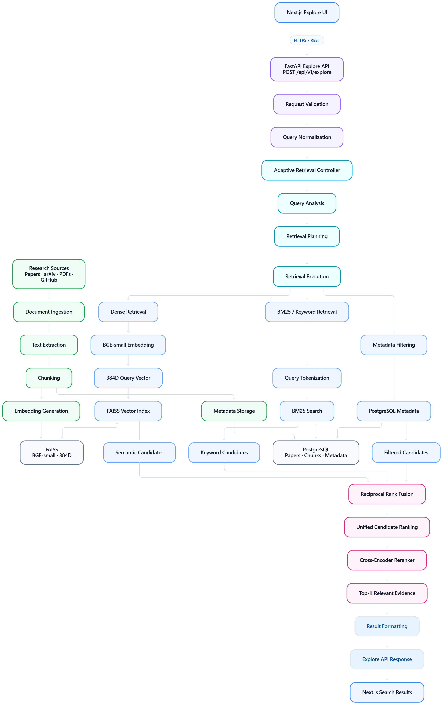

.png)


