# AI Research Assistant — Frontier Research Architecture

## Advanced Research Discovery, Multi-Source Evidence Synthesis & Research Gap Analysis

---

# 1. Overview

The **Frontier Research module** is the advanced research-discovery layer of the AI Research Assistant.

It is designed for questions that require more than conventional document retrieval.

The Frontier system combines:

- Research question analysis
- Research decomposition
- Multi-step research planning
- Parallel research tasks
- Multi-source research
- Advanced retrieval
- Hybrid retrieval
- Reciprocal Rank Fusion
- Cross-encoder reranking
- Evidence extraction and verification
- Research knowledge graph analysis
- Literature synthesis
- Comparative analysis
- Research gap analysis
- Trend analysis
- LLM-based research reasoning
- Citation and source traceability

The architecture follows:

```text
Researcher
    ↓
Next.js Frontier UI
    ↓
FastAPI Frontier API
    ↓
Frontier Research Orchestrator
    ↓
Research Question Analysis
    ↓
Research Decomposition
    ↓
Multi-Step Research Plan
    ↓
Parallel Research Tasks
    ↓
Multi-Source Research
    ↓
Advanced Retrieval Pipeline
    ↓
Hybrid Retrieval
    ↓
RRF Fusion
    ↓
Cross-Encoder Reranking
    ↓
Evidence Processing & Verification
    ↓
Research Knowledge Graph
    ↓
Research Synthesis Engine
    ↓
LLM Research Reasoning
    ↓
Frontier Research Outputs
```

---

# 2. High-Level Frontier Architecture

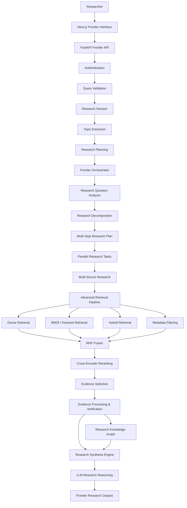

---

# 3. Frontier UI

The Frontier interface is the user-facing research discovery layer.

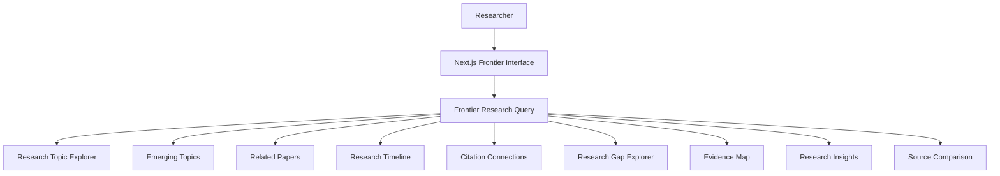

The Frontier UI can expose multiple research perspectives from the same research session.

Examples include:

- Research Topic Explorer
- Emerging Topics
- Related Papers
- Research Timeline
- Citation Connections
- Research Gap Explorer
- Evidence Map
- Research Insights
- Source Comparison

---

# 4. Frontier API

The Frontier API provides the HTTP boundary for advanced research workflows.

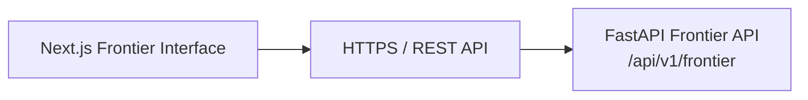

The API handles:

- Authentication
- Query validation
- Research session management
- Topic extraction
- Research planning
- Frontier orchestration

---

# 5. Frontier API Processing Layer

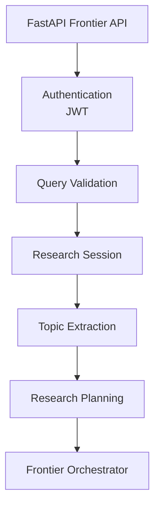

The API layer prepares the request before handing it to the Frontier Research Orchestrator.

---

# 6. Frontier Research Orchestrator

The Frontier Research Orchestrator is responsible for converting a complex research question into an executable research workflow.

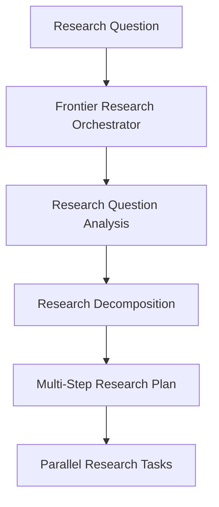

The orchestrator is responsible for:

- Understanding the research question.
- Identifying research dimensions.
- Decomposing complex questions.
- Creating multi-step research plans.
- Creating parallel research tasks.
- Coordinating multi-source research.
- Sending tasks into the retrieval and evidence pipeline.

---

# 7. Research Question Analysis

The first stage analyzes the research question and identifies what kind of research is required.

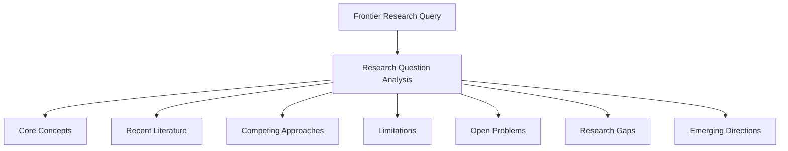

The analysis identifies research dimensions such as:

- Core concepts
- Recent literature
- Competing approaches
- Limitations
- Open problems
- Research gaps
- Emerging directions

---

# 8. Research Decomposition

Complex research questions are decomposed into smaller research tasks.

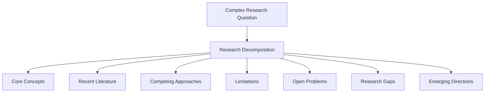

This decomposition allows the system to research different dimensions independently.

---

# 9. Multi-Step Research Plan

The decomposed research tasks are converted into an execution plan.

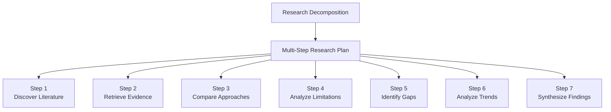

The research plan provides the execution structure for the Frontier workflow.

---

# 10. Parallel Research Tasks

Independent research dimensions can be executed as parallel tasks.

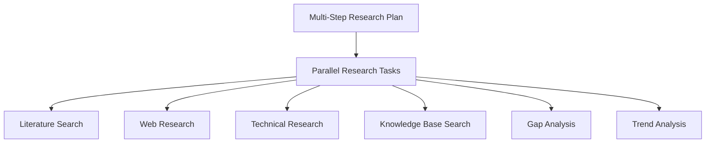

Parallelization allows the Frontier engine to investigate multiple research dimensions without forcing every task through a single sequential path.

---

# 11. Multi-Source Research Engine

The Multi-Source Research Engine combines different classes of research sources.

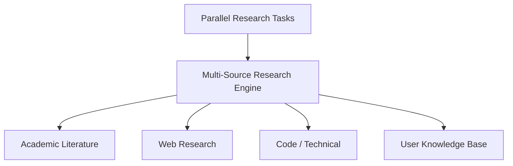

---

# 12. Academic Literature

The academic research source layer can include:

- arXiv
- Research papers
- Conference papers
- Journal articles
- Citation metadata

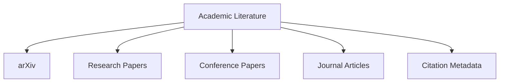

---

# 13. Web Research

Web research provides additional context outside the academic literature corpus.

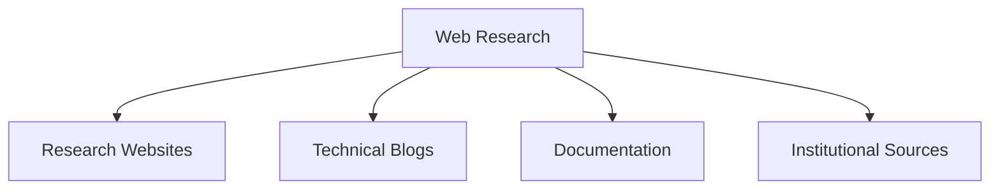

Web sources can provide:

- Research organization pages.
- Technical explanations.
- Documentation.
- Institutional information.
- Supporting context.

---

# 14. Code / Technical Research

The technical research layer provides implementation-oriented evidence.

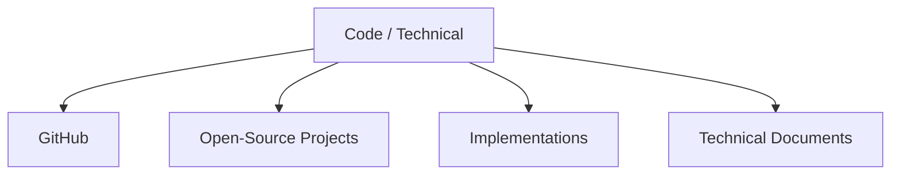

This layer is useful when research questions involve:

- Implementations.
- Open-source systems.
- Repositories.
- Technical architectures.
- Practical engineering approaches.

---

# 15. User Knowledge Base

The Frontier engine can also use user-provided research knowledge.

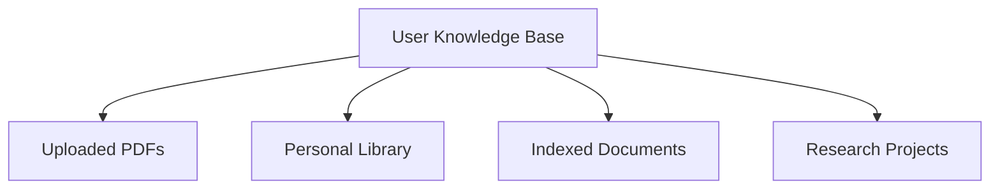

This allows external research sources and private indexed knowledge to participate in the same research workflow.

---

# 16. Advanced Research Retrieval Pipeline

The Frontier retrieval engine uses multiple retrieval stages.

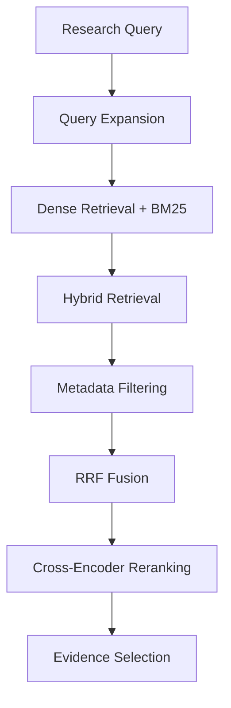

The retrieval pipeline progressively improves:

- Query coverage
- Candidate recall
- Candidate relevance
- Evidence precision

---

# 17. Query Expansion

Query expansion generates additional retrieval formulations for complex research questions.

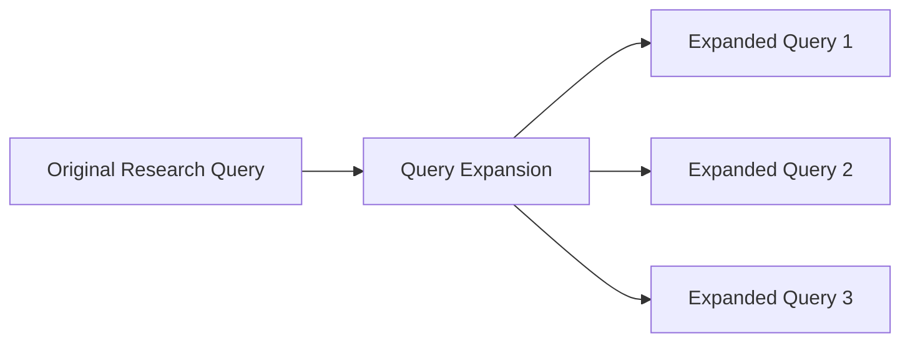

Query expansion is useful when a single wording may not capture the complete research terminology.

---

# 18. Dense Retrieval

Dense retrieval uses semantic embeddings to retrieve conceptually relevant research content.

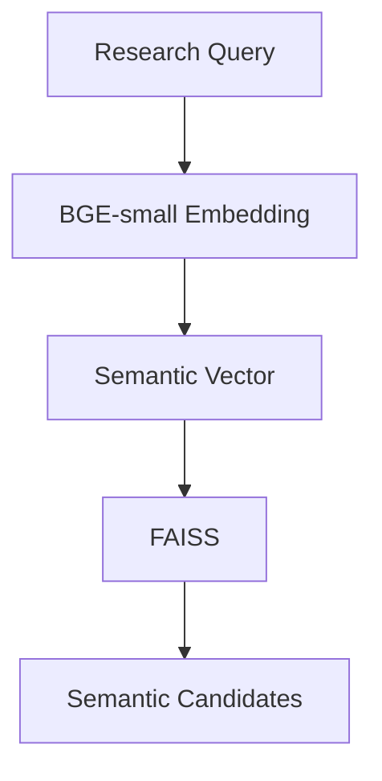

Dense retrieval supports semantic matching across different wording and terminology.

---

# 19. BM25 / Keyword Retrieval

BM25 provides lexical retrieval for exact terminology and research-specific terms.

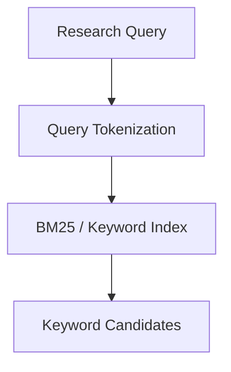

BM25 is especially useful for:

- Technical terminology
- Named methods
- Acronyms
- Paper titles
- Author names
- Exact phrases
- Identifiers

---

# 20. Hybrid Retrieval

Hybrid retrieval combines semantic and lexical signals.

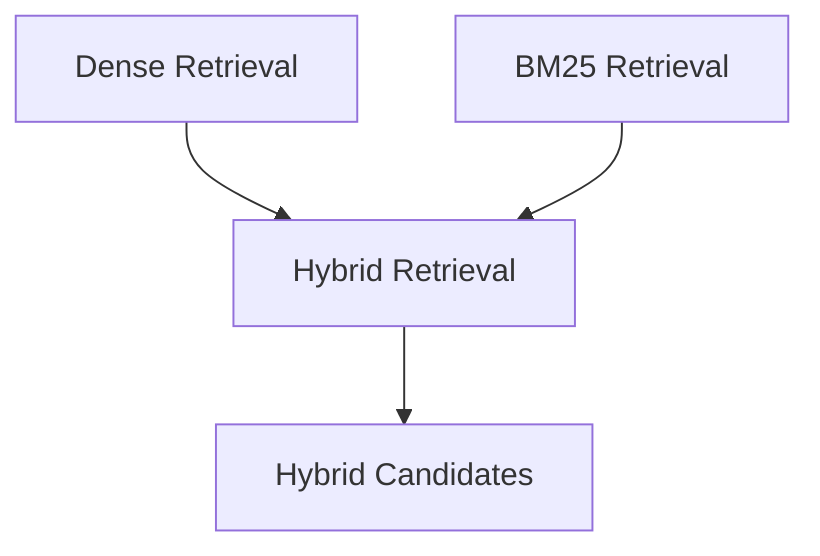

The hybrid layer increases retrieval coverage by combining complementary retrieval mechanisms.

---

# 21. Metadata Filtering

Metadata filtering applies structured research constraints.

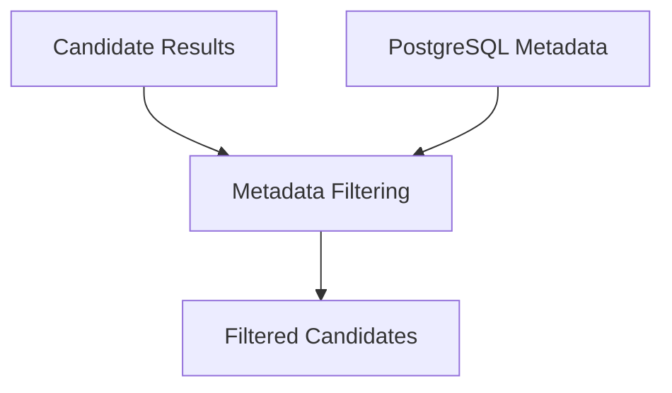

Metadata can represent information such as:

- Paper metadata
- Authors
- Topics
- Documents
- Research projects
- Source types
- Other indexed research attributes

---

# 22. Research Retrieval Infrastructure

The Frontier retrieval engine relies on multiple infrastructure components.

```mermaid
flowchart TD

    R[Research Retrieval Engine]

    F[FAISS<br/>Embeddings · Vector Search]

    B[BM25<br/>Lexical Search]

    PG[PostgreSQL<br/>Metadata]

    R --> F
    R --> B
    R --> PG
```

The infrastructure provides complementary retrieval capabilities.

---

# 23. Reciprocal Rank Fusion

RRF combines results from multiple retrieval strategies.

```mermaid
flowchart TD

    D[Dense Candidates]

    B[BM25 Candidates]

    H[Hybrid Candidates]

    M[Filtered Candidates]

    RRF[Reciprocal Rank Fusion]

    U[Unified Candidate Ranking]

    D --> RRF
    B --> RRF
    H --> RRF
    M --> RRF

    RRF --> U
```

The purpose of RRF is to combine different ranking signals into a unified candidate set.

---

# 24. Cross-Encoder Reranking

The cross-encoder performs a higher-precision relevance evaluation.

```mermaid
flowchart LR

    U[Unified Candidate Ranking]

    R[Cross-Encoder Reranking]

    E[Relevant Evidence]

    U --> R
    R --> E
```

The reranker evaluates candidates against the research query before evidence is selected for downstream synthesis.

---

# 25. Evidence Selection

The retrieval pipeline produces a focused evidence set.

```mermaid
flowchart TD

    R[Cross-Encoder Reranking]

    E[Evidence Selection]

    TOP[Selected Research Evidence]

    R --> E
    E --> TOP
```

Evidence selection ensures that downstream research synthesis operates on the most relevant available evidence.

---

# 26. Evidence Processing & Verification

The Evidence Processing and Verification layer transforms raw retrieval results into validated research evidence.

```mermaid
flowchart TD

    E[Retrieved Evidence]

    V[Evidence Processing & Verification]

    EX[Evidence Extraction]

    DD[Evidence Deduplication]

    SA[Source Attribution]

    QS[Source Quality Signals]

    CT[Citation Tracking]

    CM[Claim → Evidence Mapping]

    DP[Duplicate Detection]

    CD[Contradiction Detection]

    E --> V

    V --> EX
    V --> DD
    V --> SA
    V --> QS
    V --> CT
    V --> CM
    V --> DP
    V --> CD
```

---

# 27. Evidence Extraction

Evidence extraction identifies useful research statements and passages from retrieved documents.

```mermaid
flowchart LR

    D[Retrieved Documents]

    E[Evidence Extraction]

    P[Supporting Passages]

    D --> E
    E --> P
```

The extracted evidence becomes the basis for research synthesis and claim verification.

---

# 28. Evidence Deduplication

Duplicate evidence is identified and consolidated.

```mermaid
flowchart LR

    E[Retrieved Evidence]

    D[Evidence Deduplication]

    U[Unique Evidence]

    E --> D
    D --> U
```

Deduplication prevents repeated evidence from disproportionately influencing synthesis.

---

# 29. Source Attribution

Each evidence item maintains information about its originating source.

```mermaid
flowchart LR

    E[Evidence]

    A[Source Attribution]

    S[Source]

    E --> A
    A --> S
```

This supports source traceability throughout the research workflow.

---

# 30. Source Quality Signals

Source quality information can be attached to evidence.

```mermaid
flowchart LR

    S[Research Source]

    Q[Source Quality Signals]

    E[Evidence]

    S --> Q
    Q --> E
```

Quality signals can help downstream reasoning distinguish between different source types and evidence contexts.

---

# 31. Citation Tracking

Citation tracking connects research claims and evidence to their sources.

```mermaid
flowchart LR

    E[Evidence]

    C[Citation Tracking]

    S[Source Citation]

    E --> C
    C --> S
```

This supports citation-aware research synthesis.

---

# 32. Claim to Evidence Mapping

The system maps synthesized claims back to supporting evidence.

```mermaid
flowchart LR

    C[Research Claim]

    M[Claim → Evidence Mapping]

    E[Supporting Evidence]

    C --> M
    M --> E
```

This creates a traceability relationship:

```text
Research Claim
      ↓
Evidence Mapping
      ↓
Supporting Evidence
      ↓
Source
```

---

# 33. Duplicate and Contradiction Detection

The verification layer identifies repeated or conflicting evidence.

```mermaid
flowchart TD

    E[Research Evidence]

    D[Duplicate Detection]

    C[Contradiction Detection]

    U[Validated Evidence]

    E --> D
    E --> C

    D --> U
    C --> U
```

Contradiction detection is especially important for frontier research where multiple studies may report different findings.

---

# 34. Research Knowledge Graph

The Research Knowledge Graph represents relationships between research entities.

```mermaid
flowchart LR

    P[Paper]

    A[Author]

    T[Topic]

    M[Method]

    E[Evidence]

    PR[Research Problem]

    P -->|Cited| A
    P -->|Uses| M
    P -->|Explores| T
    P -->|Contains| E
    T -->|Addresses| PR
    E -->|Supports| PR
```

The graph can represent:

- Papers
- Authors
- Topics
- Methods
- Evidence
- Research problems
- Citations
- Relationships between research concepts

---

# 35. Knowledge Graph Relationships

The graph provides structured relationships that can support frontier research analysis.

```mermaid
flowchart TD

    P[Paper]

    A[Author]

    T[Topic]

    M[Method]

    E[Evidence]

    PR[Research Problem]

    P --> A
    P --> T
    P --> M
    P --> E

    T --> PR
    M --> PR
    E --> PR
```

These relationships can support:

- Related paper discovery
- Citation analysis
- Topic relationships
- Method comparisons
- Research problem discovery
- Evidence mapping

---

# 36. Research Synthesis Engine

The Research Synthesis Engine transforms verified evidence into higher-level research analysis.

```mermaid
flowchart TD

    E[Verified Evidence]

    S[Research Synthesis Engine]

    LS[Literature Synthesis]

    CA[Comparative Analysis]

    GA[Research Gap Analysis]

    TA[Trend Analysis]

    E --> S

    S --> LS
    S --> CA
    S --> GA
    S --> TA
```

---

# 37. Literature Synthesis

Literature synthesis combines evidence across multiple research sources.

```mermaid
flowchart LR

    E1[Paper Evidence]
    E2[Paper Evidence]
    E3[Paper Evidence]

    LS[Literature Synthesis]

    F[Combined Findings]

    E1 --> LS
    E2 --> LS
    E3 --> LS

    LS --> F
```

Literature synthesis can identify:

- Common findings
- Divergent findings
- Methodological patterns
- Recurring limitations
- Research evolution

---

# 38. Comparative Analysis

Comparative analysis evaluates differences across research approaches.

```mermaid
flowchart TD

    E[Verified Evidence]

    C[Comparative Analysis]

    M[Methods]

    R[Results]

    L[Limitations]

    A[Assumptions]

    E --> C

    C --> M
    C --> R
    C --> L
    C --> A
```

Comparative analysis can compare:

- Methods
- Results
- Limitations
- Assumptions
- Experimental approaches
- Research outcomes

---

# 39. Research Gap Analysis

Research Gap Analysis identifies unexplored areas and open research problems.

```mermaid
flowchart TD

    E[Verified Evidence]

    G[Research Gap Analysis]

    UA[Unexplored Areas]

    CF[Conflicting Findings]

    OQ[Open Questions]

    E --> G

    G --> UA
    G --> CF
    G --> OQ
```

Research gap analysis can identify:

- Unexplored areas.
- Conflicting findings.
- Open questions.
- Missing evidence.
- Under-researched methods.
- Potential future directions.

---

# 40. Trend Analysis

Trend Analysis identifies changes in research activity and methodology.

```mermaid
flowchart TD

    E[Research Evidence]

    T[Trend Analysis]

    ET[Emerging Topics]

    RE[Research Evolution]

    MA[Method Adoption]

    E --> T

    T --> ET
    T --> RE
    T --> MA
```

Trend analysis can examine:

- Emerging topics.
- Research evolution.
- Method adoption.
- Increasing or declining research attention.
- New methodological directions.

---

# 41. LLM Research Reasoning Layer

The LLM Research Reasoning Layer receives structured evidence and research synthesis context.

```mermaid
flowchart TD

    E[Verified Evidence]

    KG[Knowledge Graph]

    S[Research Synthesis]

    C[Structured Context]

    LLM[LLM Research Reasoning]

    E --> C
    KG --> C
    S --> C

    C --> LLM
```

The reasoning layer can perform:

- Structured prompt construction.
- Evidence-grounded reasoning.
- Multi-document synthesis.
- Comparative reasoning.
- Hypothesis generation.
- Research question generation.
- Report generation.

---

# 42. Structured Prompt Construction

The system prepares a structured prompt using validated research context.

```mermaid
flowchart TD

    Q[Research Question]

    E[Verified Evidence]

    KG[Knowledge Graph]

    S[Synthesis Results]

    P[Structured Prompt Construction]

    LLM[LLM]

    Q --> P
    E --> P
    KG --> P
    S --> P

    P --> LLM
```

The prompt provides the LLM with explicit research context instead of relying only on the original user query.

---

# 43. Evidence-Grounded Reasoning

The LLM reasons over the supplied evidence.

```mermaid
flowchart LR

    E[Verified Evidence]

    C[Evidence-Grounded Context]

    LLM[LLM Research Reasoning]

    R[Research Reasoning]

    E --> C
    C --> LLM
    LLM --> R
```

The reasoning layer should distinguish between:

- Evidence-supported findings.
- Synthesis.
- Interpretation.
- Uncertainty.
- Research hypotheses.

---

# 44. Multi-Document Synthesis

The Frontier engine can synthesize evidence across multiple research documents.

```mermaid
flowchart TD

    P1[Paper 1]
    P2[Paper 2]
    P3[Paper 3]
    P4[Paper 4]

    E[Evidence Context]

    LLM[LLM]

    S[Synthesized Research Findings]

    P1 --> E
    P2 --> E
    P3 --> E
    P4 --> E

    E --> LLM
    LLM --> S
```

This allows the system to reason across a broader literature set rather than treating each document independently.

---

# 45. Comparative Reasoning

Comparative reasoning combines evidence from multiple approaches.

```mermaid
flowchart TD

    A[Approach A Evidence]

    B[Approach B Evidence]

    C[Approach C Evidence]

    CR[Comparative Reasoning]

    O[Comparison]

    A --> CR
    B --> CR
    C --> CR

    CR --> O
```

The output can compare:

- Methods.
- Results.
- Assumptions.
- Limitations.
- Trade-offs.
- Evidence strength.

---

# 46. Hypothesis Generation

The LLM reasoning layer can generate research hypotheses grounded in retrieved evidence.

```mermaid
flowchart TD

    E[Verified Evidence]

    S[Research Synthesis]

    H[Hypothesis Generation]

    RQ[Research Questions]

    E --> H
    S --> H
    H --> RQ
```

Generated hypotheses should remain clearly distinguished from established evidence.

---

# 47. Research Question Generation

Frontier analysis can identify follow-up research questions.

```mermaid
flowchart TD

    G[Research Gaps]

    O[Open Problems]

    T[Emerging Directions]

    RQ[Research Question Generation]

    Q[Suggested Research Questions]

    G --> RQ
    O --> RQ
    T --> RQ

    RQ --> Q
```

---

# 48. Report Generation

The final research response can be produced as a structured research report.

```mermaid
flowchart TD

    E[Evidence Context]

    S[Research Synthesis]

    G[Gap Analysis]

    T[Trend Analysis]

    LLM[LLM Research Reasoning]

    R[Report Generation]

    OUT[Research Report]

    E --> LLM
    S --> LLM
    G --> LLM
    T --> LLM

    LLM --> R
    R --> OUT
```

---

# 49. Frontier Research Outputs

The Frontier module can produce multiple research-oriented outputs.

```mermaid
flowchart TD

    LLM[LLM Research Reasoning]

    O[Frontier Research Outputs]

    RL[Research Landscape]

    LM[Literature Map]

    EG[Evidence Graph]

    RT[Research Timeline]

    MC[Method Comparison]

    RG[Research Gaps]

    OP[Open Problems]

    ED[Emerging Directions]

    SRQ[Suggested Research Questions]

    LLM --> O

    O --> RL
    O --> LM
    O --> EG
    O --> RT
    O --> MC
    O --> RG
    O --> OP
    O --> ED
    O --> SRQ
```

---

# 50. Research Landscape

The Research Landscape provides a high-level view of the research domain.

```mermaid
flowchart LR

    P[Papers]

    T[Topics]

    M[Methods]

    A[Authors]

    R[Research Landscape]

    P --> R
    T --> R
    M --> R
    A --> R
```

---

# 51. Literature Map

The Literature Map organizes research papers around topics, methods, and relationships.

```mermaid
flowchart TD

    P[Papers]

    T[Topics]

    M[Methods]

    C[Citations]

    LM[Literature Map]

    P --> LM
    T --> LM
    M --> LM
    C --> LM
```

---

# 52. Evidence Graph

The Evidence Graph connects claims, evidence, sources, and research problems.

```mermaid
flowchart LR

    C[Claim]

    E[Evidence]

    S[Source]

    P[Research Problem]

    C --> E
    E --> S
    E --> P
```

---

# 53. Research Timeline

The Research Timeline represents the evolution of research topics and methods.

```mermaid
flowchart LR

    Y1[Earlier Research]

    Y2[Recent Research]

    Y3[Current Research]

    Y4[Emerging Research]

    Y1 --> Y2
    Y2 --> Y3
    Y3 --> Y4
```

---

# 54. Method Comparison

The Method Comparison output organizes differences between competing approaches.

```mermaid
flowchart TD

    M1[Method A]

    M2[Method B]

    M3[Method C]

    MC[Method Comparison]

    M1 --> MC
    M2 --> MC
    M3 --> MC

    MC --> R[Results]
    MC --> L[Limitations]
    MC --> A[Assumptions]
```

---

# 55. Research Gaps

Research gaps are derived from evidence, literature synthesis, and knowledge graph relationships.

```mermaid
flowchart TD

    E[Verified Evidence]

    L[Literature Synthesis]

    KG[Knowledge Graph]

    G[Research Gap Analysis]

    RG[Research Gaps]

    E --> G
    L --> G
    KG --> G

    G --> RG
```

---

# 56. Open Problems

Open problems are identified from unresolved research questions and limitations.

```mermaid
flowchart TD

    L[Research Limitations]

    C[Conflicting Findings]

    Q[Open Questions]

    O[Open Problems]

    L --> O
    C --> O
    Q --> O
```

---

# 57. Emerging Directions

Emerging directions are derived from research trends and recent literature.

```mermaid
flowchart TD

    T[Trend Analysis]

    R[Recent Literature]

    M[Method Adoption]

    E[Emerging Directions]

    T --> E
    R --> E
    M --> E
```

---

# 58. Suggested Research Questions

The system can turn identified gaps and emerging directions into new research questions.

```mermaid
flowchart TD

    G[Research Gaps]

    O[Open Problems]

    E[Emerging Directions]

    RQ[Suggested Research Questions]

    G --> RQ
    O --> RQ
    E --> RQ
```

---

# 59. Complete Frontier Retrieval Flow

```mermaid
flowchart TD

    Q[Frontier Research Query]

    A[Research Question Analysis]

    D[Research Decomposition]

    P[Multi-Step Research Plan]

    T[Parallel Research Tasks]

    MS[Multi-Source Research]

    QE[Query Expansion]

    DR[Dense Retrieval]

    BM[BM25 Retrieval]

    HY[Hybrid Retrieval]

    MF[Metadata Filtering]

    RRF[Reciprocal Rank Fusion]

    RR[Cross-Encoder Reranking]

    ES[Evidence Selection]

    EP[Evidence Processing & Verification]

    KG[Research Knowledge Graph]

    SYN[Research Synthesis]

    LLM[LLM Research Reasoning]

    OUT[Frontier Research Outputs]

    Q --> A
    A --> D
    D --> P
    P --> T
    T --> MS

    MS --> QE

    QE --> DR
    QE --> BM

    DR --> HY
    BM --> HY

    HY --> MF
    MF --> RRF

    RRF --> RR
    RR --> ES

    ES --> EP

    EP --> KG
    EP --> SYN

    KG --> SYN
    SYN --> LLM

    LLM --> OUT
```

---

# 60. Complete Evidence Flow

```mermaid
flowchart LR

    SOURCE[Research Sources]

    INGEST[Knowledge Ingestion]

    INDEX[Research Indexes]

    RET[Retrieval]

    FUSION[RRF Fusion]

    RERANK[Cross-Encoder Reranking]

    VERIFY[Evidence Verification]

    GRAPH[Knowledge Graph]

    SYNTH[Research Synthesis]

    REASON[LLM Research Reasoning]

    OUTPUT[Research Output]

    SOURCE --> INGEST
    INGEST --> INDEX
    INDEX --> RET
    RET --> FUSION
    FUSION --> RERANK
    RERANK --> VERIFY
    VERIFY --> GRAPH
    VERIFY --> SYNTH
    GRAPH --> SYNTH
    SYNTH --> REASON
    REASON --> OUTPUT
```

---

# 61. End-to-End Frontier Architecture

```mermaid
flowchart TD

    U[Researcher]

    UI[Next.js Frontier Interface]

    API[FastAPI Frontier API<br/>/api/v1/frontier]

    AUTH[Authentication<br/>JWT]

    VAL[Query Validation]

    SESSION[Research Session]

    TOPIC[Topic Extraction]

    PLAN[Research Planning]

    O[Frontier Research Orchestrator]


    subgraph ANALYSIS["Research Analysis"]

        QA[Research Question Analysis]

        RD[Research Decomposition]

        MP[Multi-Step Research Plan]

        PT[Parallel Research Tasks]

        QA --> RD
        RD --> MP
        MP --> PT

    end


    subgraph SOURCES["Multi-Source Research"]

        AC[Academic Literature]

        WEB[Web Research]

        CODE[Code / Technical]

        UKB[User Knowledge Base]

    end


    subgraph RETRIEVAL["Advanced Research Retrieval"]

        QE[Query Expansion]

        D[Dense Retrieval]

        B[BM25 / Keyword Retrieval]

        H[Hybrid Retrieval]

        MF[Metadata Filtering]

        RRF[Reciprocal Rank Fusion]

        RR[Cross-Encoder Reranking]

        ES[Evidence Selection]

        QE --> D
        QE --> B
        D --> H
        B --> H
        H --> MF
        MF --> RRF
        RRF --> RR
        RR --> ES

    end


    subgraph VERIFY["Evidence Processing & Verification"]

        EX[Evidence Extraction]

        DD[Evidence Deduplication]

        SA[Source Attribution]

        QS[Source Quality Signals]

        CT[Citation Tracking]

        CM[Claim → Evidence Mapping]

        DP[Duplicate Detection]

        CD[Contradiction Detection]

    end


    subgraph GRAPH["Research Knowledge Graph"]

        PAP[Papers]

        AUT[Authors]

        TOPICG[Topics]

        MET[Methods]

        EVID[Evidence]

        PROB[Research Problems]

    end


    subgraph SYNTHESIS["Research Synthesis Engine"]

        LS[Literature Synthesis]

        CA[Comparative Analysis]

        GA[Research Gap Analysis]

        TA[Trend Analysis]

    end


    subgraph REASONING["LLM Research Reasoning"]

        SP[Structured Prompt Construction]

        EGR[Evidence-Grounded Reasoning]

        MDS[Multi-Document Synthesis]

        CR[Comparative Reasoning]

        HG[Hypothesis Generation]

        RQ[Research Question Generation]

        RG[Report Generation]

    end


    OUT[Frontier Research Outputs]


    U --> UI
    UI --> API

    API --> AUTH
    AUTH --> VAL
    VAL --> SESSION
    SESSION --> TOPIC
    TOPIC --> PLAN
    PLAN --> O

    O --> QA

    PT --> AC
    PT --> WEB
    PT --> CODE
    PT --> UKB

    AC --> QE
    WEB --> QE
    CODE --> QE
    UKB --> QE

    ES --> EX

    EX --> DD
    EX --> SA
    EX --> QS
    EX --> CT
    EX --> CM
    EX --> DP
    EX --> CD

    EX --> PAP
    EX --> EVID

    PAP --> AUT
    PAP --> TOPICG
    PAP --> MET
    TOPICG --> PROB
    MET --> PROB
    EVID --> PROB

    EX --> LS
    EX --> CA
    EX --> GA
    EX --> TA

    PAP --> LS
    GRAPH --> LS

    LS --> SP
    CA --> SP
    GA --> SP
    TA --> SP
    GRAPH --> SP

    SP --> EGR
    EGR --> MDS
    MDS --> CR
    CR --> HG
    HG --> RQ
    RQ --> RG

    RG --> OUT
```

---

# 62. Frontier Research Sequence

```mermaid
sequenceDiagram

    participant U as Researcher
    participant UI as Next.js Frontier UI
    participant API as FastAPI Frontier API
    participant O as Frontier Orchestrator
    participant P as Research Planner
    participant MS as Multi-Source Research
    participant R as Retrieval Engine
    participant V as Evidence Verification
    participant KG as Knowledge Graph
    participant S as Synthesis Engine
    participant L as LLM Reasoning
    participant OUT as Frontier Outputs

    U->>UI: Frontier Research Query

    UI->>API: POST /api/v1/frontier

    API->>API: Authentication
    API->>API: Query Validation
    API->>API: Create Research Session
    API->>API: Extract Topic

    API->>O: Start Frontier Research

    O->>P: Analyze and Decompose Query
    P-->>O: Multi-Step Research Plan

    O->>MS: Execute Parallel Research Tasks
    MS-->>O: Multi-Source Candidates

    O->>R: Execute Advanced Retrieval

    R->>R: Query Expansion
    R->>R: Dense Retrieval
    R->>R: BM25 Retrieval
    R->>R: Hybrid Retrieval
    R->>R: Metadata Filtering
    R->>R: RRF Fusion
    R->>R: Cross-Encoder Reranking

    R-->>O: Selected Evidence

    O->>V: Process and Verify Evidence

    V->>V: Extract Evidence
    V->>V: Deduplicate Evidence
    V->>V: Attribute Sources
    V->>V: Track Citations
    V->>V: Map Claims to Evidence
    V->>V: Detect Contradictions

    V-->>O: Verified Evidence

    O->>KG: Build / Query Research Graph
    KG-->>O: Research Relationships

    O->>S: Synthesize Research
    S->>S: Literature Synthesis
    S->>S: Comparative Analysis
    S->>S: Research Gap Analysis
    S->>S: Trend Analysis

    S-->>O: Research Synthesis

    O->>L: Generate Grounded Research Reasoning
    L-->>O: Research Analysis

    O->>OUT: Generate Frontier Outputs
    OUT-->>UI: Research Landscape / Gaps / Timeline / Insights
    UI-->>U: Frontier Research Results
```

---

# 63. Complete Frontier Data Flow

```text
Researcher
    |
    v
Next.js Frontier Interface
    |
    v
HTTPS / REST
    |
    v
FastAPI Frontier API
    |
    +--> Authentication
    |
    +--> Query Validation
    |
    +--> Research Session
    |
    +--> Topic Extraction
    |
    +--> Research Planning
    |
    v
Frontier Research Orchestrator
    |
    v
Research Question Analysis
    |
    v
Research Decomposition
    |
    v
Multi-Step Research Plan
    |
    v
Parallel Research Tasks
    |
    +-------------------+-------------------+-------------------+
    |                   |                   |                   |
    v                   v                   v                   v
Academic Literature   Web Research      Code / Technical   User Knowledge
    |                   |                   |                   |
    +-------------------+-------------------+-------------------+
                            |
                            v
                      Query Expansion
                            |
              +-------------+-------------+
              |                           |
              v                           v
       Dense Retrieval            BM25 / Keyword
              |                           |
              +-------------+-------------+
                            |
                            v
                    Hybrid Retrieval
                            |
                            v
                   Metadata Filtering
                            |
                            v
                 Reciprocal Rank Fusion
                            |
                            v
                Unified Candidate Ranking
                            |
                            v
                Cross-Encoder Reranking
                            |
                            v
                    Evidence Selection
                            |
                            v
             Evidence Processing & Verification
                            |
             +--------------+--------------+
             |              |              |
             v              v              v
       Source Attribution  Citation    Contradiction
                          Tracking      Detection
             |              |              |
             +--------------+--------------+
                            |
                            v
                 Research Knowledge Graph
                            |
                            v
                 Research Synthesis Engine
                            |
          +-----------------+-----------------+
          |                 |                 |
          v                 v                 v
   Literature          Comparative       Gap / Trend
   Synthesis            Analysis          Analysis
          |                 |                 |
          +-----------------+-----------------+
                            |
                            v
                LLM Research Reasoning
                            |
          +-----------------+-----------------+
          |                 |                 |
          v                 v                 v
    Multi-Document     Comparative      Hypothesis /
      Synthesis         Reasoning       Research Questions
          |                 |                 |
          +-----------------+-----------------+
                            |
                            v
                   Report Generation
                            |
                            v
                 Frontier Research Outputs
                            |
          +-----------------+-------------------+
          |                 |                   |
          v                 v                   v
   Research Landscape   Literature Map    Evidence Graph
          |
          +-----------------+-------------------+
                            |
                            v
                    Research Timeline
                            |
                            v
                    Method Comparison
                            |
                            v
                     Research Gaps
                            |
                            v
                     Open Problems
                            |
                            v
                  Emerging Directions
                            |
                            v
              Suggested Research Questions
                            |
                            v
                    Back to Frontier UI
```

---

# 64. Research Knowledge Infrastructure

```mermaid
flowchart LR

    PG[PostgreSQL]

    FAISS[FAISS]

    DS[Document Storage]

    KG[Research Graph]

    PG --> P[Papers]
    PG --> D[Documents]
    PG --> C[Chunks]
    PG --> M[Metadata]

    FAISS --> E[Embeddings]
    FAISS --> V[Vector IDs]
    FAISS --> S[Similarity Index]

    DS --> PDF[PDFs]
    DS --> SRC[Original Sources]

    KG --> ENT[Research Entities]
    KG --> REL[Relationships]
    KG --> CIT[Citations]
    KG --> EV[Evidence Links]
```

The infrastructure supports four primary storage concerns:

- Structured research metadata.
- Vector representations.
- Original research documents.
- Graph relationships.

---

# 65. Document Ingestion Architecture

External research sources enter the system through Document Ingestion.

```mermaid
flowchart LR

    S[External Research Sources]

    I[Document Ingestion]

    T[Text Extraction]

    C[Chunking]

    E[Embedding Generation]

    M[Metadata Storage]

    S --> I
    I --> T
    T --> C

    C --> E
    C --> M
```

External sources can include:

- Academic papers.
- arXiv.
- Uploaded PDFs.
- Research documents.
- GitHub repositories.
- External research sources.

---

# 66. Complete Ingestion Flow

```mermaid
flowchart TD

    A[Academic Papers]

    AX[arXiv]

    UP[Uploaded PDFs]

    RD[Research Documents]

    GH[GitHub / External Sources]

    I[Document Ingestion]

    T[Text Extraction]

    C[Chunking]

    E[Embedding Generation]

    M[Metadata Storage]

    F[FAISS]

    PG[PostgreSQL]

    A --> I
    AX --> I
    UP --> I
    RD --> I
    GH --> I

    I --> T
    T --> C

    C --> E
    E --> F

    C --> M
    M --> PG
```

---

# 67. Research Gap Discovery Flow

```mermaid
flowchart TD

    Q[Frontier Research Question]

    L[Literature Retrieval]

    E[Verified Evidence]

    KG[Research Knowledge Graph]

    LS[Literature Synthesis]

    CA[Comparative Analysis]

    TA[Trend Analysis]

    GA[Research Gap Analysis]

    G[Research Gaps]

    O[Open Problems]

    ED[Emerging Directions]

    RQ[Suggested Research Questions]

    Q --> L
    L --> E

    E --> KG
    E --> LS
    E --> CA
    E --> TA

    KG --> GA
    LS --> GA
    CA --> GA
    TA --> GA

    GA --> G
    GA --> O
    GA --> ED

    G --> RQ
    O --> RQ
    ED --> RQ
```

---

# 68. Multi-Source Evidence Synthesis

```mermaid
flowchart TD

    A[Academic Evidence]

    W[Web Evidence]

    C[Code / Technical Evidence]

    K[User Knowledge Evidence]

    F[Evidence Fusion]

    V[Evidence Verification]

    S[Research Synthesis]

    L[LLM Research Reasoning]

    A --> F
    W --> F
    C --> F
    K --> F

    F --> V
    V --> S
    S --> L
```

This creates a multi-source research workflow in which evidence from different source classes can be compared and synthesized.

---

# 69. Research Reproducibility

The Frontier research workflow maintains explicit research stages.

```text
Research Question
        ↓
Research Plan
        ↓
Research Tasks
        ↓
Sources
        ↓
Retrieval
        ↓
Evidence
        ↓
Verification
        ↓
Synthesis
        ↓
Reasoning
        ↓
Research Output
```

Each stage provides a conceptual boundary that can be inspected and reproduced.

---

# 70. Source Attribution and Traceability

The research output should maintain a traceable relationship between conclusions and source evidence.

```mermaid
flowchart LR

    SOURCE[Original Source]

    DOC[Document]

    CHUNK[Research Chunk]

    RET[Retrieval Result]

    EVID[Verified Evidence]

    CLAIM[Research Claim]

    SYN[Synthesis]

    OUT[Research Output]

    SOURCE --> DOC
    DOC --> CHUNK
    CHUNK --> RET
    RET --> EVID
    EVID --> CLAIM
    CLAIM --> SYN
    SYN --> OUT
```

This allows research findings to be traced back to the underlying evidence.

---

# 71. Frontier Research Design Principles

## 71.1 Multi-Source Research

Frontier research should not depend on a single source class.

```text
Academic Literature
        +
Web Research
        +
Code / Technical Sources
        +
User Knowledge
        |
        v
Multi-Source Evidence
```

---

## 71.2 Retrieval First

Research reasoning begins after evidence retrieval.

```text
Question
   ↓
Plan
   ↓
Retrieve
   ↓
Verify
   ↓
Synthesize
   ↓
Reason
   ↓
Generate
```

---

## 71.3 Evidence Grounded

The reasoning layer receives verified evidence rather than relying exclusively on model knowledge.

```mermaid
flowchart LR

    E[Verified Evidence]

    C[Evidence Context]

    LLM[LLM]

    O[Research Output]

    E --> C
    C --> LLM
    LLM --> O
```

---

## 71.4 Citation Traceable

Research claims should remain connected to supporting evidence.

```text
Source
  ↓
Evidence
  ↓
Claim
  ↓
Synthesis
  ↓
Output
```

---

## 71.5 Modular Research Services

Research capabilities are separated into modular engines.

```mermaid
flowchart TD

    ORCH[Frontier Orchestrator]

    RET[Retrieval Engine]

    VER[Evidence Verification]

    KG[Knowledge Graph]

    SYN[Synthesis Engine]

    LLM[LLM Reasoning]

    ORCH --> RET
    ORCH --> VER
    ORCH --> KG
    ORCH --> SYN
    ORCH --> LLM
```

---

## 71.6 Separation of Retrieval and Generation

Retrieval determines:

> **What evidence is available?**

Reasoning determines:

> **What does the evidence mean?**

```mermaid
flowchart LR

    R[Retrieval]

    E[Evidence Verification]

    S[Synthesis]

    L[LLM Reasoning]

    R --> E
    E --> S
    S --> L
```

---

## 71.7 Human-in-the-Loop Research

The Frontier system supports researcher interaction rather than replacing researcher judgment.

```mermaid
flowchart LR

    R[Researcher]

    F[Frontier Research System]

    O[Research Insights]

    R --> F
    F --> O
    O --> R
```

The researcher can use the generated:

- Evidence.
- Literature maps.
- Research gaps.
- Timelines.
- Comparisons.
- Emerging directions.
- Suggested research questions

as inputs for further investigation.

---

# 72. Frontier Component Boundaries

| Component | Responsibility |
|---|---|
| Researcher | Human research interaction and interpretation |
| Next.js Frontier Interface | Frontier research UI |
| FastAPI Frontier API | HTTP/API boundary |
| Authentication | Request authentication |
| Query Validation | Request validation |
| Research Session | Track research workflow |
| Topic Extraction | Identify research topic |
| Research Planning | Create research execution plan |
| Frontier Research Orchestrator | Coordinate complete frontier workflow |
| Research Question Analysis | Analyze research intent and dimensions |
| Research Decomposition | Break complex questions into tasks |
| Multi-Step Research Plan | Define research execution steps |
| Parallel Research Tasks | Execute independent research dimensions |
| Multi-Source Research Engine | Coordinate multiple source types |
| Academic Literature | Academic research evidence |
| Web Research | External research context |
| Code / Technical | Technical and implementation evidence |
| User Knowledge Base | User-provided research knowledge |
| Query Expansion | Expand research retrieval queries |
| Dense Retrieval | Semantic retrieval |
| BM25 / Keyword Retrieval | Lexical retrieval |
| Hybrid Retrieval | Combine retrieval signals |
| Metadata Filtering | Structured filtering |
| RRF Fusion | Combine candidate rankings |
| Cross-Encoder Reranking | High-precision relevance ranking |
| Evidence Selection | Select relevant evidence |
| Evidence Extraction | Extract useful passages |
| Evidence Deduplication | Remove duplicate evidence |
| Source Attribution | Track evidence sources |
| Source Quality Signals | Preserve source quality information |
| Citation Tracking | Track citation relationships |
| Claim → Evidence Mapping | Connect claims to supporting evidence |
| Duplicate Detection | Identify repeated information |
| Contradiction Detection | Identify conflicting evidence |
| Research Knowledge Graph | Represent research relationships |
| Literature Synthesis | Combine literature findings |
| Comparative Analysis | Compare methods and findings |
| Research Gap Analysis | Identify gaps and open problems |
| Trend Analysis | Identify emerging research directions |
| LLM Research Reasoning | Grounded research reasoning |
| Multi-Document Synthesis | Synthesize multiple sources |
| Comparative Reasoning | Reason across approaches |
| Hypothesis Generation | Generate evidence-grounded hypotheses |
| Research Question Generation | Generate follow-up questions |
| Report Generation | Produce structured research output |
| Frontier Research Outputs | Present research insights |

---

# 73. Complete Frontier Architecture Summary

```text
Researcher
    ↓
Next.js Frontier Interface
    ↓
FastAPI Frontier API
    ↓
Authentication
    ↓
Query Validation
    ↓
Research Session
    ↓
Topic Extraction
    ↓
Research Planning
    ↓
Frontier Research Orchestrator
    ↓
Research Question Analysis
    ↓
Research Decomposition
    ↓
Multi-Step Research Plan
    ↓
Parallel Research Tasks
    ↓
Multi-Source Research
    ├── Academic Literature
    ├── Web Research
    ├── Code / Technical
    └── User Knowledge Base
    ↓
Advanced Retrieval Pipeline
    ↓
Query Expansion
    ↓
Dense + BM25
    ↓
Hybrid Retrieval
    ↓
Metadata Filtering
    ↓
RRF Fusion
    ↓
Cross-Encoder Reranking
    ↓
Evidence Selection
    ↓
Evidence Processing & Verification
    ├── Evidence Extraction
    ├── Deduplication
    ├── Source Attribution
    ├── Citation Tracking
    ├── Claim → Evidence Mapping
    └── Contradiction Detection
    ↓
Research Knowledge Graph
    ↓
Research Synthesis Engine
    ├── Literature Synthesis
    ├── Comparative Analysis
    ├── Research Gap Analysis
    └── Trend Analysis
    ↓
LLM Research Reasoning
    ├── Structured Prompt Construction
    ├── Evidence-Grounded Reasoning
    ├── Multi-Document Synthesis
    ├── Comparative Reasoning
    ├── Hypothesis Generation
    ├── Research Question Generation
    └── Report Generation
    ↓
Frontier Research Outputs
    ├── Research Landscape
    ├── Literature Map
    ├── Evidence Graph
    ├── Research Timeline
    ├── Method Comparison
    ├── Research Gaps
    ├── Open Problems
    ├── Emerging Directions
    └── Suggested Research Questions
```

---

# 74. Final Frontier Architecture

```mermaid
flowchart TD

    U[Researcher]

    UI[Next.js Frontier Interface]

    API[FastAPI Frontier API]

    O[Frontier Research Orchestrator]

    A[Research Question Analysis]

    D[Research Decomposition]

    P[Multi-Step Research Plan]

    T[Parallel Research Tasks]

    MS[Multi-Source Research]

    RET[Advanced Retrieval Pipeline]

    RRF[RRF Fusion]

    RR[Cross-Encoder Reranking]

    V[Evidence Processing & Verification]

    KG[Research Knowledge Graph]

    SYN[Research Synthesis Engine]

    LLM[LLM Research Reasoning]

    OUT[Frontier Research Outputs]

    U --> UI
    UI --> API
    API --> O

    O --> A
    A --> D
    D --> P
    P --> T
    T --> MS
    MS --> RET

    RET --> RRF
    RRF --> RR
    RR --> V

    V --> KG
    V --> SYN
    KG --> SYN

    SYN --> LLM
    LLM --> OUT

    OUT --> UI
```

---

# 75. Core Frontier Principle

The Frontier Research module follows:

```text
Research Intent
      ↓
Research Decomposition
      ↓
Multi-Source Discovery
      ↓
Advanced Retrieval
      ↓
Evidence Verification
      ↓
Knowledge Graph Analysis
      ↓
Literature Synthesis
      ↓
Gap & Trend Analysis
      ↓
Grounded LLM Reasoning
      ↓
Frontier Research Output
```

The core principle is:

> **Frontier Research combines multi-source retrieval, evidence verification, structured research relationships, and grounded reasoning to discover research patterns, gaps, trends, and emerging directions.**


# Frontier

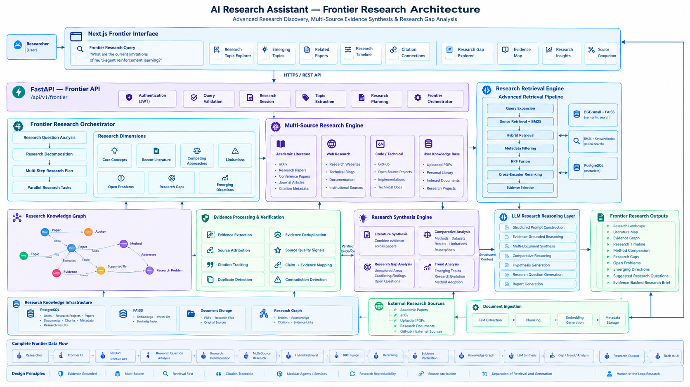