# AI Research Assistant — Reports & Research Generation Architecture

## 1. Overview

The **Reports module** is the research synthesis and report-generation layer of the AI Research Assistant.

It connects the application APIs and services to the Adaptive RAG pipeline, retrieves relevant research evidence, reranks the evidence, constructs grounded context, and uses an LLM to generate a structured research answer or report.

The architecture follows:

```text
Next.js UI
    ↓
FastAPI API
    ↓
Reports Services
    ↓
Adaptive RAG Controller
    ↓
Query Planner
    ↓
Retrieval Pipeline
    ↓
Dense + BM25 + Metadata Retrieval
    ↓
Hybrid Retrieval / RRF
    ↓
Cross-Encoder Reranking
    ↓
Evidence Context
    ↓
LLM / OpenRouter
    ↓
Research Answer / Report
```

---

# 2. High-Level Architecture

```mermaid
flowchart TD

    UI[Next.js UI]

    HTTP[HTTPS / REST]

    API[FastAPI API]

    RS[Research Services]
    ES[Explore Services]
    RPS[Reports Services]
    AS[Assistant Services]

    C[Adaptive RAG Controller]

    P[Query Planner]

    R[Retrieval Pipeline]

    D[Dense Retrieval]
    B[BM25 / Keyword Retrieval]
    M[Metadata Filtering]

    HR[Hybrid Retrieval / RRF]

    RR[Cross-Encoder Reranking]

    EC[Evidence Context]

    LLM[LLM / OpenRouter]

    OUT[Research Answer / Report]

    UI --> HTTP
    HTTP --> API

    API --> RS
    API --> ES
    API --> RPS
    API --> AS

    RS --> C
    ES --> C
    RPS --> C
    AS --> C

    C --> P
    P --> R

    R --> D
    R --> B
    R --> M

    D --> HR
    B --> HR
    M --> HR

    HR --> RR
    RR --> EC
    EC --> LLM
    LLM --> OUT
```

---

# 3. Application API Layer

The Reports module is exposed through the FastAPI application layer.

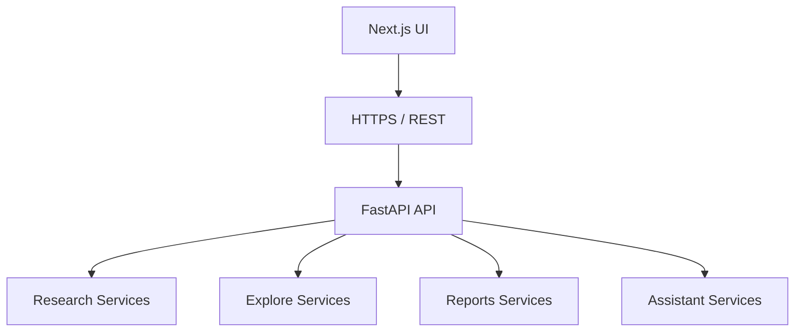

The FastAPI layer acts as the HTTP boundary for the application.

It exposes separate service boundaries for:

- Research
- Explore
- Reports
- Assistant

These services can share the same Adaptive RAG infrastructure.

---

# 4. Reports Services

The **Reports Services** layer coordinates report-specific application behavior.


The Reports Services layer is responsible for:

- Receiving report-generation requests.
- Passing research queries into Adaptive RAG.
- Requesting evidence retrieval.
- Receiving grounded evidence context.
- Passing the context toward report generation.
- Returning the generated research output.

The service layer does not need to implement retrieval itself.

---

# 5. Shared Adaptive RAG Architecture

The Reports module uses the shared Adaptive RAG Controller.

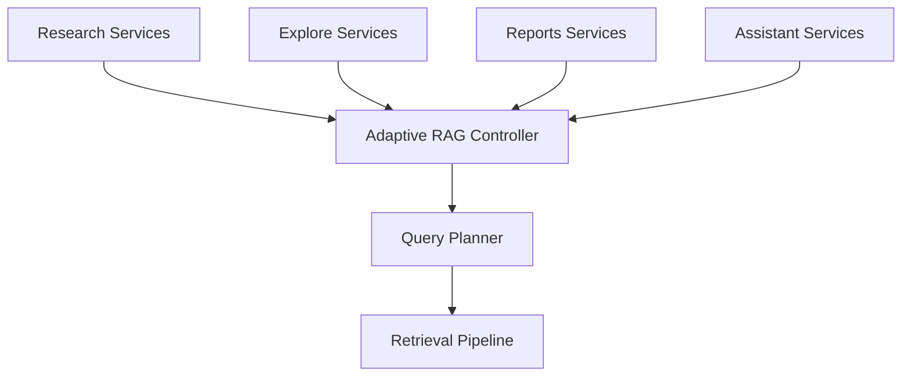

This provides a common retrieval orchestration layer across the application.

The same retrieval infrastructure can therefore support:

- Research queries.
- Explore search.
- Reports.
- Assistant interactions.

---

# 6. Adaptive RAG Controller

The Adaptive RAG Controller is the central orchestration boundary.

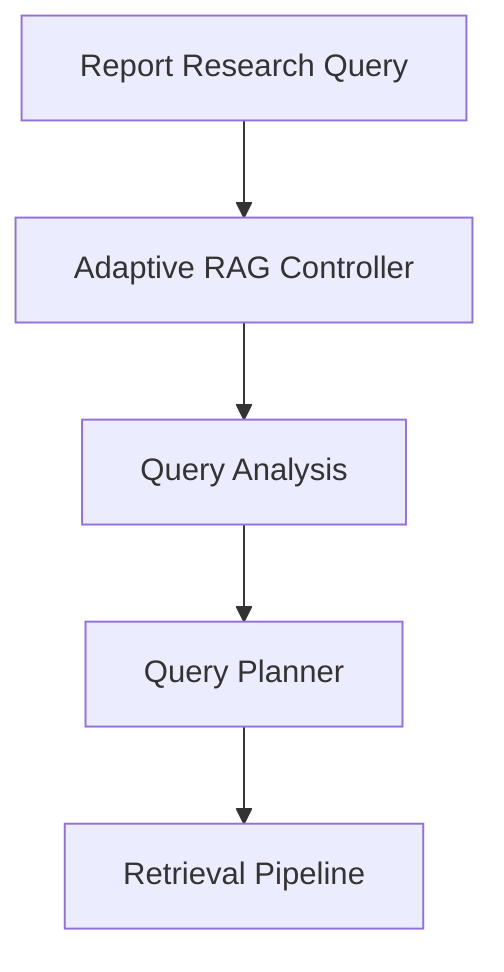

The controller coordinates:

1. Query analysis.
2. Retrieval planning.
3. Retrieval execution.
4. Candidate fusion.
5. Reranking.
6. Evidence preparation.
7. LLM context generation.

---

# 7. Query Planner

The Query Planner determines how the research query should be retrieved.

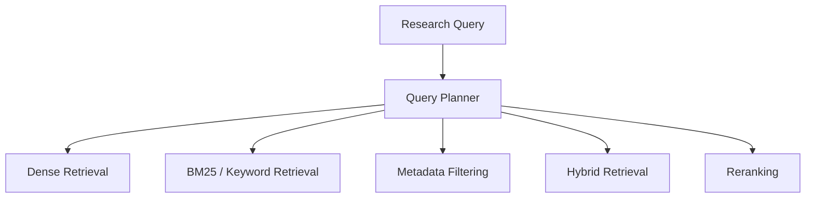

The planner can determine:

- Retrieval mode.
- Retrieval depth.
- Dense retrieval usage.
- Keyword retrieval usage.
- Metadata constraints.
- Hybrid retrieval.
- Reranking requirements.
- Additional retrieval behavior.

The planner determines the retrieval strategy while the retrieval pipeline performs execution.

---

# 8. Retrieval Pipeline

The Retrieval Pipeline executes the strategy selected by the Query Planner.

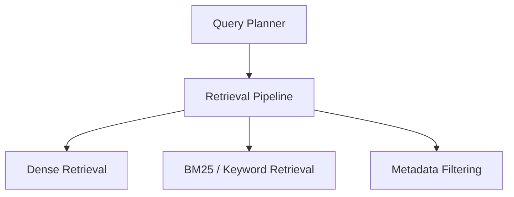

The pipeline produces multiple candidate evidence sets.

```text
Query
  |
  v
Retrieval Pipeline
  |
  +---- Dense Candidates
  |
  +---- Keyword Candidates
  |
  +---- Filtered Candidates
```

These candidates are then combined by the hybrid retrieval layer.

---

# 9. Research Sources

The report-generation pipeline depends on an indexed research corpus.

```mermaid
flowchart TD

    S[Research Papers<br/>Web · GitHub · APIs]

    I[Knowledge Ingestion]

    F[FAISS]

    PG[PostgreSQL]

    S --> I

    I --> F
    I --> PG
```

Research sources can include:

- Research papers.
- Web sources.
- GitHub repositories.
- External APIs.
- Other indexed research documents.

---

# 10. Knowledge Ingestion

Knowledge Ingestion transforms research sources into searchable representations.

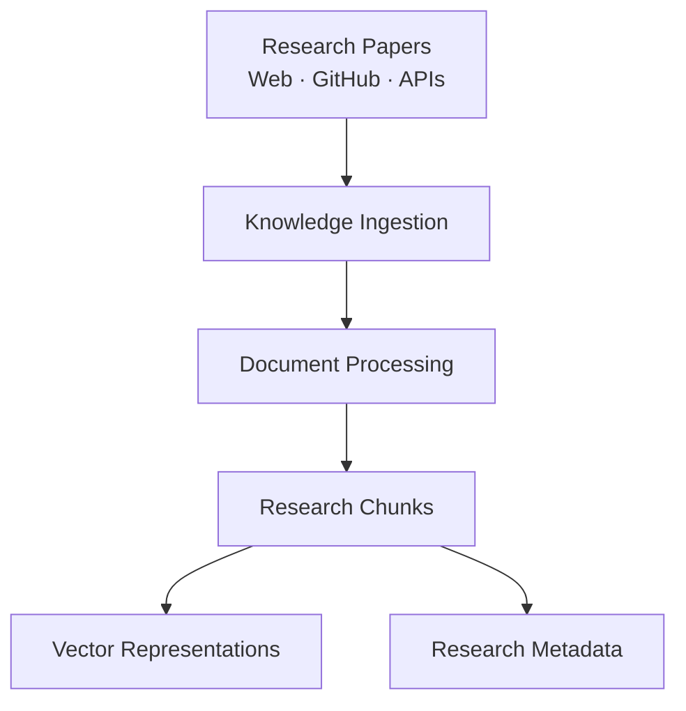

The ingestion layer prepares both:

- Semantic representations.
- Structured metadata.

These representations support the retrieval pipeline.

---

# 11. FAISS Vector Store

FAISS provides the vector search layer for dense retrieval.

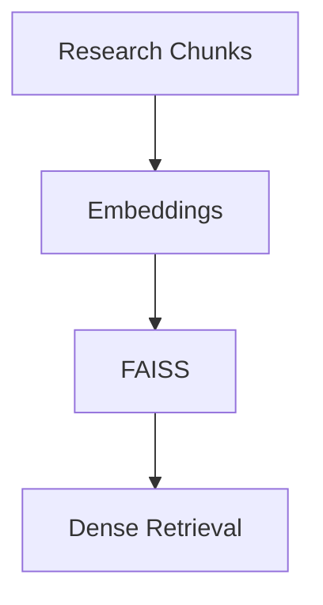

The vector index allows the system to identify semantically similar research content.

---

# 12. PostgreSQL Research Store

PostgreSQL provides structured research data and metadata.

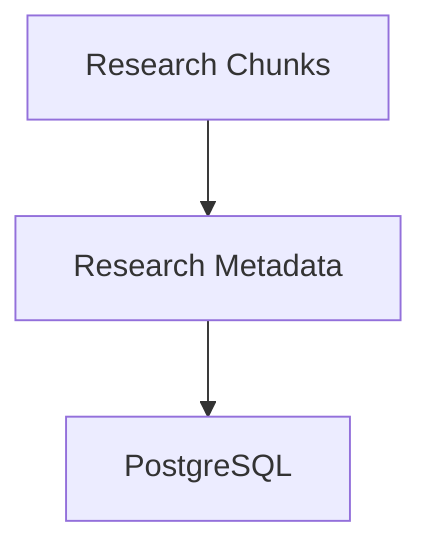

PostgreSQL can support:

- Paper metadata.
- Chunk metadata.
- Document information.
- Research attributes.
- Structured filtering.

---

# 13. Dense Retrieval

Dense retrieval searches the FAISS vector index using semantic representations.

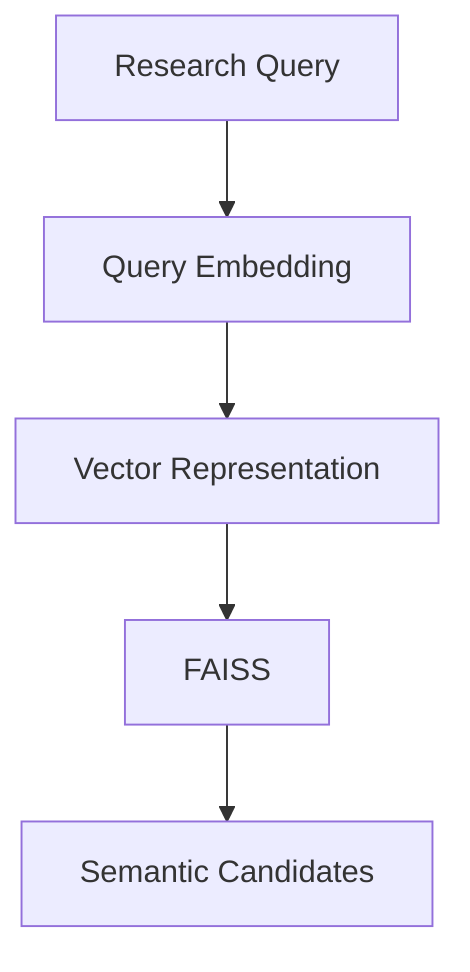

Dense retrieval is useful for:

- Semantic similarity.
- Conceptual research questions.
- Paraphrased terminology.
- Related research concepts.
- Queries where exact wording differs from source documents.

---

# 14. BM25 / Keyword Retrieval

BM25 provides lexical retrieval.

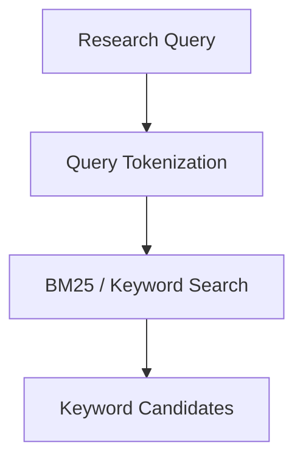

Keyword retrieval is useful for:

- Exact technical terminology.
- Paper titles.
- Author names.
- Acronyms.
- Named methods.
- Identifiers.
- Domain-specific phrases.

---

# 15. Metadata Filtering

Metadata filtering uses structured research metadata to constrain candidate results.

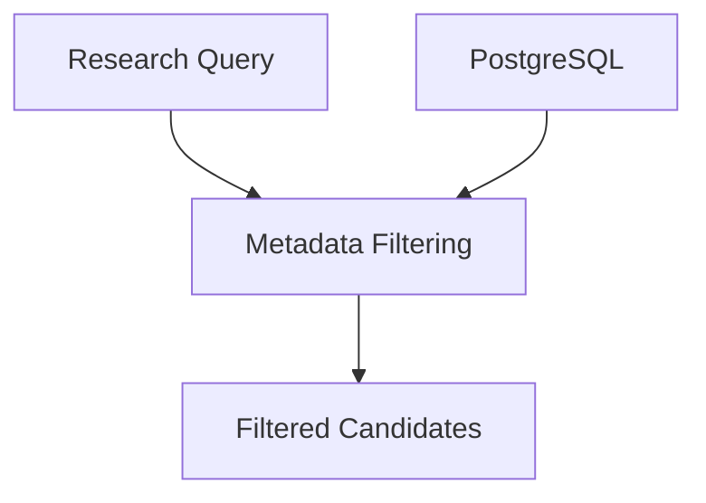

Metadata filtering can be used to narrow results based on available research attributes.

Conceptually:

```text
Dense Retrieval
       +
BM25 Retrieval
       +
Metadata Filtering
       |
       v
Candidate Evidence
```

---

# 16. Multi-Source Retrieval

The Retrieval Pipeline combines the primary retrieval mechanisms.

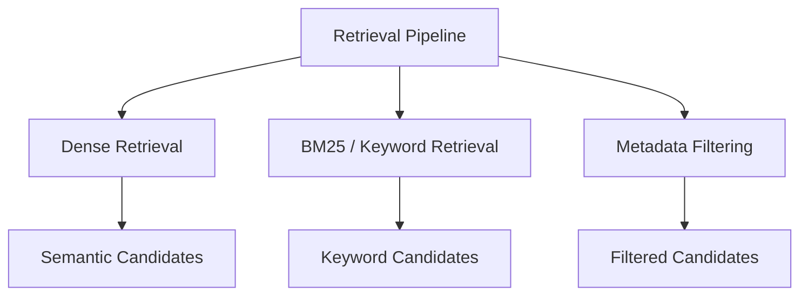

The three candidate streams are passed into the hybrid retrieval and ranking layer.

---

# 17. Hybrid Retrieval / Reciprocal Rank Fusion

The Hybrid Retrieval layer combines the candidate rankings.

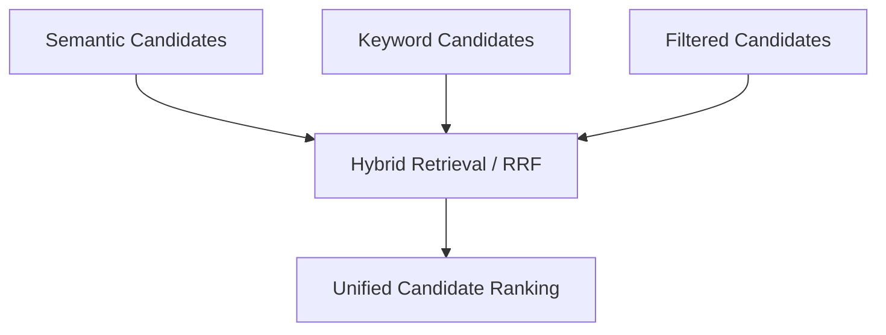

Reciprocal Rank Fusion allows multiple retrieval systems to contribute to a unified ranking.

The conceptual flow is:

```text
Dense Ranking
      +
BM25 Ranking
      +
Metadata Filtering
      |
      v
Reciprocal Rank Fusion
      |
      v
Unified Candidate Ranking
```

---

# 18. Unified Candidate Ranking

The unified ranking stage produces a single candidate set from the different retrieval sources.

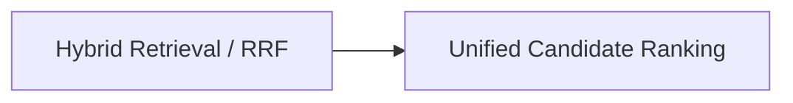

The unified candidate list becomes the input to the cross-encoder reranker.

---

# 19. Cross-Encoder Reranking

The cross-encoder performs higher-precision relevance evaluation.

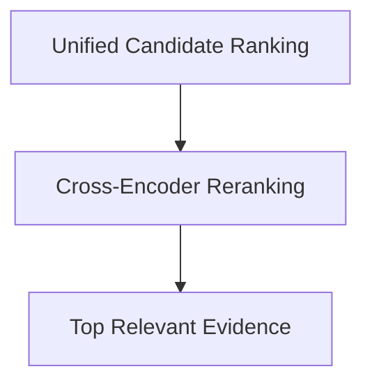

The cross-encoder evaluates candidate evidence in relation to the research query.

The retrieval architecture therefore follows:

```text
Broad Candidate Retrieval
          |
          v
Hybrid Fusion
          |
          v
Unified Ranking
          |
          v
Cross-Encoder Reranking
          |
          v
Relevant Evidence
```

---

# 20. Evidence Context

The reranked evidence is assembled into a structured context for the language model.

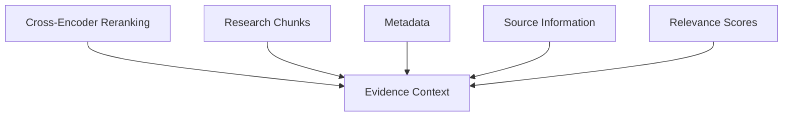

Evidence Context can contain:

- Retrieved research chunks.
- Paper information.
- Metadata.
- Source references.
- Relevance scores.
- Supporting passages.

The context acts as the grounding boundary before LLM generation.

---

# 21. Grounded LLM Research

The Evidence Context is passed to the LLM layer.

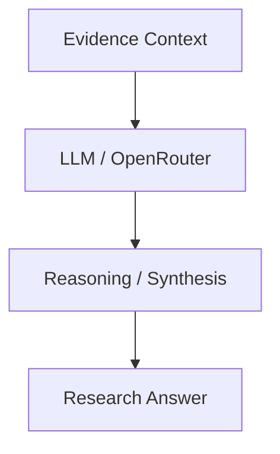

The LLM is responsible for:

- Interpreting retrieved evidence.
- Connecting related findings.
- Synthesizing research.
- Producing structured explanations.
- Generating the final research answer or report.

The retrieved evidence remains the grounding source.

---

# 22. LLM / OpenRouter

The architecture uses an LLM provider abstraction.

```mermaid
flowchart LR

    C[Evidence Context]

    L[LLM / OpenRouter]

    M[Language Model]

    C --> L
    L --> M
```

Using a provider abstraction keeps the retrieval system decoupled from a specific model provider.

The following components remain independent:

- Retrieval.
- FAISS.
- PostgreSQL.
- Ranking.
- Reranking.
- Evidence context.
- LLM provider.

---

# 23. Research Answer / Report

The final output is generated after evidence retrieval and contextualization.

```mermaid
flowchart TD

    E[Evidence Context]

    L[LLM / OpenRouter]

    R[Research Reasoning]

    OUT[Research Answer / Report]

    E --> L
    L --> R
    R --> OUT
```

A report can contain:

```text
Research Report
│
├── Executive Summary
│
├── Key Findings
│
├── Evidence
│
├── Research Synthesis
│
├── Supporting Sources
│
└── Limitations
```

---

# 24. Reports End-to-End Flow

The complete Reports architecture is:

```mermaid
flowchart TD

    UI[Next.js UI]

    HTTP[HTTPS / REST]

    API[FastAPI API]

    RS[Research Services]
    ES[Explore Services]
    RPS[Reports Services]
    AS[Assistant Services]

    C[Adaptive RAG Controller]

    P[Query Planner]

    R[Retrieval Pipeline]

    D[Dense Retrieval]
    B[BM25 / Keyword Retrieval]
    M[Metadata Filtering]

    F[Hybrid Retrieval / RRF]

    RR[Cross-Encoder Reranking]

    EC[Evidence Context]

    LLM[LLM / OpenRouter]

    OUT[Research Answer / Report]


    UI --> HTTP
    HTTP --> API

    API --> RS
    API --> ES
    API --> RPS
    API --> AS

    RS --> C
    ES --> C
    RPS --> C
    AS --> C

    C --> P
    P --> R

    R --> D
    R --> B
    R --> M

    D --> F
    B --> F
    M --> F

    F --> RR
    RR --> EC

    EC --> LLM
    LLM --> OUT
```

---

# 25. Report Generation Sequence

```mermaid
sequenceDiagram

    participant UI as Next.js UI
    participant API as FastAPI API
    participant RS as Reports Services
    participant C as Adaptive RAG Controller
    participant P as Query Planner
    participant R as Retrieval Pipeline
    participant F as Hybrid / RRF
    participant RR as Cross-Encoder
    participant EC as Evidence Context
    participant LLM as LLM / OpenRouter

    UI->>API: Report Request
    API->>RS: Generate Research Report
    RS->>C: Execute Adaptive RAG

    C->>P: Analyze Research Query
    P-->>C: Retrieval Plan

    C->>R: Execute Retrieval

    R-->>C: Dense Candidates
    R-->>C: BM25 Candidates
    R-->>C: Filtered Candidates

    C->>F: Fuse Candidate Rankings
    F-->>C: Unified Candidates

    C->>RR: Rerank Candidates
    RR-->>C: Relevant Evidence

    C->>EC: Build Evidence Context
    EC-->>C: Grounded Context

    C->>LLM: Generate Research Response
    LLM-->>C: Research Answer / Report

    C-->>RS: Report Result
    RS-->>API: Formatted Report
    API-->>UI: Research Answer / Report
```

---

# 26. Research Source to Report Flow

```mermaid
flowchart TD

    S[Research Papers<br/>Web · GitHub · APIs]

    I[Knowledge Ingestion]

    F[FAISS]

    PG[PostgreSQL]

    R[Retrieval Pipeline]

    D[Dense Retrieval]

    B[BM25 / Keyword Retrieval]

    M[Metadata Filtering]

    HR[Hybrid Retrieval / RRF]

    RR[Cross-Encoder Reranking]

    EC[Evidence Context]

    LLM[LLM / OpenRouter]

    OUT[Research Answer / Report]

    S --> I

    I --> F
    I --> PG

    F --> D
    PG --> B
    PG --> M

    D --> HR
    B --> HR
    M --> HR

    HR --> RR
    RR --> EC
    EC --> LLM
    LLM --> OUT
```

---

# 27. Shared Service Architecture

The application contains multiple service entry points that share the same Adaptive RAG infrastructure.

```mermaid
flowchart TD

    API[FastAPI API]

    R[Research Services]
    E[Explore Services]
    RP[Reports Services]
    A[Assistant Services]

    C[Adaptive RAG Controller]

    P[Query Planner]

    RET[Retrieval Pipeline]

    RANK[Hybrid / Ranking]

    RR[Cross-Encoder Reranking]

    R --> C
    E --> C
    RP --> C
    A --> C

    C --> P
    P --> RET
    RET --> RANK
    RANK --> RR

    API --> R
    API --> E
    API --> RP
    API --> A
```

This creates a reusable retrieval architecture rather than implementing independent retrieval systems for each feature.

---

# 28. Component Boundaries

| Component | Responsibility |
|---|---|
| Next.js UI | User-facing research interface |
| FastAPI API | HTTP/API boundary |
| Research Services | Research application workflows |
| Explore Services | Search and discovery workflows |
| Reports Services | Report-generation workflows |
| Assistant Services | Assistant interaction workflows |
| Adaptive RAG Controller | Shared retrieval orchestration |
| Query Planner | Determines retrieval strategy |
| Retrieval Pipeline | Executes retrieval |
| Dense Retrieval | Semantic candidate retrieval |
| BM25 / Keyword Retrieval | Lexical candidate retrieval |
| Metadata Filtering | Structured filtering |
| FAISS | Vector similarity search |
| PostgreSQL | Structured research metadata |
| Hybrid Retrieval / RRF | Combines retrieval rankings |
| Unified Candidate Ranking | Produces unified candidate set |
| Cross-Encoder Reranking | Precision relevance ranking |
| Evidence Context | Grounded context construction |
| LLM / OpenRouter | Language reasoning and generation |
| Research Answer / Report | Final research output |

---

# 29. Design Principles

## 29.1 Shared Retrieval Infrastructure

Reports should reuse the same Adaptive RAG infrastructure used by other research workflows.

```text
Research Services
        |
Explore Services
        |
Reports Services
        |
Assistant Services
        |
        v
Adaptive RAG Controller
```

This reduces duplicated retrieval logic.

---

## 29.2 Retrieval Before Generation

The report is not generated directly from the raw query.

The system first retrieves and ranks evidence.

```text
Query
  ↓
Retrieve
  ↓
Fuse
  ↓
Rerank
  ↓
Evidence Context
  ↓
LLM
  ↓
Report
```

---

## 29.3 Multi-Signal Retrieval

The Reports module combines:

```text
Dense Retrieval
       +
BM25 / Keyword Retrieval
       +
Metadata Filtering
       |
       v
Hybrid Retrieval / RRF
```

This allows semantic, lexical, and structured signals to contribute to evidence retrieval.

---

## 29.4 Reranking Before LLM

The LLM receives reranked evidence rather than the complete raw candidate set.

```text
Candidates
    ↓
RRF
    ↓
Unified Ranking
    ↓
Cross-Encoder
    ↓
Evidence Context
    ↓
LLM
```

---

## 29.5 Evidence-Grounded Generation

The LLM receives an explicit evidence context.

```mermaid
flowchart LR

    Q[Research Query]

    E[Retrieved Evidence]

    C[Evidence Context]

    L[LLM]

    O[Research Report]

    Q --> C
    E --> C
    C --> L
    L --> O
```

The generated report should distinguish evidence-supported findings from interpretation and synthesis.

---

## 29.6 Provider Independence

The retrieval pipeline should remain independent of the selected LLM provider.

```mermaid
flowchart LR

    RET[Retrieval Pipeline]

    EC[Evidence Context]

    P[LLM Provider Layer]

    O[OpenRouter]

    M[Language Model]

    RET --> EC
    EC --> P
    P --> O
    O --> M
```

---

# 30. Complete Reports Architecture

```mermaid
flowchart TD

    UI[Next.js UI]

    API[FastAPI API]

    RS[Research Services]
    ES[Explore Services]
    RPS[Reports Services]
    AS[Assistant Services]

    C[Adaptive RAG Controller]

    P[Query Planner]

    R[Retrieval Pipeline]


    subgraph RETRIEVAL["Retrieval Layer"]

        D[Dense Retrieval]

        B[BM25 / Keyword Retrieval]

        M[Metadata Filtering]

        D --> DF[FAISS]
        B --> PG[PostgreSQL]
        M --> PG

    end


    subgraph RANKING["Ranking Layer"]

        RRF[Hybrid Retrieval / RRF]

        UR[Unified Candidate Ranking]

        CE[Cross-Encoder Reranking]

        RRF --> UR
        UR --> CE

    end


    EC[Evidence Context]

    LLM[LLM / OpenRouter]

    OUT[Research Answer / Report]


    UI --> API

    API --> RS
    API --> ES
    API --> RPS
    API --> AS

    RS --> C
    ES --> C
    RPS --> C
    AS --> C

    C --> P
    P --> R

    R --> RETRIEVAL

    DF --> D
    PG --> B
    PG --> M

    D --> RRF
    B --> RRF
    M --> RRF

    CE --> EC
    EC --> LLM
    LLM --> OUT
```

---

# 31. Final Data Flow

```text
Next.js UI
      |
      v
HTTPS / REST
      |
      v
FastAPI API
      |
      +----------------+----------------+----------------+
      |                |                |                |
      v                v                v                v
Research          Explore           Reports          Assistant
Services          Services          Services         Services
      |                |                |                |
      +----------------+----------------+----------------+
                       |
                       v
              Adaptive RAG Controller
                       |
                       v
                  Query Planner
                       |
                       v
                Retrieval Pipeline
                       |
          +------------+------------+
          |            |            |
          v            v            v
       Dense          BM25       Metadata
      Retrieval     Retrieval    Filtering
          |            |            |
          +------------+------------+
                       |
                       v
             Hybrid Retrieval / RRF
                       |
                       v
             Unified Candidate Ranking
                       |
                       v
            Cross-Encoder Reranking
                       |
                       v
                 Evidence Context
                       |
                       v
                LLM / OpenRouter
                       |
                       v
             Research Answer / Report
```

---

# 32. Core Architecture Principle

The Reports module follows:

```text
Research Intent
      ↓
Query Planning
      ↓
Multi-Signal Retrieval
      ↓
Candidate Fusion
      ↓
Cross-Encoder Reranking
      ↓
Evidence Context
      ↓
Grounded LLM Reasoning
      ↓
Research Answer / Report
```

The core principle is:

> **Reports are generated from retrieved and reranked research evidence through a shared Adaptive RAG pipeline, rather than being generated directly from the user's query.**


# Research Report

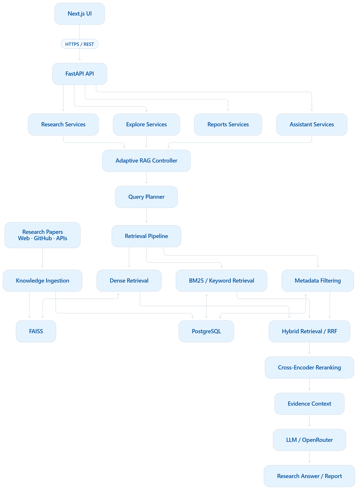