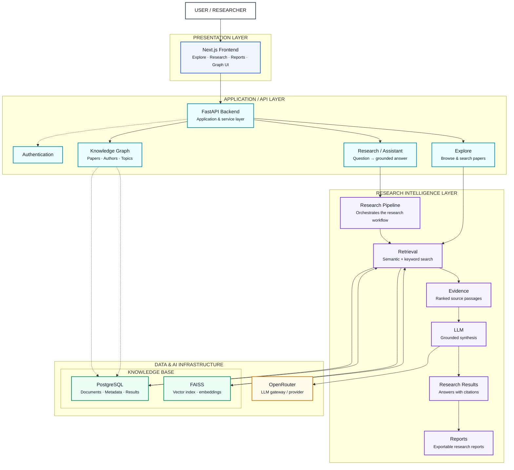
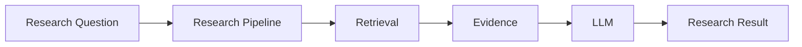
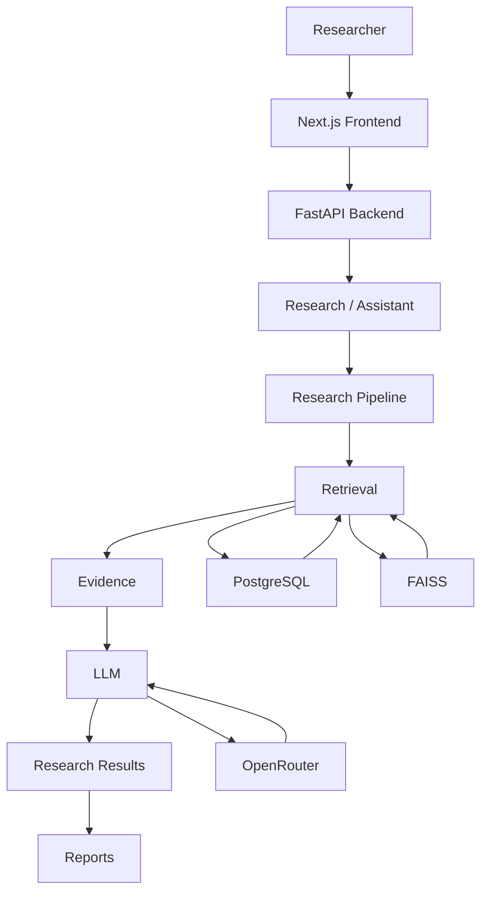
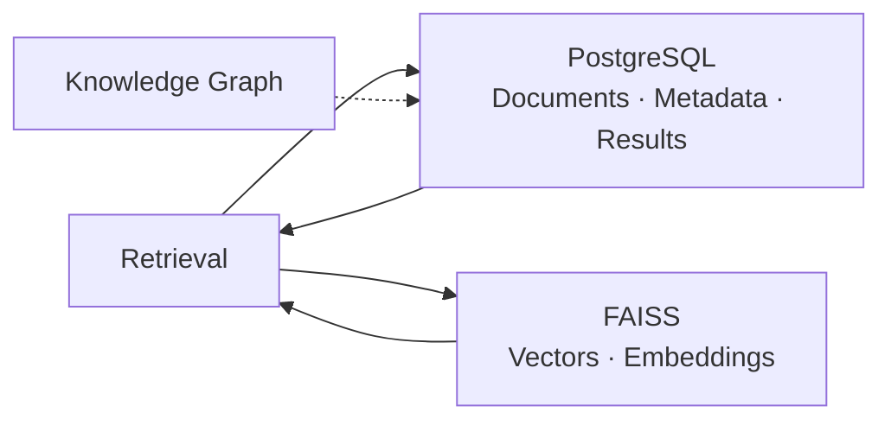
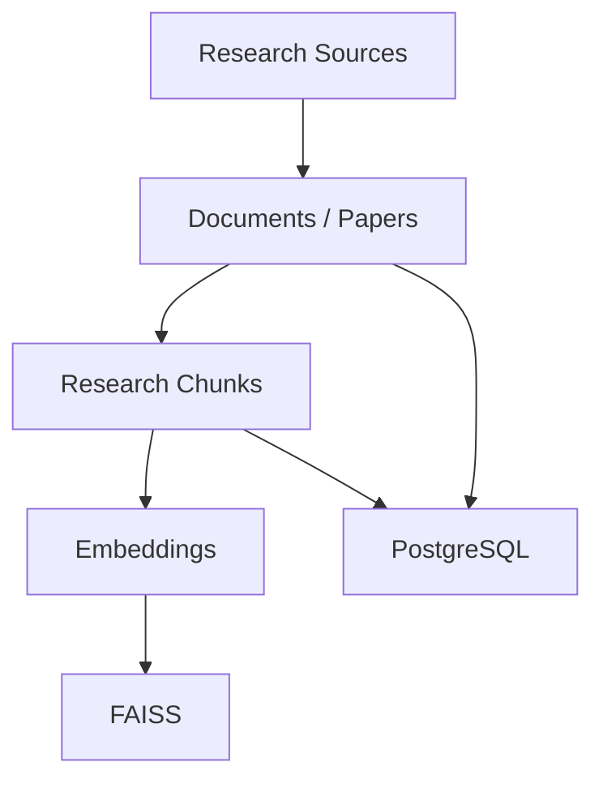
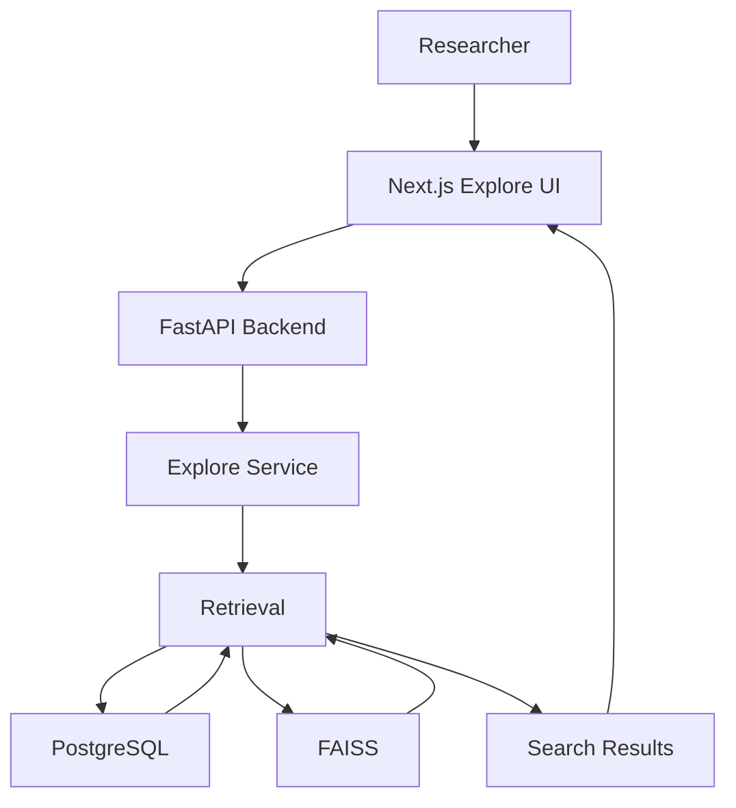
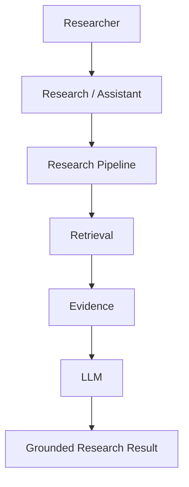
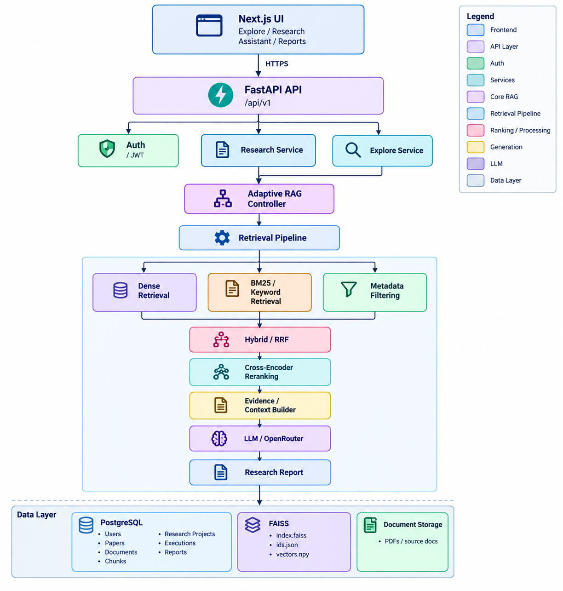

# AI Research Assistant — System Overview

> What the platform is made of: from the researcher to grounded, cited research results.



---

## 1. System Overview

The **AI Research Assistant** is a research-oriented platform that transforms a research question into a grounded, evidence-backed and cited research result.

The system is organized into four major architectural layers:

1. **Presentation Layer**
2. **Application / API Layer**
3. **Research Intelligence Layer**
4. **Data & AI Infrastructure**

The core research flow is:

```text
Researcher
    ↓
Next.js Frontend
    ↓
FastAPI Backend
    ↓
Research / Assistant
    ↓
Research Pipeline
    ↓
Retrieval
    ↓
Evidence
    ↓
LLM
    ↓
Research Results
    ↓
Reports
```

---

# 2. Presentation Layer

The presentation layer provides the user-facing research interface.

## Next.js Frontend

The frontend is responsible for:

- Research interaction
- Explore/search interface
- Research results
- Reports
- Knowledge graph visualization
- Research navigation
- Source and citation presentation

The frontend communicates with the backend through HTTP/REST APIs.

```text
User
  ↓
Next.js Frontend
  ↓
HTTPS / REST
  ↓
FastAPI Backend
```

---

# 3. Application / API Layer

The application layer exposes the platform's backend APIs and coordinates access to research services.

## FastAPI Backend

The FastAPI backend acts as the primary application and service boundary.

Responsibilities include:

- HTTP API handling
- Request validation
- Authentication
- Service routing
- Research orchestration
- Explore/search requests
- Knowledge graph access
- Report generation
- Assistant interactions

```text
Next.js Frontend
        ↓
   FastAPI Backend
        ↓
 ┌──────┼─────────┬──────────┐
 ↓      ↓         ↓          ↓
Explore Research  Graph   Assistant
```

---

# 4. Authentication

Authentication protects application and research APIs.

The authentication layer can be positioned beside the FastAPI backend rather than inside the research intelligence pipeline.

```text
Client
   ↓
FastAPI
   ↓
Authentication
   ↓
Authorized Service Request
```

Authentication is therefore an application concern rather than a retrieval or reasoning concern.

---

# 5. Application Services

The backend exposes multiple application-level capabilities.

| Service | Responsibility |
|---|---|
| Explore | Browse and search research papers |
| Research / Assistant | Answer research questions |
| Knowledge Graph | Explore papers, authors and topics |
| Reports | Produce exportable research outputs |

These services can share the same underlying research intelligence infrastructure.

---

# 6. Research Intelligence Layer

The research intelligence layer contains the core research workflow.

Its primary components are:

```text
Research Pipeline
      ↓
   Retrieval
      ↓
   Evidence
      ↓
      LLM
      ↓
Research Results
      ↓
    Reports
```

The architecture separates **retrieval**, **evidence**, and **generation** so that the LLM does not independently determine the factual research context.

---

# 7. Research Pipeline

The **Research Pipeline** orchestrates the research workflow.

It acts as the central research processing layer between the application services and retrieval infrastructure.

Responsibilities include:

- Research workflow orchestration
- Retrieval coordination
- Evidence preparation
- Context construction
- LLM invocation
- Result generation
- Research output preparation



---

# 8. Retrieval

The retrieval layer finds relevant research information from the knowledge base.

Retrieval can combine:

- Semantic/vector search
- Keyword search
- Metadata filtering
- Hybrid retrieval

The objective is to retrieve candidate evidence relevant to the research question.

```text
Research Question
       ↓
    Retrieval
       ↓
Relevant Research Evidence
```

---

# 9. Evidence

The **Evidence** layer represents ranked and selected source passages used for grounded generation.

Evidence can contain:

- Retrieved chunks
- Source documents
- Metadata
- Paper information
- Relevance scores
- Source references
- Citation information

The LLM receives evidence rather than relying only on the original user question.

```text
Retrieved Candidates
        ↓
 Evidence Processing
        ↓
 Ranked Evidence
        ↓
      LLM
```

---

# 10. LLM

The LLM provides the reasoning and synthesis layer.

Its responsibility is to:

- Interpret retrieved evidence
- Synthesize information
- Compare research findings
- Explain relationships
- Generate structured research responses
- Preserve source attribution
- Express uncertainty where evidence is insufficient

The LLM should operate over the retrieved research context.

```text
Research Question
       +
Retrieved Evidence
       ↓
      LLM
       ↓
Grounded Research Synthesis
```

---

# 11. Research Results

The Research Results layer represents the user-facing research answer.

A research result can contain:

- Summary
- Key findings
- Supporting evidence
- Research interpretation
- Citations
- Sources
- Limitations
- Research gaps

```text
Evidence
   ↓
LLM Synthesis
   ↓
Research Results
   ↓
Cited Answer
```

---

# 12. Reports

Reports provide an exportable representation of research results.

Reports can contain:

- Research summary
- Literature findings
- Evidence
- Citations
- Comparative analysis
- Research gaps
- Limitations
- References

```text
Research Results
       ↓
     Reports
       ↓
Exportable Research Report
```

---

# 13. Knowledge Graph

The **Knowledge Graph** represents structured relationships between research entities.

Possible entities include:

- Papers
- Authors
- Topics
- Research concepts
- Methods
- Citations

The graph can support research exploration and contextual discovery.

```text
Paper
 ├── written by → Author
 ├── discusses → Topic
 ├── cites → Paper
 └── related to → Concept
```

The knowledge graph is connected to the persistence layer for storing and retrieving graph-related information.

---

# 14. Data & AI Infrastructure

The infrastructure layer provides persistent research knowledge and AI model access.

Main components:

```text
Knowledge Base
 ├── PostgreSQL
 └── FAISS

AI Provider
 └── OpenRouter
```

---

# 15. PostgreSQL

PostgreSQL is the primary structured persistence layer.

It can store:

- Documents
- Research papers
- Metadata
- Chunks
- Research results
- Application records
- Knowledge graph data

Conceptually:

```text
PostgreSQL
 ├── Documents
 ├── Metadata
 ├── Chunks
 ├── Research Results
 └── Knowledge Graph Data
```

---

# 16. FAISS

FAISS provides vector indexing and similarity search.

It stores or indexes:

- Embeddings
- Vector representations
- Similarity-search structures

The retrieval layer can use FAISS for semantic retrieval.

```text
Research Documents
       ↓
   Embeddings
       ↓
      FAISS
       ↓
Semantic Search
       ↓
Relevant Chunks
```

---

# 17. OpenRouter

OpenRouter acts as the LLM gateway/provider layer.

The architecture separates the LLM provider from the research pipeline.

```text
Research Pipeline
       ↓
      LLM
       ↓
   OpenRouter
       ↓
Selected Language Model
```

This allows the application architecture to remain independent of a specific model provider.

---

# 18. End-to-End Research Flow

The complete research flow can be represented as:



---

# 19. Component Boundaries

| Component | Primary Responsibility |
|---|---|
| Next.js Frontend | User-facing research interface |
| FastAPI Backend | API and application boundary |
| Authentication | Request authorization |
| Explore | Research discovery and search |
| Research / Assistant | Research question handling |
| Knowledge Graph | Structured research relationships |
| Research Pipeline | Research workflow orchestration |
| Retrieval | Candidate evidence retrieval |
| Evidence | Ranked research passages |
| LLM | Reasoning and synthesis |
| Research Results | Grounded research answers |
| Reports | Exportable research outputs |
| PostgreSQL | Structured persistence |
| FAISS | Vector similarity search |
| OpenRouter | LLM provider gateway |

---

# 20. Primary Data Flow

The primary application flow is:

```text
USER / RESEARCHER
        │
        ▼
NEXT.JS FRONTEND
        │
        ▼
FASTAPI BACKEND
        │
        ▼
RESEARCH / ASSISTANT
        │
        ▼
RESEARCH PIPELINE
        │
        ▼
RETRIEVAL
        │
        ▼
EVIDENCE
        │
        ▼
LLM
        │
        ▼
RESEARCH RESULTS
        │
        ▼
REPORTS
```

---

# 21. Supporting Data Flow

The retrieval layer interacts with the knowledge infrastructure.



The persistence layer supports retrieval and structured knowledge access without becoming part of the user-facing research flow.

---

# 22. Retrieval and Generation Separation

A core architectural principle is the separation between retrieval and generation.

```text
                  RESEARCH QUESTION
                         │
                         ▼
                    RETRIEVAL
                         │
                         ▼
                 RELEVANT EVIDENCE
                         │
                         ▼
                      EVIDENCE
                         │
                         ▼
                        LLM
                         │
                         ▼
                 GROUNDED SYNTHESIS
```

This separation provides a clear boundary:

- **Retrieval:** What information is available?
- **Evidence:** What information is sufficiently relevant?
- **LLM:** What does the evidence mean?
- **Results:** How should the findings be communicated?

---

# 23. Knowledge Base Architecture

The knowledge base consists of structured and vector representations of research information.



---

# 24. Explore Flow

The Explore capability provides research discovery and search.



---

# 25. Research / Assistant Flow

The Research / Assistant service focuses on answering research questions using grounded evidence.



---

# 26. Research Graph Relationship

The knowledge graph provides a structured representation that complements document and vector retrieval.

```text
                    KNOWLEDGE GRAPH
                          │
          ┌───────────────┼───────────────┐
          │               │               │
        Papers          Authors         Topics
          │               │               │
          └───────────────┼───────────────┘
                          │
                    Research Context
                          │
                          ▼
                    Research System
```

The graph can support:

- Topic discovery
- Paper relationships
- Author relationships
- Citation exploration
- Research navigation
- Context enrichment

---

# 27. Grounded Research Architecture

The system follows a grounded research architecture:

```text
                    USER INTENT
                         │
                         ▼
                 RESEARCH QUESTION
                         │
                         ▼
                RESEARCH PIPELINE
                         │
                         ▼
                    RETRIEVAL
                         │
                         ▼
                     EVIDENCE
                         │
                         ▼
                       LLM
                         │
                         ▼
                GROUNDED SYNTHESIS
                         │
                         ▼
                 RESEARCH RESULTS
                         │
                         ▼
                      REPORTS
```

---

# 28. Design Principles

## 28.1 Retrieval Before Generation

Research information should be retrieved before generation.

```text
Retrieve
   ↓
Evaluate Evidence
   ↓
Ground Context
   ↓
Generate
```

---

## 28.2 Evidence-Grounded Generation

The LLM should generate from retrieved research evidence rather than treating the model's internal knowledge as the primary research source.

---

## 28.3 Separation of Concerns

Each architectural layer has a focused responsibility.

```text
Presentation
     ↓
Application
     ↓
Research Intelligence
     ↓
Infrastructure
```

---

## 28.4 Provider Independence

The research pipeline should remain independent of the specific LLM provider.

```text
Research Pipeline
       ↓
      LLM
       ↓
Provider Gateway
       ↓
Model
```

This allows the underlying model provider to change without redesigning the complete research architecture.

---

## 28.5 Persistent Knowledge

Research documents, metadata, results and graph information are persisted separately from the transient research request.

---

## 28.6 Vector and Structured Retrieval

The system can combine:

```text
Semantic Retrieval
       +
Structured / Metadata Retrieval
       +
Knowledge Graph Context
       ↓
Research Evidence
```

---

## 28.7 Traceable Research

Research outputs should preserve the relationship between:

```text
Research Question
       ↓
Retrieved Source
       ↓
Evidence Passage
       ↓
LLM Context
       ↓
Research Claim
       ↓
Citation
```

This enables research results to remain connected to their supporting evidence.

---

# 29. Architectural Summary

The AI Research Assistant is organized around a simple architectural principle:

```text
USER
 ↓
NEXT.JS
 ↓
FASTAPI
 ↓
RESEARCH SERVICES
 ↓
RESEARCH PIPELINE
 ↓
RETRIEVAL
 ↓
EVIDENCE
 ↓
LLM
 ↓
RESEARCH RESULTS
 ↓
REPORTS
```

Supporting infrastructure provides the knowledge and model capabilities:

```text
                 RESEARCH SYSTEM
                       │
          ┌────────────┴────────────┐
          │                         │
     KNOWLEDGE BASE             AI PROVIDER
          │                         │
     ┌────┴────┐               OpenRouter
     │         │
PostgreSQL   FAISS
```

The overall architecture therefore separates:

- User interaction
- API and application services
- Research orchestration
- Retrieval
- Evidence
- LLM reasoning
- Knowledge persistence
- Vector search
- Research reporting

This creates a modular foundation for building a research assistant capable of **searching, grounding, reasoning over and presenting research knowledge with traceable evidence**.

---

# 30. Core Architecture Principle

> **The AI Research Assistant should reason over retrieved and validated research evidence rather than generate research answers independently of the knowledge and retrieval pipeline.**

```text
Researcher
    ↓
Research Intent
    ↓
Research Pipeline
    ↓
Retrieval
    ↓
Evidence
    ↓
Grounded LLM Reasoning
    ↓
Cited Research Result
    ↓
Exportable Report
```

# System Overview


